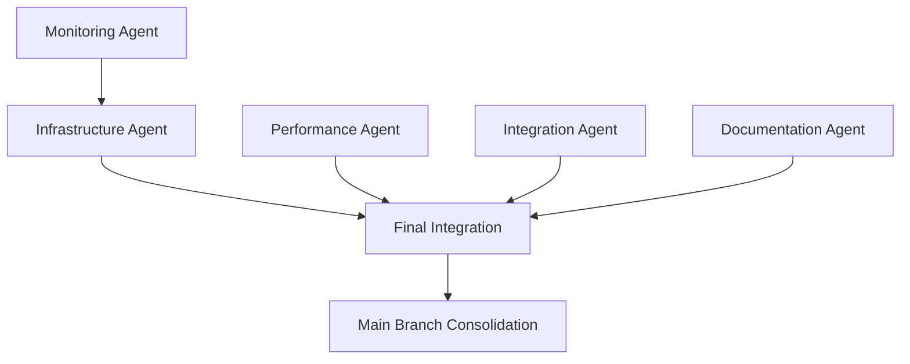

# Agent Coordination Dashboard
## Foundation Epic Phase 2 - Multi-Agent Execution Status

### 🚀 ACTIVE AGENT FLEET STATUS

| Agent ID | Type | Mission | Status | Timeline | Progress |
|----------|------|---------|--------|----------|----------|
| `infrastructure-Jul-17-0822` | Infrastructure | State Management Scalability | 🟢 ACTIVE | 4-5h | SQLite bottleneck analysis |
| `performance-Jul-17-0823` | Quality/Performance | Technical Debt Reduction | 🟢 ACTIVE | 3-4h | Analysis reports processing |
| `integration-specialist-Jul-17-0824` | Integration | Repository Cleanup | 🟢 ACTIVE | 2-3h | Branch/issue management |
| `monitoring-Jul-17-0824` | Observability | Production Monitoring | 🟢 ACTIVE | 3-4h | Metrics & alerting framework |
| `frontend-Jul-17-0824` | Documentation | Architecture Consolidation | 🟢 ACTIVE | 2-3h | ARCHITECTURE.md creation |

### 📊 MISSION CRITICAL OBJECTIVES

#### 🏗️ Infrastructure Agent (`infrastructure-Jul-17-0822`)
**PRIMARY MISSION:** Resolve SQLite state management bottleneck identified by Gemini expert analysis
- ✅ **Spawned:** 08:22 UTC
- 🎯 **Key Deliverables:**
  - SQLite bottleneck analysis and performance benchmarks
  - PostgreSQL migration strategy with implementation plan
  - Redis integration for ephemeral state and event queues
  - Distributed state architecture blueprint for production
- ⚠️ **Critical Dependencies:** None (Independent critical path)
- 🚨 **Escalation Triggers:** Database migration complexity, cross-agent state conflicts

#### 🔧 Performance/Quality Agent (`performance-Jul-17-0823`)
**PRIMARY MISSION:** Aggressive technical debt reduction based on analysis reports
- ✅ **Spawned:** 08:23 UTC
- 🎯 **Key Deliverables:**
  - Zero mypy violations across entire codebase
  - Zero pylint violations with enforced standards
  - Dead code removal with impact analysis
  - Enhanced pre-commit hooks with stricter quality gates
- ⚠️ **Critical Dependencies:** None (Independent critical path)
- 🚨 **Escalation Triggers:** Critical code dependencies affected, type annotation complexity

#### 🔄 Integration Specialist Agent (`integration-specialist-Jul-17-0824`)
**PRIMARY MISSION:** Repository cleanup and GitHub project synchronization
- ✅ **Spawned:** 08:24 UTC
- 🎯 **Key Deliverables:**
  - Clean branch structure with only active development branches
  - Updated GitHub project board reflecting accurate current status
  - Main branch integration of Foundation Epic Phase 2 work
  - Repository cleanup report with deleted branches and updated issues
- ⚠️ **Critical Dependencies:** Coordination with other agents before branch deletion
- 🚨 **Escalation Triggers:** Branch deletion affecting active work, GitHub API limits

#### 📊 Monitoring/Observability Agent (`monitoring-Jul-17-0824`)
**PRIMARY MISSION:** Production-ready monitoring and alerting framework
- ✅ **Spawned:** 08:24 UTC
- 🎯 **Key Deliverables:**
  - Agent performance metrics dashboard with business KPIs
  - Automated alerting for SQLite contention and context usage
  - End-to-end distributed tracing for complete task workflows
  - Production monitoring runbook and escalation procedures
- ⚠️ **Critical Dependencies:** Infrastructure agent's state management work
- 🚨 **Escalation Triggers:** OpenTelemetry integration issues, alerting conflicts

#### 📚 Documentation Agent (`frontend-Jul-17-0824`)
**PRIMARY MISSION:** Consolidated, authoritative documentation architecture
- ✅ **Spawned:** 08:24 UTC
- 🎯 **Key Deliverables:**
  - Single source of truth ARCHITECTURE.md file
  - Cleaned documentation structure in docs/ directory
  - Updated README with clear system overview
  - Agent communication pattern documentation
- ⚠️ **Critical Dependencies:** Input from all other agents for architecture docs
- 🚨 **Escalation Triggers:** Documentation conflicts, architecture complexity

### 🎛️ COORDINATION PROTOCOL

#### Hourly Checkpoint Schedule
- **T+1 Hour (09:25):** Infrastructure + Performance agents status check
- **T+2 Hours (10:25):** Integration + Monitoring agents status check
- **T+3 Hours (11:25):** Documentation agent + cross-agent dependency review
- **T+4 Hours (12:25):** Integration preparation and conflict resolution
- **T+5 Hours (13:25):** Final deliverable consolidation

#### Inter-Agent Communication Rules
1. **No Direct Agent-to-Agent Communication:** All coordination via PM (this session)
2. **Branch Isolation:** Each agent works on separate feature branches
3. **Conflict Escalation:** Immediate escalation to PM for any cross-agent dependencies
4. **Progress Reporting:** Status updates via agent status monitoring every hour

#### Critical Success Dependencies

### 🚨 RISK MITIGATION MATRIX

| Risk | Probability | Impact | Mitigation Strategy |
|------|-------------|--------|-------------------|
| Agent conflicts over shared files | Medium | High | Branch isolation + PM coordination |
| SQLite migration complexity | High | Critical | Infrastructure agent escalation trigger |
| Technical debt cleanup breaking critical code | Medium | High | Performance agent testing requirements |
| Branch deletion affecting active work | Low | Critical | Integration agent coordination locks |
| Documentation conflicts from multiple sources | Medium | Medium | Documentation agent consolidation strategy |

### 📈 SUCCESS METRICS

#### Expected Completion Timeline
- **Infrastructure Critical Path:** 4-5 hours → 🎯 **Target: 12:25 UTC**
- **Quality Critical Path:** 3-4 hours → 🎯 **Target: 11:25 UTC**
- **Repository Management:** 2-3 hours → 🎯 **Target: 10:25 UTC**
- **Monitoring Framework:** 3-4 hours → 🎯 **Target: 11:25 UTC**
- **Documentation:** 2-3 hours → 🎯 **Target: 10:25 UTC**

#### Quality Gates Before Integration
- ✅ All agents pass enhanced pre-commit hooks
- ✅ Cross-agent coordination conflicts resolved
- ✅ Test suites pass on all agent branches
- ✅ Performance benchmarks meet requirements
- ✅ Documentation accuracy validated

### 🎯 EXPECTED DELIVERABLES

**Infrastructure Foundation:**
- Production-ready state management with PostgreSQL migration path
- SQLite bottleneck eliminated with performance benchmarks
- Redis integration operational for ephemeral state

**Quality Foundation:**
- Zero technical debt violations with automated enforcement
- Enhanced quality gates preventing future technical debt accumulation
- Clean codebase ready for production deployment

**Repository Foundation:**
- Clean, organized repository structure
- Accurate GitHub project tracking
- Consolidated main branch with Foundation Epic Phase 2 work

**Observability Foundation:**
- Production monitoring and alerting operational
- Agent performance metrics dashboard
- End-to-end distributed tracing for debugging

**Documentation Foundation:**
- Single source of truth ARCHITECTURE.md
- Clear system overview enabling team onboarding
- Agent communication patterns documented

**OUTCOME:** Foundation Epic Phase 2 Sprint 1 ready to begin with Security & Authentication implementation on production-ready, scalable platform.

---

**Last Updated:** 2025-07-17 08:25 UTC | **PM Agent:** `main-branch-coordination` | **Status:** 🟢 COORDINATING