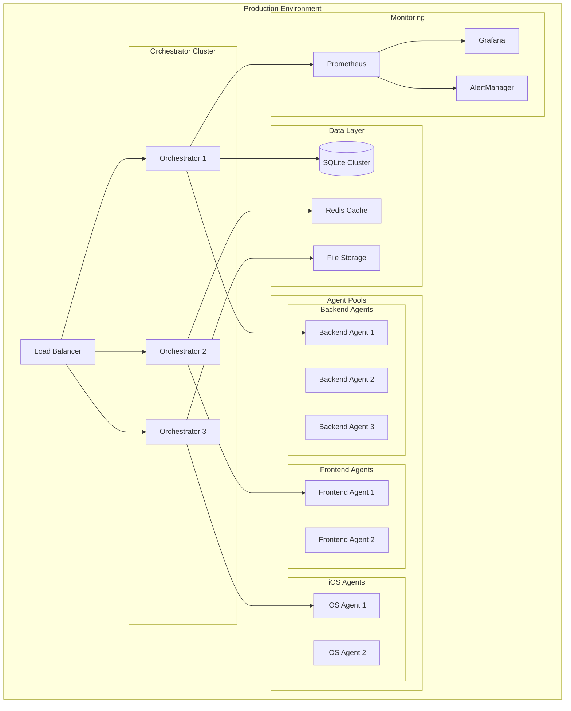

# Deployment Guide

Comprehensive deployment guide for LeanVibe Agent Hive - covering production deployment strategies, Docker configuration, monitoring and observability, security considerations, and scalability planning.

## Table of Contents

- [Overview](#overview)
- [Deployment Strategies](#deployment-strategies)
- [Docker Configuration](#docker-configuration)
- [Production Environment Setup](#production-environment-setup)
- [Security Considerations](#security-considerations)
- [Monitoring and Observability](#monitoring-and-observability)
- [Scalability and Performance](#scalability-and-performance)
- [Backup and Recovery](#backup-and-recovery)
- [CI/CD Pipeline](#cicd-pipeline)
- [Troubleshooting Production Issues](#troubleshooting-production-issues)

## Overview

LeanVibe Agent Hive is designed for production deployment with high availability, scalability, and security. This guide covers deployment from single-instance setups to large-scale distributed environments.

### Production Readiness Checklist

- [x] **Phase 1 Complete**: Quality foundation with 106+ tests
- [x] **Phase 2.1 Operational**: Multi-agent coordination with 95%+ efficiency
- [x] **Performance Validated**: <500ms coordination latency, <5 min MTTR
- [x] **Security Framework**: Configuration management and access controls
- [ ] **Phase 2.2-2.5**: Advanced ML, API integration, monitoring, HA (in progress)

### Architecture Overview for Deployment



## Deployment Strategies

### Single Instance Deployment

**Use Case**: Development, testing, small teams (<5 developers)

#### Docker Compose Setup

```yaml
# docker-compose.yml
version: '3.8'

services:
  agent-hive:
    build: .
    container_name: agent-hive
    restart: unless-stopped
    ports:
      - "8080:8080"
    environment:
      - LEANVIBE_SYSTEM_LOG_LEVEL=INFO
      - LEANVIBE_SYSTEM_DEBUG_MODE=false
      - LEANVIBE_MULTI_AGENT_MAX_AGENTS=5
    volumes:
      - ./data:/app/data
      - ./logs:/app/logs
      - ./config:/app/.claude/config
    healthcheck:
      test: ["CMD", "python", "-c", "from claude.utils.health_check import basic_health_check; basic_health_check()"]
      interval: 30s
      timeout: 10s
      retries: 3
      start_period: 40s

  redis:
    image: redis:7-alpine
    container_name: agent-hive-redis
    restart: unless-stopped
    ports:
      - "6379:6379"
    volumes:
      - redis_data:/data

  prometheus:
    image: prom/prometheus:latest
    container_name: agent-hive-prometheus
    restart: unless-stopped
    ports:
      - "9090:9090"
    volumes:
      - ./monitoring/prometheus.yml:/etc/prometheus/prometheus.yml
      - prometheus_data:/prometheus

volumes:
  redis_data:
  prometheus_data:
```

#### Quick Start

```bash
# Clone and setup
git clone https://github.com/leanvibe/agent-hive.git
cd agent-hive

# Create production configuration
cp .claude/config/config.yaml.production .claude/config/config.yaml

# Build and deploy
docker-compose up -d

# Verify deployment
docker-compose ps
docker-compose logs agent-hive
```

### High Availability Deployment

**Use Case**: Production environments, teams >10 developers, critical workloads

#### Kubernetes Configuration

```yaml
# k8s/namespace.yaml
apiVersion: v1
kind: Namespace
metadata:
  name: agent-hive
  labels:
    app: agent-hive
    environment: production

---
# k8s/configmap.yaml
apiVersion: v1
kind: ConfigMap
metadata:
  name: agent-hive-config
  namespace: agent-hive
data:
  config.yaml: |
    system:
      log_level: INFO
      debug_mode: false
      max_concurrent_tasks: 50
    
    multi_agent:
      enabled: true
      max_agents: 20
      min_agents: 5
      load_balancing_strategy: "least_loaded"
      health_check_interval: 30
    
    resources:
      monitoring:
        cpu: true
        memory: true
        disk: true
        network: true
      allocation:
        cpu_limit_percent: 80
        memory_limit_percent: 75
    
    scaling:
      enabled: true
      auto_scale: true
      strategies:
        scale_up:
          threshold: 0.8
          factor: 1.5
          max_instances: 20
        scale_down:
          threshold: 0.3
          factor: 0.7
          min_instances: 5

---
# k8s/deployment.yaml
apiVersion: apps/v1
kind: Deployment
metadata:
  name: agent-hive-orchestrator
  namespace: agent-hive
  labels:
    app: agent-hive
    component: orchestrator
spec:
  replicas: 3
  strategy:
    type: RollingUpdate
    rollingUpdate:
      maxSurge: 1
      maxUnavailable: 0
  selector:
    matchLabels:
      app: agent-hive
      component: orchestrator
  template:
    metadata:
      labels:
        app: agent-hive
        component: orchestrator
    spec:
      containers:
      - name: orchestrator
        image: leanvibe/agent-hive:latest
        ports:
        - containerPort: 8080
          name: http
        - containerPort: 8081
          name: metrics
        env:
        - name: LEANVIBE_SYSTEM_LOG_LEVEL
          value: "INFO"
        - name: LEANVIBE_MULTI_AGENT_MAX_AGENTS
          value: "20"
        - name: LEANVIBE_RESOURCES_CPU_LIMIT_PERCENT
          value: "80"
        resources:
          requests:
            cpu: 500m
            memory: 1Gi
          limits:
            cpu: 2
            memory: 4Gi
        livenessProbe:
          httpGet:
            path: /health
            port: 8080
          initialDelaySeconds: 30
          periodSeconds: 10
          timeoutSeconds: 5
        readinessProbe:
          httpGet:
            path: /ready
            port: 8080
          initialDelaySeconds: 5
          periodSeconds: 5
          timeoutSeconds: 3
        volumeMounts:
        - name: config
          mountPath: /app/.claude/config
        - name: data
          mountPath: /app/data
      volumes:
      - name: config
        configMap:
          name: agent-hive-config
      - name: data
        persistentVolumeClaim:
          claimName: agent-hive-data

---
# k8s/service.yaml
apiVersion: v1
kind: Service
metadata:
  name: agent-hive-service
  namespace: agent-hive
  labels:
    app: agent-hive
spec:
  selector:
    app: agent-hive
    component: orchestrator
  ports:
  - name: http
    port: 80
    targetPort: 8080
  - name: metrics
    port: 8081
    targetPort: 8081
  type: ClusterIP

---
# k8s/ingress.yaml
apiVersion: networking.k8s.io/v1
kind: Ingress
metadata:
  name: agent-hive-ingress
  namespace: agent-hive
  annotations:
    kubernetes.io/ingress.class: nginx
    cert-manager.io/cluster-issuer: letsencrypt-prod
    nginx.ingress.kubernetes.io/rate-limit: "100"
    nginx.ingress.kubernetes.io/ssl-redirect: "true"
spec:
  tls:
  - hosts:
    - agent-hive.example.com
    secretName: agent-hive-tls
  rules:
  - host: agent-hive.example.com
    http:
      paths:
      - path: /
        pathType: Prefix
        backend:
          service:
            name: agent-hive-service
            port:
              number: 80
```

#### Deployment Commands

```bash
# Apply Kubernetes configuration
kubectl apply -f k8s/

# Verify deployment
kubectl get pods -n agent-hive
kubectl get services -n agent-hive
kubectl logs -n agent-hive -l app=agent-hive --tail=100

# Scale deployment
kubectl scale deployment agent-hive-orchestrator --replicas=5 -n agent-hive

# Rolling update
kubectl set image deployment/agent-hive-orchestrator orchestrator=leanvibe/agent-hive:v2.1 -n agent-hive
```

## Docker Configuration

### Multi-Stage Dockerfile

```dockerfile
# Dockerfile
FROM python:3.12-slim as builder

# Install UV for dependency management
RUN pip install uv

# Set work directory
WORKDIR /app

# Copy dependency files
COPY pyproject.toml uv.lock ./

# Install dependencies
RUN uv sync --frozen --no-dev

# Production stage
FROM python:3.12-slim as production

# Install runtime dependencies
RUN apt-get update && apt-get install -y \
    curl \
    sqlite3 \
    && rm -rf /var/lib/apt/lists/*

# Create non-root user
RUN groupadd -r agent-hive && useradd -r -g agent-hive agent-hive

# Set work directory
WORKDIR /app

# Copy virtual environment from builder
COPY --from=builder /app/.venv /app/.venv

# Make sure to use venv
ENV PATH="/app/.venv/bin:$PATH"

# Copy application code
COPY . .

# Create necessary directories
RUN mkdir -p /app/data /app/logs \
    && chown -R agent-hive:agent-hive /app

# Switch to non-root user
USER agent-hive

# Expose ports
EXPOSE 8080 8081

# Health check
HEALTHCHECK --interval=30s --timeout=10s --start-period=30s --retries=3 \
    CMD python -c "from claude.utils.health_check import basic_health_check; basic_health_check()" || exit 1

# Default command
CMD ["python", ".claude/orchestrator.py"]
```

### Docker Compose for Development

```yaml
# docker-compose.dev.yml
version: '3.8'

services:
  agent-hive:
    build:
      context: .
      target: development
    volumes:
      - .:/app
      - ~/.cache/uv:/root/.cache/uv
    environment:
      - LEANVIBE_SYSTEM_DEBUG_MODE=true
      - LEANVIBE_DEVELOPMENT_USE_MOCK_CLI=true
    ports:
      - "8080:8080"
      - "8081:8081"
    command: uv run python .claude/orchestrator.py --dev
    
  postgres:
    image: postgres:15-alpine
    environment:
      POSTGRES_DB: agent_hive_dev
      POSTGRES_USER: dev
      POSTGRES_PASSWORD: dev_password
    ports:
      - "5432:5432"
    volumes:
      - postgres_dev_data:/var/lib/postgresql/data

volumes:
  postgres_dev_data:
```

### Build and Push Images

```bash
# Build multi-platform images
docker buildx create --use
docker buildx build --platform linux/amd64,linux/arm64 -t leanvibe/agent-hive:latest .

# Tag and push
docker tag leanvibe/agent-hive:latest leanvibe/agent-hive:v2.1
docker push leanvibe/agent-hive:latest
docker push leanvibe/agent-hive:v2.1

# Development build
docker-compose -f docker-compose.dev.yml up --build
```

## Production Environment Setup

### Environment Configuration

#### Production Configuration Template

```yaml
# .claude/config/config.production.yaml
system:
  log_level: INFO
  debug_mode: false
  max_concurrent_tasks: 100

# Multi-agent production settings
multi_agent:
  enabled: true
  max_agents: 50
  min_agents: 10
  load_balancing_strategy: "predictive"
  health_check_interval: 15
  failure_threshold: 3
  coordination_timeout: 30

# Resource management for production
resources:
  monitoring:
    cpu: true
    memory: true
    disk: true
    network: true
    interval_seconds: 5
  
  allocation:
    cpu_limit_percent: 85
    memory_limit_percent: 80
    disk_limit_percent: 90
    
  thresholds:
    warning: 75
    critical: 90

# Production scaling configuration
scaling:
  enabled: true
  auto_scale: true
  strategies:
    scale_up:
      threshold: 0.75
      factor: 1.3
      max_instances: 50
    scale_down:
      threshold: 0.25
      factor: 0.8
      min_instances: 10
  cooldown_minutes: 3

# Agent types for production
agents:
  backend:
    max_instances: 20
    capabilities: ["python", "api", "database", "microservices"]
    resource_requirements:
      cpu_cores: 2
      memory_mb: 2048
      disk_mb: 1024
  
  frontend:
    max_instances: 15
    capabilities: ["javascript", "typescript", "react", "vue", "ui"]
    resource_requirements:
      cpu_cores: 1
      memory_mb: 1024
      disk_mb: 512
      
  ios:
    max_instances: 10
    capabilities: ["swift", "mobile", "ui", "app_store"]
    resource_requirements:
      cpu_cores: 4
      memory_mb: 4096
      disk_mb: 2048
      
  infrastructure:
    max_instances: 8
    capabilities: ["docker", "kubernetes", "terraform", "monitoring"]
    resource_requirements:
      cpu_cores: 2
      memory_mb: 2048
      disk_mb: 1024

# Production database settings
database:
  connection_pool_size: 20
  max_overflow: 30
  pool_timeout: 30
  pool_recycle: 3600
  echo: false

# Logging configuration
logging:
  level: INFO
  format: json
  handlers:
    - console
    - file
    - syslog
  file:
    path: /app/logs/orchestrator.log
    max_size: 100MB
    backup_count: 10
  syslog:
    facility: local0
    address: ['localhost', 514]

# Monitoring and metrics
monitoring:
  enabled: true
  metrics_port: 8081
  health_check_port: 8080
  prometheus:
    enabled: true
    path: /metrics
  alerts:
    enabled: true
    webhook_url: "https://hooks.slack.com/services/YOUR/SLACK/WEBHOOK"
```

#### Environment Variables

```bash
# Production environment variables
export LEANVIBE_SYSTEM_LOG_LEVEL=INFO
export LEANVIBE_SYSTEM_DEBUG_MODE=false

# Multi-agent settings
export LEANVIBE_MULTI_AGENT_MAX_AGENTS=50
export LEANVIBE_MULTI_AGENT_LOAD_BALANCING_STRATEGY=predictive

# Resource limits
export LEANVIBE_RESOURCES_CPU_LIMIT_PERCENT=85
export LEANVIBE_RESOURCES_MEMORY_LIMIT_PERCENT=80

# Database settings
export LEANVIBE_DATABASE_URL=postgresql://user:pass@db:5432/agent_hive
export LEANVIBE_DATABASE_POOL_SIZE=20

# Security settings
export LEANVIBE_SECURITY_SECRET_KEY=your-secret-key-here
export LEANVIBE_SECURITY_API_KEY=your-api-key-here

# External service URLs
export CLAUDE_API_URL=https://api.anthropic.com
export GEMINI_API_URL=https://generativelanguage.googleapis.com
```

### Performance Tuning

#### System Optimization

```bash
# Linux system tuning for high performance
# /etc/sysctl.conf additions

# Network optimization
net.core.rmem_max = 16777216
net.core.wmem_max = 16777216
net.ipv4.tcp_rmem = 4096 16384 16777216
net.ipv4.tcp_wmem = 4096 16384 16777216

# File descriptor limits
fs.file-max = 1000000

# Memory optimization
vm.swappiness = 10
vm.dirty_ratio = 15
vm.dirty_background_ratio = 5
```

#### Application Tuning

```python
# Production performance settings
import asyncio
import gc

# Optimize asyncio event loop
asyncio.set_event_loop_policy(asyncio.WindowsProactorEventLoopPolicy())  # Windows
# OR
asyncio.set_event_loop_policy(asyncio.UnixDefaultEventLoopPolicy())     # Unix/Linux

# Garbage collection optimization
gc.set_threshold(700, 10, 10)

# Python optimization
import sys
sys.dont_write_bytecode = True  # Reduce I/O in containerized environments
```

## Security Considerations

### Authentication and Authorization

#### API Security

```python
# Security configuration
from fastapi import FastAPI, Depends, HTTPException, status
from fastapi.security import HTTPBearer, HTTPAuthorizationCredentials
import jwt

app = FastAPI()
security = HTTPBearer()

async def verify_token(credentials: HTTPAuthorizationCredentials = Depends(security)):
    """Verify JWT token for API access."""
    try:
        payload = jwt.decode(
            credentials.credentials,
            SECRET_KEY,
            algorithms=["HS256"]
        )
        username: str = payload.get("sub")
        if username is None:
            raise HTTPException(
                status_code=status.HTTP_401_UNAUTHORIZED,
                detail="Invalid authentication credentials",
                headers={"WWW-Authenticate": "Bearer"},
            )
        return username
    except jwt.PyJWTError:
        raise HTTPException(
            status_code=status.HTTP_401_UNAUTHORIZED,
            detail="Invalid authentication credentials",
            headers={"WWW-Authenticate": "Bearer"},
        )

@app.get("/orchestrator/status")
async def get_status(current_user: str = Depends(verify_token)):
    """Get orchestrator status (authenticated endpoint)."""
    # Implementation
    pass
```

#### Network Security

```yaml
# Network policies for Kubernetes
apiVersion: networking.k8s.io/v1
kind: NetworkPolicy
metadata:
  name: agent-hive-network-policy
  namespace: agent-hive
spec:
  podSelector:
    matchLabels:
      app: agent-hive
  policyTypes:
  - Ingress
  - Egress
  ingress:
  - from:
    - namespaceSelector:
        matchLabels:
          name: ingress-nginx
    ports:
    - protocol: TCP
      port: 8080
  egress:
  - to: []
    ports:
    - protocol: TCP
      port: 443  # HTTPS
    - protocol: TCP
      port: 53   # DNS
    - protocol: UDP
      port: 53   # DNS
```

### Secrets Management

#### Kubernetes Secrets

```yaml
# secrets.yaml
apiVersion: v1
kind: Secret
metadata:
  name: agent-hive-secrets
  namespace: agent-hive
type: Opaque
data:
  secret-key: <base64-encoded-secret>
  api-key: <base64-encoded-api-key>
  database-password: <base64-encoded-password>
```

#### External Secrets Integration

```yaml
# external-secrets.yaml
apiVersion: external-secrets.io/v1beta1
kind: SecretStore
metadata:
  name: vault-backend
  namespace: agent-hive
spec:
  provider:
    vault:
      server: "https://vault.example.com"
      path: "secret"
      version: "v2"
      auth:
        kubernetes:
          mountPath: "kubernetes"
          role: "agent-hive"
---
apiVersion: external-secrets.io/v1beta1
kind: ExternalSecret
metadata:
  name: agent-hive-external-secrets
  namespace: agent-hive
spec:
  refreshInterval: 15s
  secretStoreRef:
    name: vault-backend
    kind: SecretStore
  target:
    name: agent-hive-secrets
    creationPolicy: Owner
  data:
  - secretKey: secret-key
    remoteRef:
      key: agent-hive
      property: secret_key
```

### Security Hardening

#### Container Security

```dockerfile
# Security-hardened Dockerfile
FROM python:3.12-slim

# Install security updates
RUN apt-get update && apt-get upgrade -y \
    && apt-get install -y --no-install-recommends \
        curl \
        sqlite3 \
    && rm -rf /var/lib/apt/lists/*

# Create non-root user with minimal privileges
RUN groupadd -r -g 1001 agent-hive \
    && useradd -r -g agent-hive -u 1001 -m -d /app agent-hive

# Set secure file permissions
COPY --chown=agent-hive:agent-hive . /app
WORKDIR /app

# Remove unnecessary files
RUN find /app -name "*.pyc" -delete \
    && find /app -name "__pycache__" -delete

# Switch to non-root user
USER 1001:1001

# Security labels
LABEL security.contact="security@leanvibe.com"
LABEL security.scan-policy="scan-on-build"
```

## Monitoring and Observability

### Prometheus Configuration

```yaml
# monitoring/prometheus.yml
global:
  scrape_interval: 15s
  evaluation_interval: 15s

rule_files:
  - "agent_hive_rules.yml"

scrape_configs:
  - job_name: 'agent-hive'
    static_configs:
      - targets: ['agent-hive:8081']
    metrics_path: /metrics
    scrape_interval: 10s
    
  - job_name: 'kubernetes-pods'
    kubernetes_sd_configs:
      - role: pod
    relabel_configs:
      - source_labels: [__meta_kubernetes_pod_annotation_prometheus_io_scrape]
        action: keep
        regex: true
      - source_labels: [__meta_kubernetes_pod_annotation_prometheus_io_path]
        action: replace
        target_label: __metrics_path__
        regex: (.+)
```

### Grafana Dashboards

```json
{
  "dashboard": {
    "title": "LeanVibe Agent Hive - Production Dashboard",
    "panels": [
      {
        "title": "Agent Coordination Latency",
        "type": "graph",
        "targets": [
          {
            "expr": "agent_hive_coordination_latency_ms"
          }
        ],
        "yAxes": [
          {
            "label": "Milliseconds",
            "max": 500
          }
        ]
      },
      {
        "title": "Resource Utilization",
        "type": "singlestat",
        "targets": [
          {
            "expr": "agent_hive_resource_utilization_percent"
          }
        ],
        "thresholds": "75,90"
      },
      {
        "title": "Active Agents",
        "type": "graph",
        "targets": [
          {
            "expr": "agent_hive_active_agents_total"
          }
        ]
      },
      {
        "title": "Task Throughput",
        "type": "graph",
        "targets": [
          {
            "expr": "rate(agent_hive_tasks_completed_total[5m])"
          }
        ]
      }
    ]
  }
}
```

### Custom Metrics

```python
# Prometheus metrics integration
from prometheus_client import Counter, Histogram, Gauge, start_http_server

# Define custom metrics
COORDINATION_LATENCY = Histogram(
    'agent_hive_coordination_latency_seconds',
    'Time spent coordinating agents',
    buckets=(0.1, 0.25, 0.5, 0.75, 1.0, 2.5, 5.0, 7.5, 10.0, float('inf'))
)

ACTIVE_AGENTS = Gauge(
    'agent_hive_active_agents_total',
    'Number of active agents'
)

TASKS_COMPLETED = Counter(
    'agent_hive_tasks_completed_total',
    'Total number of completed tasks',
    ['agent_type', 'status']
)

RESOURCE_UTILIZATION = Gauge(
    'agent_hive_resource_utilization_percent',
    'Current resource utilization percentage'
)

# Instrument code
@COORDINATION_LATENCY.time()
async def coordinate_agents(self, tasks):
    # Implementation
    pass

def update_metrics(self):
    """Update Prometheus metrics."""
    ACTIVE_AGENTS.set(len(self.active_agents))
    RESOURCE_UTILIZATION.set(self.get_resource_utilization())
```

### Alerting Rules

```yaml
# monitoring/agent_hive_rules.yml
groups:
  - name: agent_hive_alerts
    rules:
      - alert: HighCoordinationLatency
        expr: agent_hive_coordination_latency_ms > 500
        for: 2m
        labels:
          severity: warning
        annotations:
          summary: "Agent coordination latency is high"
          description: "Coordination latency has been above 500ms for more than 2 minutes"
          
      - alert: LowResourceUtilization
        expr: agent_hive_resource_utilization_percent < 30
        for: 5m
        labels:
          severity: info
        annotations:
          summary: "Resource utilization is low"
          description: "System may be over-provisioned"
          
      - alert: AgentFailure
        expr: increase(agent_hive_agent_failures_total[5m]) > 5
        for: 1m
        labels:
          severity: critical
        annotations:
          summary: "Multiple agent failures detected"
          description: "{{ $value }} agent failures in the last 5 minutes"
          
      - alert: SystemOverload
        expr: agent_hive_resource_utilization_percent > 90
        for: 1m
        labels:
          severity: critical
        annotations:
          summary: "System resource utilization critical"
          description: "Resource utilization has been above 90% for more than 1 minute"
```

## Scalability and Performance

### Horizontal Scaling

#### Auto-scaling Configuration

```yaml
# k8s/hpa.yaml
apiVersion: autoscaling/v2
kind: HorizontalPodAutoscaler
metadata:
  name: agent-hive-hpa
  namespace: agent-hive
spec:
  scaleTargetRef:
    apiVersion: apps/v1
    kind: Deployment
    name: agent-hive-orchestrator
  minReplicas: 3
  maxReplicas: 20
  metrics:
  - type: Resource
    resource:
      name: cpu
      target:
        type: Utilization
        averageUtilization: 70
  - type: Resource
    resource:
      name: memory
      target:
        type: Utilization
        averageUtilization: 80
  - type: Pods
    pods:
      metric:
        name: agent_hive_coordination_latency_ms
      target:
        type: AverageValue
        averageValue: 300m
  behavior:
    scaleUp:
      stabilizationWindowSeconds: 60
      policies:
      - type: Percent
        value: 50
        periodSeconds: 60
    scaleDown:
      stabilizationWindowSeconds: 300
      policies:
      - type: Percent
        value: 25
        periodSeconds: 60
```

#### Cluster Auto-scaling

```yaml
# cluster-autoscaler.yaml
apiVersion: apps/v1
kind: Deployment
metadata:
  name: cluster-autoscaler
  namespace: kube-system
spec:
  template:
    spec:
      containers:
      - image: k8s.gcr.io/autoscaling/cluster-autoscaler:v1.21.0
        name: cluster-autoscaler
        command:
        - ./cluster-autoscaler
        - --v=4
        - --stderrthreshold=info
        - --cloud-provider=aws
        - --skip-nodes-with-local-storage=false
        - --expander=least-waste
        - --node-group-auto-discovery=asg:tag=k8s.io/cluster-autoscaler/enabled,k8s.io/cluster-autoscaler/agent-hive
        - --balance-similar-node-groups
        - --scale-down-enabled=true
        - --scale-down-delay-after-add=10m
        - --scale-down-unneeded-time=10m
```

### Performance Optimization

#### Database Optimization

```python
# Database connection pooling and optimization
from sqlalchemy import create_engine
from sqlalchemy.pool import QueuePool

engine = create_engine(
    DATABASE_URL,
    poolclass=QueuePool,
    pool_size=20,
    max_overflow=30,
    pool_pre_ping=True,
    pool_recycle=3600,
    echo=False
)

# SQLite optimizations for single-instance deployments
def optimize_sqlite(connection):
    """Apply SQLite performance optimizations."""
    connection.execute("PRAGMA journal_mode=WAL")
    connection.execute("PRAGMA synchronous=NORMAL")
    connection.execute("PRAGMA cache_size=10000")
    connection.execute("PRAGMA temp_store=MEMORY")
    connection.execute("PRAGMA mmap_size=268435456")  # 256MB
```

#### Caching Strategy

```python
# Redis caching for improved performance
import redis
import json
from typing import Optional, Any

class CacheManager:
    """Production-ready caching manager."""
    
    def __init__(self, redis_url: str):
        self.redis = redis.from_url(redis_url, decode_responses=True)
        
    async def get(self, key: str) -> Optional[Any]:
        """Get cached value."""
        try:
            value = self.redis.get(key)
            return json.loads(value) if value else None
        except Exception:
            return None
            
    async def set(self, key: str, value: Any, ttl: int = 300):
        """Set cached value with TTL."""
        try:
            self.redis.setex(key, ttl, json.dumps(value))
        except Exception:
            pass  # Graceful degradation
            
    async def invalidate_pattern(self, pattern: str):
        """Invalidate cache keys matching pattern."""
        keys = self.redis.keys(pattern)
        if keys:
            self.redis.delete(*keys)
```

## Backup and Recovery

### Data Backup Strategy

#### Database Backup

```bash
#!/bin/bash
# backup_database.sh

BACKUP_DIR="/app/backups"
TIMESTAMP=$(date +%Y%m%d_%H%M%S)
DATABASE_FILE="/app/data/agent_hive.db"

# Create backup directory
mkdir -p "$BACKUP_DIR"

# SQLite backup
sqlite3 "$DATABASE_FILE" ".backup $BACKUP_DIR/agent_hive_$TIMESTAMP.db"

# Compress backup
gzip "$BACKUP_DIR/agent_hive_$TIMESTAMP.db"

# Upload to cloud storage (example with AWS S3)
aws s3 cp "$BACKUP_DIR/agent_hive_$TIMESTAMP.db.gz" "s3://agent-hive-backups/database/"

# Clean up old local backups (keep last 7 days)
find "$BACKUP_DIR" -name "agent_hive_*.db.gz" -mtime +7 -delete

echo "Database backup completed: agent_hive_$TIMESTAMP.db.gz"
```

#### Configuration Backup

```bash
#!/bin/bash
# backup_config.sh

BACKUP_DIR="/app/backups"
TIMESTAMP=$(date +%Y%m%d_%H%M%S)
CONFIG_DIR="/app/.claude/config"

# Create backup
tar -czf "$BACKUP_DIR/config_$TIMESTAMP.tar.gz" -C "$CONFIG_DIR" .

# Upload to cloud storage
aws s3 cp "$BACKUP_DIR/config_$TIMESTAMP.tar.gz" "s3://agent-hive-backups/config/"

echo "Configuration backup completed: config_$TIMESTAMP.tar.gz"
```

### Disaster Recovery

#### Recovery Procedures

```bash
#!/bin/bash
# disaster_recovery.sh

# 1. Restore database
LATEST_DB_BACKUP=$(aws s3 ls s3://agent-hive-backups/database/ | sort | tail -n 1 | awk '{print $4}')
aws s3 cp "s3://agent-hive-backups/database/$LATEST_DB_BACKUP" /tmp/
gunzip "/tmp/$LATEST_DB_BACKUP"
cp "/tmp/${LATEST_DB_BACKUP%.gz}" /app/data/agent_hive.db

# 2. Restore configuration
LATEST_CONFIG_BACKUP=$(aws s3 ls s3://agent-hive-backups/config/ | sort | tail -n 1 | awk '{print $4}')
aws s3 cp "s3://agent-hive-backups/config/$LATEST_CONFIG_BACKUP" /tmp/
tar -xzf "/tmp/$LATEST_CONFIG_BACKUP" -C /app/.claude/config/

# 3. Restart services
kubectl rollout restart deployment/agent-hive-orchestrator -n agent-hive

echo "Disaster recovery completed"
```

#### Health Verification

```python
# health_verification.py
async def verify_system_health():
    """Comprehensive health verification after recovery."""
    
    health_checks = []
    
    # Database connectivity
    try:
        config = ConfigLoader()
        health_checks.append(("Database", "OK"))
    except Exception as e:
        health_checks.append(("Database", f"FAILED: {e}"))
    
    # Agent coordination
    try:
        coordinator = MultiAgentCoordinator()
        status = await coordinator.get_status()
        health_checks.append(("Coordination", "OK"))
    except Exception as e:
        health_checks.append(("Coordination", f"FAILED: {e}"))
    
    # Resource management
    try:
        resource_manager = ResourceManager()
        resources = await resource_manager.get_system_resources()
        health_checks.append(("Resources", "OK"))
    except Exception as e:
        health_checks.append(("Resources", f"FAILED: {e}"))
    
    return health_checks
```

## CI/CD Pipeline

### GitHub Actions Workflow

```yaml
# .github/workflows/deploy.yml
name: Deploy to Production

on:
  push:
    branches: [main]
    tags: ['v*']

env:
  REGISTRY: ghcr.io
  IMAGE_NAME: leanvibe/agent-hive

jobs:
  test:
    runs-on: ubuntu-latest
    steps:
    - uses: actions/checkout@v4
    
    - name: Set up Python
      uses: actions/setup-python@v4
      with:
        python-version: '3.12'
        
    - name: Install UV
      run: |
        curl -LsSf https://astral.sh/uv/install.sh | sh
        source ~/.bashrc
        
    - name: Install dependencies
      run: uv sync
      
    - name: Run tests
      run: uv run pytest --cov=.claude --cov-report=xml
      
    - name: Upload coverage
      uses: codecov/codecov-action@v3

  build:
    needs: test
    runs-on: ubuntu-latest
    outputs:
      image: ${{ steps.image.outputs.image }}
    steps:
    - uses: actions/checkout@v4
    
    - name: Set up Docker Buildx
      uses: docker/setup-buildx-action@v3
      
    - name: Log in to registry
      uses: docker/login-action@v3
      with:
        registry: ${{ env.REGISTRY }}
        username: ${{ github.actor }}
        password: ${{ secrets.GITHUB_TOKEN }}
        
    - name: Extract metadata
      id: meta
      uses: docker/metadata-action@v5
      with:
        images: ${{ env.REGISTRY }}/${{ env.IMAGE_NAME }}
        tags: |
          type=ref,event=branch
          type=ref,event=pr
          type=semver,pattern={{version}}
          type=semver,pattern={{major}}.{{minor}}
          
    - name: Build and push
      uses: docker/build-push-action@v5
      with:
        context: .
        platforms: linux/amd64,linux/arm64
        push: true
        tags: ${{ steps.meta.outputs.tags }}
        labels: ${{ steps.meta.outputs.labels }}
        cache-from: type=gha
        cache-to: type=gha,mode=max
        
    - name: Output image
      id: image
      run: echo "image=${{ env.REGISTRY }}/${{ env.IMAGE_NAME }}:${{ steps.meta.outputs.version }}" >> $GITHUB_OUTPUT

  deploy:
    needs: build
    runs-on: ubuntu-latest
    if: github.ref == 'refs/heads/main'
    environment: production
    steps:
    - uses: actions/checkout@v4
    
    - name: Set up kubectl
      uses: azure/setup-kubectl@v3
      
    - name: Configure kubectl
      run: |
        echo "${{ secrets.KUBECONFIG }}" | base64 -d > /tmp/kubeconfig
        export KUBECONFIG=/tmp/kubeconfig
        
    - name: Deploy to Kubernetes
      run: |
        sed -i 's|image: leanvibe/agent-hive:latest|image: ${{ needs.build.outputs.image }}|' k8s/deployment.yaml
        kubectl apply -f k8s/
        kubectl rollout status deployment/agent-hive-orchestrator -n agent-hive --timeout=300s
        
    - name: Verify deployment
      run: |
        kubectl get pods -n agent-hive
        kubectl logs -n agent-hive -l app=agent-hive --tail=50
```

### Deployment Validation

```python
# deployment_validation.py
import asyncio
import aiohttp
import time

async def validate_deployment(base_url: str, timeout: int = 300):
    """Validate deployment health and readiness."""
    
    start_time = time.time()
    
    async with aiohttp.ClientSession() as session:
        while time.time() - start_time < timeout:
            try:
                # Health check
                async with session.get(f"{base_url}/health") as response:
                    if response.status == 200:
                        health_data = await response.json()
                        print(f"✅ Health check passed: {health_data}")
                        
                        # Readiness check
                        async with session.get(f"{base_url}/ready") as ready_response:
                            if ready_response.status == 200:
                                ready_data = await ready_response.json()
                                print(f"✅ Readiness check passed: {ready_data}")
                                
                                # Performance validation
                                if ready_data.get('coordination_latency_ms', 0) < 500:
                                    print("✅ Deployment validation successful")
                                    return True
                                    
            except Exception as e:
                print(f"⏳ Waiting for deployment: {e}")
                
            await asyncio.sleep(10)
    
    print("❌ Deployment validation failed")
    return False

if __name__ == "__main__":
    asyncio.run(validate_deployment("https://agent-hive.example.com"))
```

## Troubleshooting Production Issues

### Common Production Problems

#### High Memory Usage

```bash
# Investigate memory usage
kubectl top pods -n agent-hive
kubectl describe pod <pod-name> -n agent-hive

# Check for memory leaks
kubectl exec -it <pod-name> -n agent-hive -- python -c "
import gc
import psutil
import os

process = psutil.Process(os.getpid())
print(f'Memory: {process.memory_info().rss / 1024 / 1024:.1f} MB')
print(f'Open files: {process.num_fds()}')
print(f'Threads: {process.num_threads()}')

# Force garbage collection
gc.collect()
print('Garbage collection completed')
"
```

#### Database Performance Issues

```bash
# Check database performance
kubectl exec -it <pod-name> -n agent-hive -- sqlite3 /app/data/agent_hive.db -cmd "
.timer on
.explain query plan SELECT * FROM tasks WHERE status = 'pending';
EXPLAIN QUERY PLAN SELECT * FROM tasks WHERE status = 'pending';
"

# Optimize database
kubectl exec -it <pod-name> -n agent-hive -- sqlite3 /app/data/agent_hive.db -cmd "
VACUUM;
REINDEX;
ANALYZE;
PRAGMA optimize;
"
```

#### Agent Coordination Failures

```bash
# Check coordination status
kubectl exec -it <pod-name> -n agent-hive -- python -c "
from claude.advanced_orchestration.multi_agent_coordinator import MultiAgentCoordinator
coordinator = MultiAgentCoordinator()
status = coordinator.get_status()
print(f'Total agents: {status.total_agents}')
print(f'Healthy agents: {status.healthy_agents}')
print(f'Performance score: {status.performance_score}')

# List unhealthy agents
for agent_id in coordinator.get_unhealthy_agents():
    agent_status = coordinator.get_agent_status(agent_id)
    print(f'Unhealthy agent {agent_id}: {agent_status.status}')
"

# Restart coordination
kubectl exec -it <pod-name> -n agent-hive -- python -c "
from claude.advanced_orchestration.multi_agent_coordinator import MultiAgentCoordinator
coordinator = MultiAgentCoordinator()
coordinator.reset_all_agents()
print('Coordination reset completed')
"
```

### Emergency Procedures

#### System Recovery

```bash
#!/bin/bash
# emergency_recovery.sh

echo "Starting emergency recovery procedure..."

# 1. Scale down to single instance
kubectl scale deployment agent-hive-orchestrator --replicas=1 -n agent-hive

# 2. Wait for scale down
kubectl rollout status deployment/agent-hive-orchestrator -n agent-hive --timeout=120s

# 3. Clear cache and temporary data
kubectl exec -it $(kubectl get pods -n agent-hive -l app=agent-hive -o jsonpath='{.items[0].metadata.name}') -n agent-hive -- sh -c "
rm -rf /tmp/*
find /app/logs -name '*.log' -mtime +1 -delete
"

# 4. Restart with fresh configuration
kubectl rollout restart deployment/agent-hive-orchestrator -n agent-hive

# 5. Scale back up gradually
sleep 60
kubectl scale deployment agent-hive-orchestrator --replicas=3 -n agent-hive

echo "Emergency recovery completed"
```

---

**Deployment Guide Version**: Phase 2.0  
**Last Updated**: July 14, 2025  
**Status**: Production-ready for Phase 1-2 | Ready for Phase 2.2-2.5 deployment enhancements

This deployment guide covers comprehensive production deployment strategies from single-instance to large-scale distributed environments. Regular updates will be provided as new features and deployment patterns are developed.