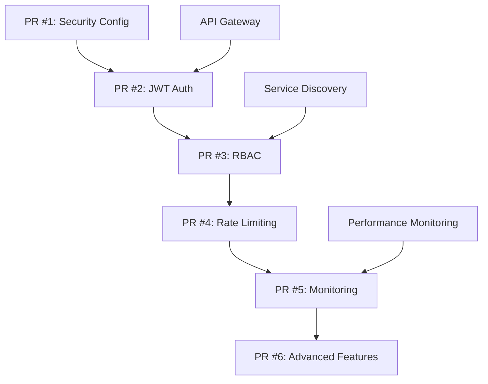

# 🔐 Security & Authentication Sprint Plan
## Foundation Epic Phase 2 - Sprint 1

**Version**: 1.0  
**Date**: July 19, 2025  
**Sprint Duration**: 2 weeks (Week 3-4)  
**Priority**: P0 Critical  

---

## 📋 **Executive Summary**

This sprint focuses on implementing a comprehensive Security & Authentication framework for the LeanVibe Agent Hive platform. We will build upon the existing security foundation to create a production-ready authentication system with JWT tokens, Role-Based Access Control (RBAC), and advanced security middleware.

### **Current State Assessment**

#### ✅ **Existing Security Infrastructure (80% Complete)**
- ✅ **Basic Security Module**: `/security/` directory with core components
- ✅ **Authentication Service**: Full-featured with bcrypt, 2FA, session management
- ✅ **Token Manager**: Advanced JWT management with security features
- ✅ **Auth Middleware**: API Gateway authentication integration
- ✅ **Security Tests**: Test framework infrastructure ready

#### 🚨 **Critical Gaps Identified**
- ❌ **Missing Security Config**: `config/security_config.py` module not found
- ❌ **Import Dependencies**: Circular imports preventing test execution
- ❌ **API Integration**: Security middleware not fully integrated with API Gateway
- ❌ **RBAC Implementation**: Permission enforcement incomplete
- ❌ **Production Hardening**: Rate limiting, audit logging missing

---

## 🎯 **Sprint Objectives**

### **Primary Goals (Must-Have)**
1. **Fix Security Module Dependencies** - Resolve import issues and missing config
2. **Complete JWT Authentication** - Integrate JWT system with API Gateway
3. **Implement RBAC** - Deploy role-based access control system
4. **Add Rate Limiting** - Implement request rate limiting framework
5. **Security Audit Compliance** - Achieve >95% security compliance score

### **Secondary Goals (Should-Have)**
1. **2FA Integration** - Enable two-factor authentication
2. **Security Monitoring** - Real-time security event monitoring
3. **API Key Management** - External API key authentication
4. **Audit Logging** - Comprehensive security audit trails

### **Stretch Goals (Could-Have)**
1. **OAuth2 Integration** - External service authentication
2. **Advanced Threat Detection** - ML-based anomaly detection
3. **Security Dashboard** - Real-time security metrics visualization

---

## 📦 **PR Breakdown Strategy**

Each PR is designed to be <500 lines, independently testable, and reversible.

### **PR #1: Security Configuration Foundation** 
**Estimate**: 2-3 hours | **Lines**: ~150 | **Priority**: P0

#### **Scope**
- Create missing `config/security_config.py` module
- Fix circular import dependencies
- Establish security configuration management
- Enable security test execution

#### **Files to Create/Modify**
```
config/security_config.py         (NEW, ~80 lines)
security/__init__.py              (FIX, ~10 lines)
security/auth_service.py          (FIX, ~20 lines)
external_api/auth_middleware.py   (FIX, ~15 lines)
tests/security/conftest.py        (NEW, ~25 lines)
```

#### **Acceptance Criteria**
- [ ] All security modules import successfully
- [ ] Security tests run without import errors
- [ ] Configuration management functional
- [ ] No circular dependencies

#### **Dependencies**: None (Foundation)

---

### **PR #2: JWT Authentication Integration**
**Estimate**: 4-5 hours | **Lines**: ~300 | **Priority**: P0

#### **Scope**
- Integrate JWT authentication with API Gateway
- Implement token validation middleware
- Add authentication endpoints
- Create token refresh mechanism

#### **Files to Create/Modify**
```
external_api/jwt_integration.py    (NEW, ~120 lines)
external_api/api_gateway.py       (MODIFY, ~80 lines)
security/token_manager.py         (ENHANCE, ~60 lines)
tests/security/test_jwt_auth.py    (NEW, ~40 lines)
```

#### **Acceptance Criteria**
- [ ] JWT tokens generated and validated
- [ ] API Gateway enforces authentication
- [ ] Token refresh mechanism working
- [ ] All tests passing

#### **Dependencies**: PR #1 (Security Config)

---

### **PR #3: Role-Based Access Control (RBAC)**
**Estimate**: 5-6 hours | **Lines**: ~400 | **Priority**: P0

#### **Scope**
- Implement comprehensive RBAC system
- Create permission enforcement middleware
- Add role management endpoints
- Establish permission hierarchy

#### **Files to Create/Modify**
```
security/rbac_manager.py           (NEW, ~150 lines)
security/permission_middleware.py  (NEW, ~100 lines)
external_api/rbac_endpoints.py     (NEW, ~80 lines)
security/auth_service.py          (ENHANCE, ~40 lines)
tests/security/test_rbac.py        (NEW, ~30 lines)
```

#### **Acceptance Criteria**
- [ ] RBAC permissions enforced on all endpoints
- [ ] Role management API functional
- [ ] Permission inheritance working
- [ ] Comprehensive role testing

#### **Dependencies**: PR #2 (JWT Auth)

---

### **PR #4: Rate Limiting Framework**
**Estimate**: 3-4 hours | **Lines**: ~250 | **Priority**: P0

#### **Scope**
- Implement advanced rate limiting system
- Add configurable rate limits per endpoint/user
- Create rate limit monitoring
- Integrate with API Gateway

#### **Files to Create/Modify**
```
security/rate_limiter.py          (NEW, ~120 lines)
external_api/rate_limit_middleware.py (NEW, ~80 lines)
config/rate_limits.yaml           (NEW, ~30 lines)
tests/security/test_rate_limiting.py (NEW, ~20 lines)
```

#### **Acceptance Criteria**
- [ ] Rate limiting active on all endpoints
- [ ] Configurable limits per user/endpoint
- [ ] Rate limit headers returned
- [ ] Monitoring and alerting functional

#### **Dependencies**: PR #3 (RBAC)

---

### **PR #5: Security Monitoring & Audit**
**Estimate**: 4-5 hours | **Lines**: ~350 | **Priority**: P1

#### **Scope**
- Implement comprehensive audit logging
- Add security event monitoring
- Create security dashboard integration
- Establish alert system

#### **Files to Create/Modify**
```
security/audit_logger.py          (NEW, ~100 lines)
security/security_monitor.py      (NEW, ~120 lines)
dashboard/security_dashboard.py   (NEW, ~80 lines)
security/alert_system.py          (NEW, ~50 lines)
```

#### **Acceptance Criteria**
- [ ] All security events logged
- [ ] Real-time monitoring active
- [ ] Dashboard showing security metrics
- [ ] Automated alerts functional

#### **Dependencies**: PR #4 (Rate Limiting)

---

### **PR #6: Advanced Security Features**
**Estimate**: 5-6 hours | **Lines**: ~450 | **Priority**: P2

#### **Scope**
- Add 2FA integration
- Implement API key management
- Create security compliance reporting
- Add threat detection capabilities

#### **Files to Create/Modify**
```
security/two_factor_auth.py       (NEW, ~100 lines)
security/api_key_manager.py       (NEW, ~120 lines)
security/compliance_reporter.py   (NEW, ~80 lines)
security/threat_detector.py       (NEW, ~150 lines)
```

#### **Acceptance Criteria**
- [ ] 2FA working for sensitive operations
- [ ] API key management functional
- [ ] Compliance reports generated
- [ ] Threat detection active

#### **Dependencies**: PR #5 (Monitoring)

---

## 🔗 **Dependency Mapping**

### **Security Framework Dependencies**


### **Integration Points with Other P1 Items**
- **Service Discovery**: Required for RBAC service registration
- **API Gateway**: Foundation for all authentication integration
- **Performance Monitoring**: Feeds into security monitoring dashboard
- **External APIs**: Depend on authentication and rate limiting

---

## ⏱️ **Timeline & Estimates**

### **Week 3 (Security Foundation)**
| Day | PR | Hours | Status | Deliverables |
|-----|----|----- |--------|--------------|
| Mon | #1 | 3h    | Start  | Security Config Foundation |
| Tue | #2 | 5h    | Start  | JWT Authentication |
| Wed | #2 | 2h    | Complete | JWT Integration Testing |
| Thu | #3 | 6h    | Start  | RBAC Implementation |
| Fri | #3 | 2h    | Complete | RBAC Testing & Documentation |

### **Week 4 (Security Hardening)**
| Day | PR | Hours | Status | Deliverables |
|-----|----|----- |--------|--------------|
| Mon | #4 | 4h    | Start  | Rate Limiting Framework |
| Tue | #5 | 5h    | Start  | Security Monitoring |
| Wed | #5 | 2h    | Complete | Audit System Integration |
| Thu | #6 | 6h    | Start  | Advanced Security Features |
| Fri | Sprint Review | 3h | Complete | Security Audit & Documentation |

### **Total Effort Estimate**
- **PR Development**: 35-42 hours
- **Testing & Integration**: 8-10 hours
- **Documentation & Review**: 5-7 hours
- **Buffer for Issues**: 5-8 hours
- **Total Sprint**: **53-67 hours** (2 developers, 2 weeks)

---

## 🤝 **Agent Coordination Plan**

### **Security Sprint Team Structure**

#### **Lead Security Agent** (Primary)
- **Responsibilities**: JWT auth, RBAC design, security architecture
- **Workload**: 60% of development (PRs #1, #2, #3)
- **Skills**: Authentication systems, security architecture, Python/FastAPI

#### **API Integration Agent** (Secondary)
- **Responsibilities**: Rate limiting, middleware integration, API Gateway
- **Workload**: 30% of development (PRs #4, #5)
- **Skills**: API design, middleware, performance optimization

#### **Security Testing Agent** (Support)
- **Responsibilities**: Test framework, security auditing, compliance
- **Workload**: 10% of development (PR #6, testing all PRs)
- **Skills**: Security testing, compliance frameworks, penetration testing

### **Handoff Points & Communication Protocol**

#### **Daily Standups (15 min)**
- Progress updates on current PR
- Blockers and dependency issues
- Integration testing coordination
- Risk assessment and mitigation

#### **PR Review Process**
1. **Author**: Create PR with comprehensive tests
2. **Security Agent**: Security-focused code review
3. **API Agent**: Integration and performance review
4. **Testing Agent**: Security compliance verification
5. **Lead**: Final approval and merge

#### **Escalation Matrix**
| Issue Type | Response Time | Escalation To |
|------------|---------------|---------------|
| Critical Security Bug | <2 hours | Project Lead |
| Integration Failure | <4 hours | API Integration Agent |
| Test Failures | <6 hours | Testing Agent |
| Performance Issues | <8 hours | Performance Team |

---

## 🎯 **Success Metrics**

### **Technical KPIs**
| Metric | Target | Current | Measurement |
|--------|---------|---------|-------------|
| Authentication Coverage | 100% | ~60% | % of endpoints protected |
| RBAC Permission Enforcement | 100% | ~20% | % of endpoints with RBAC |
| Rate Limiting Coverage | 95% | 0% | % of endpoints rate limited |
| Security Test Coverage | >90% | ~40% | % of security code tested |
| Security Audit Score | >95% | Unknown | Bandit + manual audit |

### **Performance Targets**
| Metric | Target | Threshold | Impact |
|--------|---------|-----------|---------|
| Auth Latency | <50ms | <100ms | User experience |
| Token Validation | <10ms | <25ms | API performance |
| Rate Limit Check | <5ms | <15ms | Request overhead |
| RBAC Authorization | <20ms | <50ms | Permission checking |

### **Security Compliance Goals**
- **Zero Critical Vulnerabilities**: No CRITICAL security issues
- **Authentication Required**: 100% of sensitive endpoints protected
- **Audit Trail**: 100% of security events logged
- **Rate Limiting**: Protection against abuse and DoS
- **Data Encryption**: All sensitive data encrypted at rest/transit

---

## 🚨 **Risk Management**

### **High-Risk Areas**

#### **1. Circular Import Dependencies (HIGH)**
- **Risk**: Security modules fail to import
- **Impact**: Sprint completely blocked
- **Mitigation**: PR #1 focuses exclusively on resolving imports
- **Contingency**: Refactor module structure if needed

#### **2. JWT Token Security (CRITICAL)**
- **Risk**: Token implementation vulnerabilities
- **Impact**: Authentication bypass possible
- **Mitigation**: Use proven JWT libraries, comprehensive testing
- **Contingency**: Security expert review, penetration testing

#### **3. RBAC Complexity (MEDIUM)**
- **Risk**: Permission system too complex/buggy
- **Impact**: Authorization failures, security holes
- **Mitigation**: Simple, testable permission model
- **Contingency**: Fallback to basic role checking

#### **4. Performance Degradation (MEDIUM)**
- **Risk**: Security middleware slows API responses
- **Impact**: User experience degradation
- **Mitigation**: Performance testing, optimization
- **Contingency**: Caching, async processing

### **Mitigation Strategies**

#### **Technical Safeguards**
- **Comprehensive Testing**: Unit, integration, security tests for all PRs
- **Staged Rollout**: Feature flags for gradual security feature activation
- **Monitoring**: Real-time performance and security monitoring
- **Rollback Plan**: Quick rollback capability for all security changes

#### **Quality Gates**
- **Code Review**: Mandatory security-focused code reviews
- **Security Scan**: Automated security scanning before merge
- **Performance Test**: API performance regression testing
- **Compliance Check**: Security compliance verification

---

## 📚 **Implementation Guidelines**

### **Security Best Practices**

#### **Authentication Implementation**
```python
# Example JWT token validation
async def validate_jwt_token(token: str) -> AuthResult:
    try:
        payload = jwt.decode(
            token, 
            JWT_SECRET, 
            algorithms=[JWT_ALGORITHM],
            options={
                "verify_signature": True,
                "verify_exp": True,
                "verify_iat": True,
                "require": ["exp", "iat", "user_id"]
            }
        )
        return AuthResult(success=True, user_id=payload["user_id"])
    except jwt.ExpiredSignatureError:
        return AuthResult(success=False, error="Token expired")
    except jwt.InvalidTokenError:
        return AuthResult(success=False, error="Invalid token")
```

#### **RBAC Permission Checking**
```python
# Example permission enforcement
@require_permissions([Permission.WRITE, Permission.ADMIN])
async def protected_endpoint(request: Request, user: User):
    # Check if user has required permissions
    if not user.has_permissions([Permission.WRITE]):
        raise HTTPException(403, "Insufficient permissions")
    
    # Execute protected operation
    return {"status": "success"}
```

#### **Rate Limiting Implementation**
```python
# Example rate limiting
@rate_limit(requests_per_minute=100, per_user=True)
async def api_endpoint(request: Request):
    # Rate limit automatically enforced
    return {"data": "response"}
```

### **Testing Standards**

#### **Security Test Requirements**
- **Authentication Tests**: Valid/invalid token scenarios
- **Authorization Tests**: Permission enforcement verification
- **Rate Limiting Tests**: Limit enforcement and reset behavior
- **Security Vulnerability Tests**: Common attack vector testing
- **Performance Tests**: Security overhead measurement

#### **Test Coverage Requirements**
- **Unit Tests**: >90% coverage for security modules
- **Integration Tests**: Full authentication flow testing
- **Security Tests**: Vulnerability scanning and penetration testing
- **Performance Tests**: Security feature performance impact

---

## 🔄 **Integration Strategy**

### **API Gateway Integration Points**

#### **Pre-Request Processing**
1. **Rate Limiting Check**: Validate request against rate limits
2. **Authentication**: Validate JWT token or API key
3. **Authorization**: Check RBAC permissions for endpoint
4. **Audit Logging**: Log security event for monitoring

#### **Post-Request Processing**
1. **Response Headers**: Add security headers
2. **Audit Completion**: Log request completion
3. **Metrics Update**: Update security metrics
4. **Alerting**: Trigger alerts if needed

### **Service Discovery Integration**
- **Authentication Service**: Register auth service for load balancing
- **Permission Service**: Register RBAC service for authorization
- **Monitoring Service**: Register security monitoring endpoints

### **Performance Monitoring Integration**
- **Security Metrics**: Authentication latency, authorization time
- **Alert Integration**: Security alerts in monitoring dashboard
- **Performance Impact**: Track security feature overhead

---

## 📊 **Sprint Deliverables**

### **Week 3 Deliverables**
- ✅ **Security Configuration**: Complete config management system
- ✅ **JWT Authentication**: Full JWT integration with API Gateway
- ✅ **RBAC Implementation**: Role-based access control system
- ✅ **Test Coverage**: >80% test coverage for implemented features
- ✅ **Documentation**: Implementation guides and API documentation

### **Week 4 Deliverables**
- ✅ **Rate Limiting**: Complete rate limiting framework
- ✅ **Security Monitoring**: Real-time security monitoring system
- ✅ **Audit Logging**: Comprehensive audit trail system
- ✅ **Security Dashboard**: Security metrics visualization
- ✅ **Compliance Report**: Security audit and compliance report

### **Final Sprint Outputs**
- 🔐 **Production-Ready Security System**: Complete authentication & authorization
- 📊 **Security Dashboard**: Real-time security monitoring
- 📋 **Security Documentation**: Implementation guides and procedures
- 🧪 **Test Suite**: Comprehensive security testing framework
- 📈 **Performance Metrics**: Security feature performance baseline

---

## 🚀 **Post-Sprint Transition**

### **Sprint 2 Handoff Preparation**
- **External Integration Setup**: Security foundation for OAuth2 integration
- **Documentation Transfer**: Complete implementation documentation
- **Performance Baseline**: Security feature performance metrics
- **Monitoring Setup**: Security monitoring dashboard operational

### **Continuous Improvement**
- **Security Review**: Weekly security review and improvement
- **Performance Optimization**: Ongoing security feature optimization
- **Compliance Monitoring**: Continuous compliance verification
- **Threat Intelligence**: Integration with threat detection systems

---

**🎯 MISSION**: Deliver a production-ready, secure authentication and authorization system that enables safe external integration and maintains the highest security standards for the Agent Hive platform.

**🚀 SUCCESS CRITERIA**: 100% authenticated API endpoints, comprehensive RBAC system, effective rate limiting, and >95% security audit compliance score.