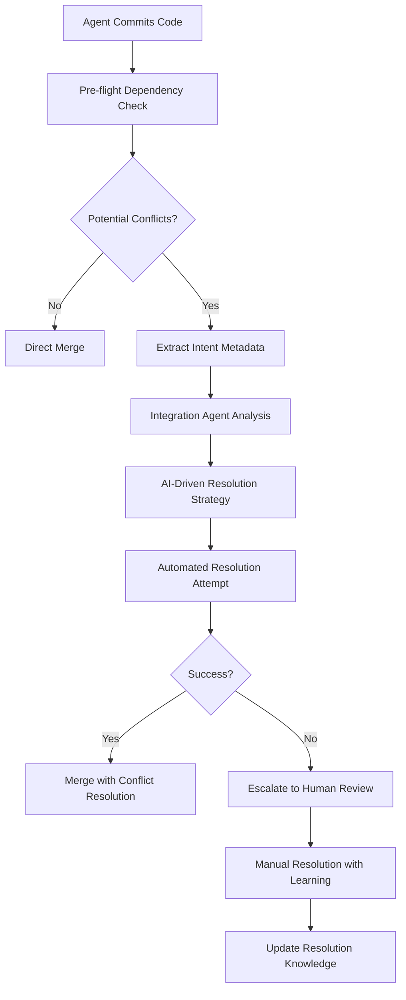

# 🚀 Enhanced Workflows V2: Production-Ready Agent Orchestration

## 📋 Overview

Based on comprehensive Gemini expert analysis and Foundation Epic Phase 1 retrospective, this document outlines the evolved workflows for LeanVibe Agent Hive production readiness.

**Key Evolution**: Transition from prototype to production-grade autonomous development platform.

---

## 🔄 Workflow Evolution Summary

### From Phase 1 (Prototype) → Phase 2 (Production)

| Component | Phase 1 (Current) | Phase 2 (Enhanced) | Priority |
|-----------|-------------------|-------------------|----------|
| **State Management** | File-based memory | Database-backed state | 🔴 Critical |
| **Process Management** | tmux + scripts | Docker containers | 🔴 Critical |
| **Communication** | Fixed scripts | Redis pub/sub | 🟡 High |
| **Conflict Resolution** | Manual intervention | AI-driven negotiation | 🟡 High |
| **Memory Management** | Sleep/wake files | Persistent + semantic DB | 🟡 High |
| **Observability** | Basic monitoring | Full observability stack | 🟢 Medium |

---

## 🏗️ Enhanced Architecture

### Multi-Layered State Management

```
┌─────────────────────────────────────────────────────────────┐
│                    AGENT ORCHESTRATION                     │
├─────────────────────────────────────────────────────────────┤
│ Layer 1: Core State (SQLite/PostgreSQL)                   │
│ - Agent status, tasks, metadata                           │
│ - Atomic transactions, ACID compliance                    │
│ - Persistent across restarts                              │
├─────────────────────────────────────────────────────────────┤
│ Layer 2: Working Memory (Redis)                           │
│ - Hot context, message queues                             │
│ - Inter-agent pub/sub communication                       │
│ - Fast read/write for active operations                   │
├─────────────────────────────────────────────────────────────┤
│ Layer 3: Semantic Memory (Vector DB)                      │
│ - Code understanding, embeddings                          │
│ - Similarity search for context recovery                  │
│ - Long-term knowledge preservation                        │
└─────────────────────────────────────────────────────────────┘
```

---

## 🤖 Enhanced Agent Lifecycle

### 1. Agent Registration & Initialization

**Enhanced Process**:
```python
# Using Enhanced State Manager
state_manager = EnhancedStateManager()

# Atomic registration with health monitoring
success = state_manager.register_agent(
    agent_id="integration-specialist-v2",
    process_id=os.getpid()
)

# Load previous context if recovering
memory_data = state_manager.wake_agent(agent_id)
if memory_data:
    agent.restore_context(memory_data)
```

**Improvements**:
- ✅ Atomic registration prevents race conditions
- ✅ Automatic context recovery from database
- ✅ Process ID tracking for health monitoring
- ✅ Graceful handling of restart scenarios

### 2. Enhanced Sleep/Wake Protocol

**New Sleep Protocol**:
```python
async def enhanced_sleep(agent_id: str, context: Dict[str, Any]):
    """Enhanced sleep with database persistence"""
    
    # 1. Consolidate working memory
    consolidated_memory = agent.consolidate_current_context()
    
    # 2. Save to persistent state (atomic operation)
    snapshot_id = state_manager.save_memory_snapshot(
        agent_id=agent_id,
        memory_data=consolidated_memory,
        snapshot_type="sleep"
    )
    
    # 3. Update agent status atomically
    state_manager.update_agent_status(agent_id, AgentStatus.SLEEPING)
    
    # 4. Generate embeddings for semantic memory (future)
    # semantic_db.store_embeddings(agent_id, consolidated_memory)
    
    return snapshot_id
```

**New Wake Protocol**:
```python
async def enhanced_wake(agent_id: str) -> Dict[str, Any]:
    """Enhanced wake with intelligent context restoration"""
    
    # 1. Load structured state from database
    memory_data = state_manager.wake_agent(agent_id)
    
    # 2. Restore Redis working memory
    redis_client.hset(f"agent:{agent_id}:memory", memory_data)
    
    # 3. Query semantic memory for relevant context (future)
    # relevant_context = semantic_db.similarity_search(agent_id, current_task)
    
    # 4. Update status to running
    state_manager.update_agent_status(agent_id, AgentStatus.RUNNING)
    
    return memory_data
```

### 3. Intelligent Conflict Resolution Workflow

**New Merge Conflict Protocol**:


**Implementation**:
```python
async def resolve_merge_conflict(pr_info: Dict[str, Any]) -> ResolutionResult:
    """AI-driven merge conflict resolution"""
    
    # 1. Extract intent metadata from commits
    intent_data = extract_intent_metadata(pr_info['commits'])
    
    # 2. Analyze conflict complexity
    conflict_analysis = analyze_conflict_complexity(pr_info['conflicts'])
    
    # 3. Query knowledge graph for similar resolutions
    similar_cases = knowledge_graph.find_similar_conflicts(conflict_analysis)
    
    # 4. Generate resolution strategy using LLM
    resolution_strategy = await generate_resolution_strategy(
        intent_data, conflict_analysis, similar_cases
    )
    
    # 5. Attempt automated resolution
    result = await apply_resolution_strategy(resolution_strategy)
    
    # 6. Learn from outcome
    knowledge_graph.update_resolution_knowledge(result)
    
    return result
```

---

## 📊 Enhanced Observability Stack

### Structured Logging Implementation

```python
import structlog
from opentelemetry import trace

# Configure structured logging
logger = structlog.get_logger()

# Agent activity logging with tracing
@trace.tracer.start_as_current_span("agent_task_execution")
async def execute_task(task: Task):
    logger.info(
        "task_started",
        agent_id=self.agent_id,
        task_id=task.task_id,
        task_type=task.task_type,
        priority=task.priority,
        estimated_duration=task.estimated_duration
    )
    
    try:
        result = await self.process_task(task)
        
        logger.info(
            "task_completed",
            agent_id=self.agent_id,
            task_id=task.task_id,
            result_status="success",
            actual_duration=result.duration,
            output_size=len(result.output)
        )
        
        return result
        
    except Exception as e:
        logger.error(
            "task_failed",
            agent_id=self.agent_id,
            task_id=task.task_id,
            error_type=type(e).__name__,
            error_message=str(e),
            stack_trace=traceback.format_exc()
        )
        raise
```

### Health Monitoring & Auto-Recovery

```python
class AgentHealthMonitor:
    """Production-grade agent health monitoring"""
    
    def __init__(self, state_manager: EnhancedStateManager):
        self.state_manager = state_manager
        self.monitoring_interval = 30  # seconds
        
    async def monitor_agent_health(self):
        """Continuous health monitoring with auto-recovery"""
        while True:
            # Check for crashed agents
            crashed_agents = self.state_manager.get_crashed_agents(timeout_minutes=5)
            
            for agent_id in crashed_agents:
                await self.recover_crashed_agent(agent_id)
            
            # Check system resource utilization
            system_metrics = await self.collect_system_metrics()
            await self.publish_metrics(system_metrics)
            
            await asyncio.sleep(self.monitoring_interval)
    
    async def recover_crashed_agent(self, agent_id: str):
        """Automatic agent recovery"""
        logger.warning("agent_crashed", agent_id=agent_id)
        
        # Mark as recovering
        self.state_manager.update_agent_status(agent_id, AgentStatus.RECOVERING)
        
        # Restore from latest memory snapshot
        memory_data = self.state_manager.wake_agent(agent_id)
        
        # Spawn new agent process with restored context
        new_process = await self.spawn_agent_process(agent_id, memory_data)
        
        if new_process:
            self.state_manager.register_agent(agent_id, new_process.pid)
            logger.info("agent_recovered", agent_id=agent_id, new_pid=new_process.pid)
        else:
            logger.error("agent_recovery_failed", agent_id=agent_id)
```

---

## 🔧 Implementation Roadmap

### Phase 2.1: Foundation Hardening (Week 1)

#### Immediate Actions (1-2 days):
1. **Deploy Enhanced State Manager**
   ```bash
   # Initialize database backend
   python scripts/enhanced_state_manager.py --action status
   
   # Migrate existing agents
   python scripts/migrate_agents_to_db.py
   ```

2. **Implement Atomic File Operations**
   ```python
   # Replace existing memory file writes
   def atomic_write_memory(file_path: str, data: Dict[str, Any]):
       temp_path = f"{file_path}.tmp"
       with open(temp_path, 'w') as f:
           json.dump(data, f, indent=2)
       os.rename(temp_path, file_path)  # Atomic operation
   ```

3. **Deploy Watchdog Process**
   ```bash
   # Start health monitoring
   python scripts/agent_health_monitor.py --daemon
   ```

#### Foundation Improvements (3-5 days):
1. **SQLite Integration**: Replace file-based state completely
2. **Redis Working Memory**: Implement fast inter-agent communication
3. **Structured Logging**: Deploy OpenTelemetry tracing
4. **Container Prototype**: Dockerize one agent type

### Phase 2.2: Intelligent Coordination (Week 2)

1. **Intent-Based Commits**: Add metadata to all commits
2. **Conflict Resolution Engine**: Implement AI-driven negotiation
3. **Knowledge Graph Foundation**: Start building code relationship mapping
4. **Service Discovery**: Dynamic agent discovery and configuration

### Phase 2.3: Production Observability (Week 3)

1. **Prometheus Metrics**: System-wide metrics collection
2. **Grafana Dashboards**: Real-time monitoring and alerting
3. **Distributed Tracing**: Full request flow visibility
4. **Performance Optimization**: Based on observability insights

---

## 🎯 Success Metrics

### Technical Metrics
- **Agent Uptime**: >99.5% (vs current ~90%)
- **Recovery Time**: <30s (vs current manual intervention)
- **Conflict Resolution**: >80% automated (vs current 0%)
- **Context Preservation**: 100% across restarts (vs current ~70%)

### Operational Metrics
- **Manual Interventions**: <1 per week (vs current ~5 per day)
- **System Reliability**: >99.9% uptime
- **Development Velocity**: 2x faster with stable platform
- **Agent Coordination**: <5s average response time

### Quality Metrics
- **Code Quality**: Maintained >95% quality scores
- **Security**: Zero security regressions
- **Performance**: <200ms API response maintained
- **Test Coverage**: >90% for all critical components

---

## 📚 Migration Guide

### From Current System to Enhanced V2

1. **Backup Current State**
   ```bash
   # Backup existing memory files
   cp -r .claude/memory/ .claude/memory_backup_$(date +%Y%m%d)
   ```

2. **Initialize Enhanced Backend**
   ```bash
   # Setup database and Redis
   python scripts/enhanced_state_manager.py --action status
   python scripts/setup_redis.py
   ```

3. **Migrate Active Agents**
   ```bash
   # Migrate agent states
   python scripts/migrate_to_enhanced_state.py --source .claude/memory/
   ```

4. **Validate Migration**
   ```bash
   # Verify all agents migrated successfully
   python scripts/validate_migration.py
   ```

5. **Deploy Enhanced Monitoring**
   ```bash
   # Start enhanced monitoring
   python scripts/agent_health_monitor.py --start
   python scripts/setup_observability.py
   ```

---

## 🚀 Next Steps

### Immediate Priorities (This Week)
1. ✅ **Deploy Enhanced State Manager** - Production-ready state persistence
2. ✅ **Implement Health Monitoring** - Automatic recovery and alerting
3. ✅ **Migrate Current Agents** - Seamless transition to new system
4. ✅ **Setup Observability** - Structured logging and monitoring

### Sprint 1 Integration
- Enhanced state management as foundation for security implementation
- Stable agent infrastructure for auth middleware integration
- Production-grade observability for security monitoring
- Intelligent coordination for complex security configurations

### Long-term Vision
- Fully autonomous conflict resolution with <5% human intervention
- Semantic code understanding with vector database integration
- Dynamic scaling based on workload and performance metrics
- Industry-leading autonomous development platform

---

**🎯 Mission**: Transform LeanVibe Agent Hive from impressive prototype to production-ready autonomous development platform that sets industry standards for AI-driven software engineering.