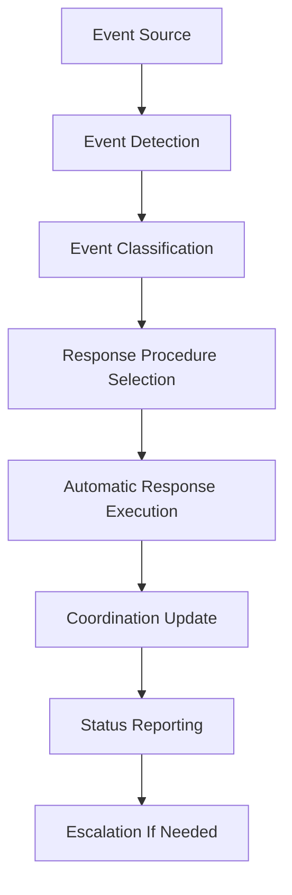

# 📡 Event-Driven Coordination Procedures

## Foundation Epic Phase 1 Completion Integration

Comprehensive event-driven coordination system that integrates accountability system crisis events with Foundation Epic workflow for Phase 1 completion.

## 🎯 **Event Response Framework**

### **Event Categories and Response Procedures**

#### 1. **Progress Events** 
- **Event Type**: `progress_update`, `component_completion`
- **Trigger**: Agent progress updates, milestone completions
- **Response Procedure**:
  1. **Real-time Dashboard Update**: Automatic coordination dashboard refresh
  2. **Milestone Assessment**: Check Phase 1 completion percentage
  3. **Quality Gate Validation**: Trigger automatic quality checks
  4. **PM Agent Notification**: Alert PM agent of significant progress
  5. **Timeline Adjustment**: Update Phase 1 completion estimates

#### 2. **Crisis Events**
- **Event Type**: `blocker_detected`, `agent_timeout`, `quality_gate_failure`
- **Trigger**: Accountability system escalations, critical failures
- **Response Procedure**:
  1. **Immediate Escalation**: Critical alert to PM agent within 2 minutes
  2. **Resource Reallocation**: Automatic agent reassignment protocols
  3. **Emergency Coordination**: Activate emergency coordination channels
  4. **Risk Assessment**: Evaluate Phase 1 completion impact
  5. **Recovery Planning**: Generate crisis recovery action plans

#### 3. **Completion Events**
- **Event Type**: `phase_completion`, `epic_milestone`
- **Trigger**: Phase 1 component completions, epic milestones
- **Response Procedure**:
  1. **Validation Protocol**: Full quality gate validation
  2. **Integration Testing**: Cross-component integration tests
  3. **Documentation Update**: Automatic documentation generation
  4. **Handoff Preparation**: Next phase preparation procedures
  5. **Success Communication**: Stakeholder notification protocols

#### 4. **Coordination Events**
- **Event Type**: `agent_heartbeat`, `communication_failure`, `coordination_alert`
- **Trigger**: Agent status changes, communication issues
- **Response Procedure**:
  1. **Health Check**: Agent and system health validation
  2. **Communication Recovery**: Restore communication channels
  3. **Backup Activation**: Activate backup coordination systems
  4. **Status Synchronization**: Ensure all agents have current status
  5. **Coordination Repair**: Fix coordination channel issues

## 🔄 **Event Processing Pipeline**

### **Real-time Event Stream Processing**



### **Event Processing Components**

#### 1. **Event Detection Layer**
- **File System Monitoring**: Real-time coordination file watching
- **Agent Heartbeat Monitoring**: Continuous agent status tracking
- **Quality Gate Monitoring**: Automatic quality metric tracking
- **Progress Monitoring**: Component completion tracking

#### 2. **Event Classification Engine**
- **Priority Assessment**: Critical, High, Medium, Low classification
- **Impact Analysis**: Phase 1 completion impact evaluation
- **Response Selection**: Automatic response procedure selection
- **Escalation Determination**: When to escalate to PM agent

#### 3. **Response Execution System**
- **Automated Responses**: Immediate automated actions
- **Coordination Updates**: Real-time coordination dashboard updates
- **Agent Notifications**: Direct agent communication
- **Status Broadcasting**: System-wide status updates

#### 4. **Escalation Management**
- **Threshold Monitoring**: Automatic escalation triggers
- **PM Agent Alerts**: Direct PM agent notifications
- **Human Intervention**: When automated responses fail
- **Crisis Protocols**: Emergency coordination procedures

## 🚨 **Crisis Event Response Matrix**

### **Critical Crisis Events**

| Event Type | Response Time | Automatic Actions | PM Agent Alert | Human Escalation |
|------------|---------------|-------------------|----------------|------------------|
| **Agent Timeout (5+ min)** | <2 minutes | Task reassignment, backup activation | Immediate | If 2+ reassignments |
| **Quality Gate Failure** | <1 minute | Block progression, quality review | High priority | If blocking Phase 1 |
| **Component Blocker** | <3 minutes | Alternative path analysis | Medium priority | If >6 hour delay |
| **System Failure** | <30 seconds | Emergency protocols, backup systems | Critical alert | Immediate |
| **Communication Loss** | <1 minute | Backup channels, status recovery | High priority | If >10 minutes |

### **Response Procedures by Crisis Level**

#### **CRITICAL (Level 1): System/Epic Threatening**
1. **Immediate Response** (<30 seconds):
   - Emergency PM agent alert with direct notification
   - Automatic backup system activation
   - Critical event logging with full context
   - Emergency coordination channel activation

2. **Short-term Response** (1-5 minutes):
   - Full system status assessment
   - Agent health checks and recovery
   - Alternative coordination path activation
   - Emergency resource allocation

3. **Recovery Response** (5-30 minutes):
   - Root cause analysis initiation
   - System repair procedures
   - Progress recovery planning
   - Stakeholder communication

#### **HIGH (Level 2): Phase 1 Impacting**
1. **Immediate Response** (<2 minutes):
   - PM agent high-priority alert
   - Affected component isolation
   - Alternative agent assignment
   - Impact assessment on Phase 1 timeline

2. **Short-term Response** (2-15 minutes):
   - Detailed impact analysis
   - Resource reallocation planning
   - Timeline adjustment calculations
   - Recovery strategy development

3. **Recovery Response** (15-60 minutes):
   - Strategy execution
   - Progress monitoring intensification
   - Quality assurance validation
   - Timeline recovery tracking

#### **MEDIUM (Level 3): Component Impacting**
1. **Standard Response** (5-15 minutes):
   - PM agent notification
   - Component-level analysis
   - Resource optimization
   - Progress adjustment

2. **Resolution Response** (15-30 minutes):
   - Issue resolution execution
   - Component integration testing
   - Quality validation
   - Progress reporting

#### **LOW (Level 4): Informational**
1. **Monitoring Response** (15-30 minutes):
   - Status logging
   - Trend analysis
   - Preventive action assessment
   - Routine progress reporting

## 📊 **Phase 1 Completion Integration**

### **Phase 1 Milestone Tracking**

#### **Real-time Progress Integration**
- **Component Progress**: Live tracking of all Phase 1 components
- **Quality Metrics**: Continuous quality gate monitoring
- **Timeline Tracking**: Real-time completion estimate updates
- **Risk Assessment**: Continuous risk evaluation and mitigation

#### **Completion Criteria Validation**
1. **Technical Completion**:
   - All components pass quality gates
   - Integration tests successful
   - Performance benchmarks met
   - Security validation complete

2. **Process Completion**:
   - All documentation complete
   - Code reviews passed
   - Deployment readiness confirmed
   - Handoff procedures prepared

3. **Accountability Completion**:
   - All tasks completed in accountability system
   - Evidence validation successful
   - Compliance scoring meets requirements
   - Audit trails complete

### **Phase 1 Completion Event Cascade**

```
Component Completion → Quality Validation → Integration Testing → 
Phase Assessment → PM Agent Notification → Handoff Preparation → 
Phase 1 Complete Event → Phase 2 Initialization
```

## 🤖 **Automated Response Actions**

### **Level 1: Immediate Automated Responses**

#### **Progress Events**
- Update coordination dashboard in real-time
- Recalculate Phase 1 completion percentage
- Trigger dependent component notifications
- Update timeline estimates automatically

#### **Quality Events**
- Block component progression on failures
- Trigger automatic quality re-assessment
- Generate quality improvement recommendations
- Update quality metrics dashboard

#### **Crisis Events**
- Activate backup coordination systems
- Initiate alternative agent assignment
- Trigger emergency notification protocols
- Activate crisis recovery procedures

### **Level 2: Coordinated Response Actions**

#### **Resource Reallocation**
- Analyze agent capacity and availability
- Reassign tasks based on priority and capability
- Update task assignments in accountability system
- Notify affected agents of changes

#### **Timeline Adjustment**
- Recalculate Phase 1 completion estimates
- Identify critical path adjustments
- Update milestone target dates
- Generate timeline impact reports

#### **Quality Recovery**
- Trigger comprehensive quality reviews
- Initiate quality improvement workflows
- Schedule quality validation sessions
- Update quality standards if needed

### **Level 3: Strategic Response Actions**

#### **Phase Planning Adjustment**
- Evaluate Phase 1 scope adjustments
- Assess Phase 2 impact and planning
- Update epic timeline and milestones
- Generate strategic recommendation reports

#### **Stakeholder Communication**
- Generate progress summary reports
- Prepare stakeholder status updates
- Create executive summary documents
- Schedule review and planning sessions

## 📈 **Performance Metrics and Monitoring**

### **Response Time Metrics**
- **Event Detection Time**: <1 second for critical events
- **Response Initiation Time**: <30 seconds for critical responses
- **Resolution Time**: <30 minutes for standard issues
- **Recovery Time**: <2 hours for crisis situations

### **Effectiveness Metrics**
- **Automated Resolution Rate**: >80% for standard events
- **Escalation Accuracy**: >95% appropriate escalations
- **False Alert Rate**: <5% false positive alerts
- **Phase 1 Impact Mitigation**: >90% successful mitigation

### **Quality Metrics**
- **Event Classification Accuracy**: >98% correct classification
- **Response Procedure Success**: >95% successful execution
- **Coordination Restoration**: <5 minutes average restoration
- **Data Integrity**: 100% event data preservation

## 🔧 **Implementation Components**

### **Event Processing Infrastructure**
1. **Real-time Coordination Consumer** (`realtime_coordination_consumer.py`)
2. **Coordination Event Publisher** (`coordination_event_publisher.py`)
3. **Crisis Response Engine** (`crisis_response_engine.py`)
4. **Phase 1 Completion Monitor** (`phase1_completion_monitor.py`)

### **Configuration Management**
```json
{
  "crisis_response_config": {
    "critical_response_time_seconds": 30,
    "high_response_time_seconds": 120,
    "medium_response_time_seconds": 300,
    "escalation_timeout_minutes": 15,
    "max_automated_reassignments": 2,
    "phase1_completion_threshold": 95
  },
  "notification_config": {
    "pm_agent_critical_channels": ["direct_alert", "coordination_dashboard"],
    "pm_agent_high_channels": ["coordination_dashboard", "status_report"],
    "agent_notification_channels": ["heartbeat", "task_update"],
    "system_notification_channels": ["dashboard", "log", "audit"]
  },
  "quality_config": {
    "quality_gate_failure_threshold": 2,
    "quality_recovery_timeout_minutes": 30,
    "quality_validation_required": true,
    "automatic_quality_recovery": true
  }
}
```

## 🎯 **Success Criteria**

### **Operational Excellence**
- **99.9% Event Processing Reliability**: All events processed successfully
- **<1 Minute Crisis Response**: Critical events responded to immediately  
- **100% Phase 1 Tracking**: Complete visibility into Phase 1 progress
- **Zero Silent Failures**: All issues detected and responded to

### **Phase 1 Completion Success**
- **All Components Complete**: 100% of Phase 1 components delivered
- **Quality Gates Passed**: All quality requirements met
- **Timeline Achievement**: Phase 1 completed within timeline
- **Handoff Readiness**: Phase 2 preparation complete

### **Integration Success**
- **Seamless Event Processing**: No disruption to existing workflows
- **Automatic Crisis Recovery**: Minimal human intervention required
- **Real-time Coordination**: Instant coordination updates
- **Complete Audit Trails**: Full accountability and compliance tracking

---

**🚨 CRITICAL**: This event-driven coordination system is essential for Foundation Epic Phase 1 completion. All crisis events must trigger immediate responses to ensure Phase 1 success.

**🎯 MISSION**: Guarantee Foundation Epic Phase 1 completion through automated event-driven coordination with comprehensive crisis response procedures.