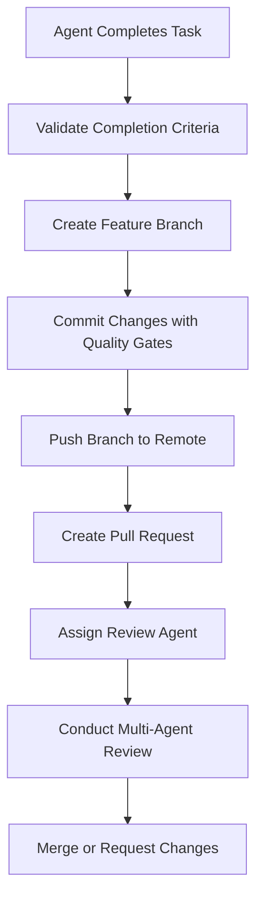

# Multi-Agent PR Review Workflow

## Overview
This document describes the automated Pull Request creation and multi-agent code review system in LeanVibe Agent Hive. When an agent completes work, the system automatically creates a PR and assigns a specialized review agent with a different persona to conduct a thorough code review.

## Workflow Architecture

### 1. Work Completion Detection


### 2. Review Agent Assignment
The system selects review agents based on:
- **Different expertise** from the implementing agent
- **Complementary perspective** (e.g., security review for feature implementation)
- **Available specialized personas** in the review agent pool

## Review Agent Personas

### Security Review Agent
**Persona**: `security-reviewer`
**Focus Areas**:
- Authentication and authorization vulnerabilities
- Input validation and sanitization
- SQL injection and XSS prevention
- Data privacy and encryption
- API security best practices

**Review Prompts**:
```
SECURITY REVIEW CHECKLIST:
1. Authentication mechanisms secure?
2. Input validation comprehensive?
3. Authorization controls proper?
4. Data exposure risks mitigated?
5. Dependencies vulnerability-free?
6. Error handling secure (no info leakage)?
7. Rate limiting and DoS protection?
8. Cryptographic implementations secure?
```

### Performance Review Agent
**Persona**: `performance-reviewer`
**Focus Areas**:
- Database query optimization
- Memory usage and leaks
- API response times
- Frontend bundle size
- Caching strategies
- Scalability concerns

**Review Prompts**:
```
PERFORMANCE REVIEW CHECKLIST:
1. Database queries optimized with proper indexes?
2. N+1 query problems avoided?
3. Memory usage reasonable and no leaks?
4. API endpoints respond within SLA (<200ms)?
5. Frontend bundles optimized and code-split?
6. Caching strategies implemented appropriately?
7. Scalability bottlenecks identified?
8. Resource usage monitored and limited?
```

### Architecture Review Agent
**Persona**: `architecture-reviewer`
**Focus Areas**:
- Code organization and structure
- Design patterns and principles
- Separation of concerns
- API design consistency
- Testability and maintainability
- Technical debt assessment

**Review Prompts**:
```
ARCHITECTURE REVIEW CHECKLIST:
1. Code follows established patterns?
2. Separation of concerns maintained?
3. API design consistent and RESTful?
4. Components properly decoupled?
5. Error handling comprehensive and consistent?
6. Code is testable and well-structured?
7. Documentation clear and complete?
8. Technical debt minimized?
```

### Quality Assurance Agent
**Persona**: `qa-reviewer`
**Focus Areas**:
- Test coverage and quality
- Edge case handling
- User experience validation
- Accessibility compliance
- Error scenarios
- Integration testing

**Review Prompts**:
```
QA REVIEW CHECKLIST:
1. Test coverage >90% for new code?
2. Edge cases properly tested?
3. Error scenarios handled gracefully?
4. User experience intuitive and accessible?
5. Integration tests cover main flows?
6. Performance tests validate requirements?
7. Documentation matches implementation?
8. Deployment procedures tested?
```

### DevOps Review Agent
**Persona**: `devops-reviewer`
**Focus Areas**:
- Deployment configuration
- Infrastructure requirements
- Monitoring and logging
- CI/CD pipeline impact
- Environment compatibility
- Operational concerns

**Review Prompts**:
```
DEVOPS REVIEW CHECKLIST:
1. Deployment configuration complete?
2. Infrastructure requirements documented?
3. Monitoring and alerting adequate?
4. Logging comprehensive and structured?
5. CI/CD pipeline updated appropriately?
6. Environment variables managed securely?
7. Scaling and resource requirements clear?
8. Rollback procedures defined?
```

## CLI Commands for PR Review Workflow

### Automatic PR Creation
```bash
# Trigger automatic PR creation after task completion
python cli.py orchestrate --workflow feature-dev --auto-pr

# Create PR with specific review requirements
python cli.py create-pr --title "Feature: User Authentication" --reviewers security,architecture

# Create PR with custom review checklist
python cli.py create-pr --review-type comprehensive --include-security --include-performance
```

### Review Agent Management
```bash
# List available review agents
python cli.py review --list-agents

# Assign specific review agent to PR
python cli.py review --pr 123 --agent security-reviewer

# Request multi-agent review
python cli.py review --pr 123 --agents security,performance,qa

# Check review status
python cli.py review --pr 123 --status
```

### Review Execution Commands
```bash
# Start automated review process
python cli.py review --pr 123 --start

# Generate review report
python cli.py review --pr 123 --report

# Apply suggested changes
python cli.py review --pr 123 --apply-suggestions

# Request additional review rounds
python cli.py review --pr 123 --request-changes
```

## Implementation Details

### 1. PR Creation Automation

#### Task Completion Detection
```python
class TaskCompletionMonitor:
    def __init__(self):
        self.completion_criteria = {
            'tests_passing': True,
            'quality_gates_passed': True,
            'documentation_updated': True,
            'no_compilation_errors': True
        }
    
    async def detect_completion(self, task_id: str) -> bool:
        """Detect when a task is ready for PR creation."""
        task_status = await self.get_task_status(task_id)
        
        return all([
            task_status.tests_passing,
            task_status.quality_gates_passed,
            task_status.documentation_updated,
            not task_status.has_compilation_errors
        ])
    
    async def trigger_pr_creation(self, task_id: str):
        """Automatically create PR when task is complete."""
        if await self.detect_completion(task_id):
            await self.create_pr_workflow(task_id)
```

#### Automated PR Creation
```python
class PRCreationService:
    async def create_pr_workflow(self, task_id: str):
        """Complete PR creation workflow."""
        task = await self.get_task(task_id)
        
        # 1. Create feature branch if not exists
        branch_name = f"feature/{task.slug}"
        await self.git_service.create_branch(branch_name)
        
        # 2. Commit changes with quality validation
        commit_message = self.generate_commit_message(task)
        await self.git_service.commit_with_validation(commit_message)
        
        # 3. Push to remote
        await self.git_service.push_branch(branch_name)
        
        # 4. Create PR via GitHub API
        pr_data = {
            'title': self.generate_pr_title(task),
            'body': self.generate_pr_description(task),
            'head': branch_name,
            'base': 'main'
        }
        pr = await self.github_service.create_pr(pr_data)
        
        # 5. Assign review agents
        await self.assign_review_agents(pr.number, task)
        
        return pr
```

### 2. Review Agent Assignment Logic

#### Agent Selection Algorithm
```python
class ReviewAgentSelector:
    def __init__(self):
        self.agent_specializations = {
            'backend': ['security-reviewer', 'performance-reviewer', 'architecture-reviewer'],
            'frontend': ['qa-reviewer', 'performance-reviewer', 'architecture-reviewer'],
            'database': ['security-reviewer', 'performance-reviewer', 'devops-reviewer'],
            'infrastructure': ['devops-reviewer', 'security-reviewer', 'architecture-reviewer'],
            'testing': ['qa-reviewer', 'architecture-reviewer'],
            'documentation': ['qa-reviewer', 'architecture-reviewer']
        }
    
    def select_review_agents(self, implementing_agent: str, task_type: str) -> List[str]:
        """Select appropriate review agents based on task and implementing agent."""
        # Get potential reviewers based on task type
        potential_reviewers = self.agent_specializations.get(task_type, [])
        
        # Remove similar personas to implementing agent
        filtered_reviewers = self.filter_similar_personas(
            implementing_agent, potential_reviewers
        )
        
        # Select diverse review perspectives
        selected_reviewers = self.select_diverse_perspectives(
            filtered_reviewers, max_reviewers=3
        )
        
        return selected_reviewers
    
    def filter_similar_personas(self, implementing_agent: str, reviewers: List[str]) -> List[str]:
        """Filter out reviewers with similar personas to implementing agent."""
        similar_pairs = {
            'backend-agent': ['architecture-reviewer'],
            'frontend-agent': ['qa-reviewer'],
            'security-agent': ['security-reviewer'],
            'devops-agent': ['devops-reviewer']
        }
        
        similar_reviewers = similar_pairs.get(implementing_agent, [])
        return [r for r in reviewers if r not in similar_reviewers]
```

### 3. Multi-Agent Review Execution

#### Review Coordination
```python
class MultiAgentReviewCoordinator:
    async def conduct_review(self, pr_number: int, review_agents: List[str]):
        """Coordinate multi-agent review process."""
        review_tasks = []
        
        for agent in review_agents:
            task = self.create_review_task(pr_number, agent)
            review_tasks.append(task)
        
        # Execute reviews in parallel
        reviews = await asyncio.gather(*review_tasks)
        
        # Consolidate review results
        consolidated_review = await self.consolidate_reviews(reviews)
        
        # Post review to PR
        await self.github_service.post_review(pr_number, consolidated_review)
        
        return consolidated_review
    
    async def create_review_task(self, pr_number: int, agent_persona: str):
        """Create individual review task for specific agent."""
        pr_content = await self.github_service.get_pr_content(pr_number)
        review_prompt = self.get_review_prompt(agent_persona)
        
        return {
            'agent': agent_persona,
            'prompt': review_prompt,
            'content': pr_content,
            'checklist': self.get_review_checklist(agent_persona)
        }
```

#### Review Report Generation
```python
class ReviewReportGenerator:
    def generate_comprehensive_review(self, reviews: List[Dict]) -> str:
        """Generate consolidated review report."""
        report = {
            'summary': self.generate_summary(reviews),
            'security_findings': self.extract_findings(reviews, 'security'),
            'performance_findings': self.extract_findings(reviews, 'performance'),
            'architecture_findings': self.extract_findings(reviews, 'architecture'),
            'qa_findings': self.extract_findings(reviews, 'qa'),
            'devops_findings': self.extract_findings(reviews, 'devops'),
            'recommendations': self.generate_recommendations(reviews),
            'approval_status': self.determine_approval_status(reviews)
        }
        
        return self.format_review_report(report)
```

## Integration with Existing CLI

### Enhanced Orchestrate Command
```bash
# Enable automatic PR creation in orchestration
python cli.py orchestrate --workflow feature-dev --auto-pr --review-agents security,performance

# Configure review requirements
python cli.py orchestrate --workflow feature-dev --review-requirements strict
```

### New Review Commands
```bash
# PR Management
python cli.py pr create --title "Feature Implementation" --auto-review
python cli.py pr list --status open
python cli.py pr status --pr 123

# Review Management  
python cli.py review start --pr 123
python cli.py review status --pr 123
python cli.py review report --pr 123 --format markdown
python cli.py review agents --list
python cli.py review assign --pr 123 --agent security-reviewer
```

## Configuration

### Review Agent Configuration
```yaml
# .leanvibe/review-config.yaml
review_agents:
  security-reviewer:
    persona: "Security Expert with 10+ years experience"
    focus_areas: ["authentication", "authorization", "input_validation", "crypto"]
    checklist_template: "security_review_checklist.md"
    
  performance-reviewer:
    persona: "Performance Engineer with optimization expertise"
    focus_areas: ["database_optimization", "caching", "memory_usage", "scalability"]
    checklist_template: "performance_review_checklist.md"

review_workflows:
  comprehensive:
    required_agents: ["security-reviewer", "architecture-reviewer", "qa-reviewer"]
    approval_threshold: 2
    
  security_focused:
    required_agents: ["security-reviewer", "devops-reviewer"]
    approval_threshold: 2
    
  performance_focused:
    required_agents: ["performance-reviewer", "architecture-reviewer"]
    approval_threshold: 2

auto_pr_settings:
  enabled: true
  branch_prefix: "feature/"
  require_tests: true
  require_documentation: true
  auto_assign_reviewers: true
```

## Benefits

### 1. Quality Assurance
- **Multiple perspectives** on every change
- **Specialized expertise** for different concerns
- **Consistent review standards** across all PRs
- **Automated quality gates** before merge

### 2. Knowledge Sharing
- **Cross-training** through diverse review perspectives
- **Best practices** propagation through consistent reviews
- **Mentoring** through senior agent personas
- **Documentation** of review decisions and rationale

### 3. Risk Mitigation
- **Security vulnerabilities** caught early
- **Performance issues** identified before production
- **Architecture violations** prevented
- **Technical debt** minimized through review standards

### 4. Efficiency
- **Automated PR creation** reduces manual overhead
- **Parallel reviews** minimize time to merge
- **Consistent processes** reduce review variability
- **Clear documentation** of requirements and decisions

## Future Enhancements

### 1. AI-Powered Review Insights
- **Pattern recognition** across historical reviews
- **Automated suggestion** generation
- **Risk assessment** scoring
- **Learning from review feedback**

### 2. Advanced Review Workflows
- **Conditional review paths** based on change types
- **Escalation procedures** for complex changes
- **Integration with external tools** (SonarQube, Snyk)
- **Custom review agent** creation and training

### 3. Metrics and Analytics
- **Review effectiveness** tracking
- **Time to merge** optimization
- **Quality trend** analysis
- **Agent performance** evaluation

This multi-agent PR review workflow ensures comprehensive code quality while maintaining development velocity through automation and specialized expertise.