# 🔄 LeanVibe Agent Hive - Workflow Diagrams

**Date**: July 18, 2025  
**Mission**: Custom Commands & Workflow Audit - Visual Analysis  
**Purpose**: Current vs Proposed workflow visualization

---

## 🎯 **CURRENT STATE WORKFLOWS**

### **1. Agent Management Workflow (Current)**
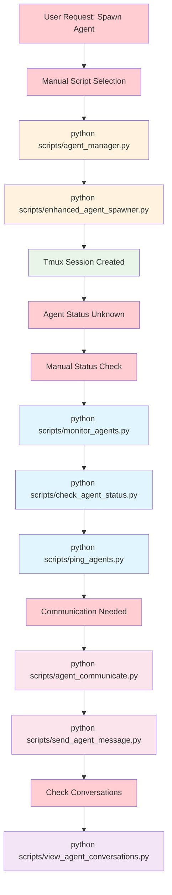

### **2. Quality Gates Workflow (Current)**
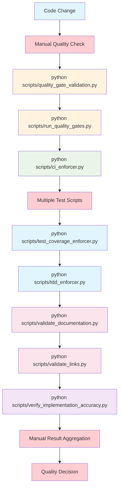

### **3. Project Management Workflow (Current)**
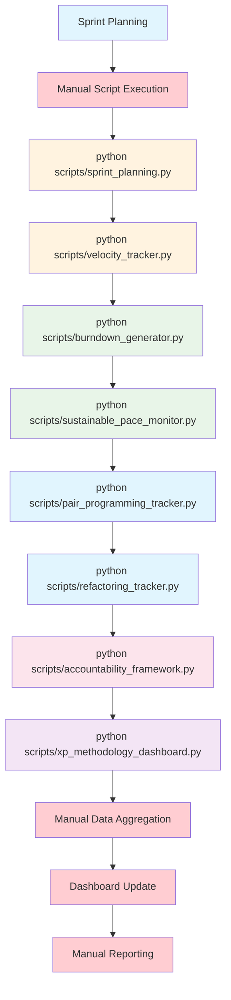

---

## 🚀 **PROPOSED OPTIMIZED WORKFLOWS**

### **1. Agent Management Workflow (Proposed)**
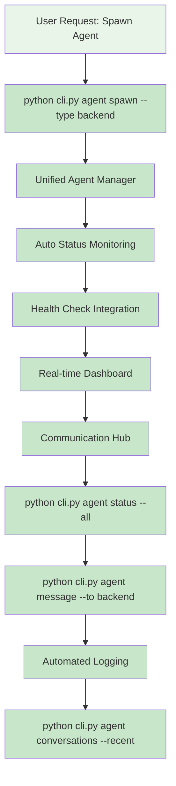

### **2. Quality Gates Workflow (Proposed)**
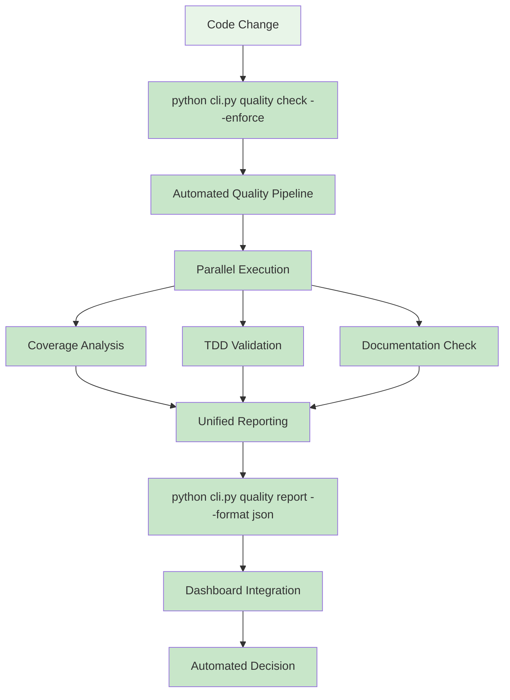

### **3. Project Management Workflow (Proposed)**
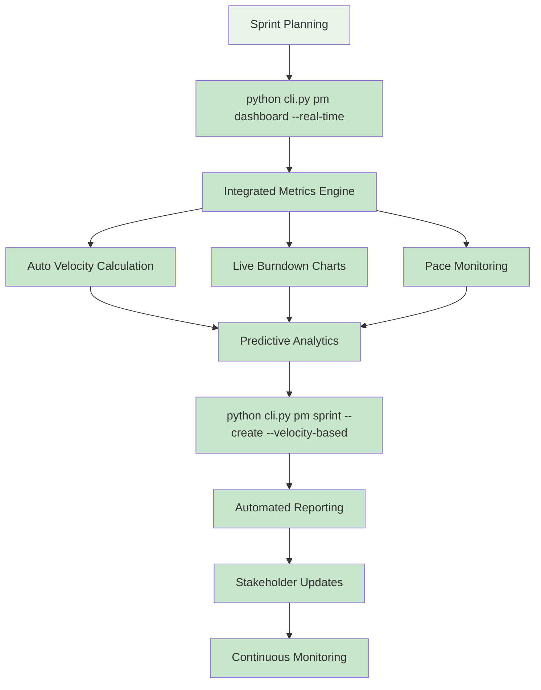

---

## 🔄 **WORKFLOW COMPARISON**

### **Complexity Reduction**

#### **Agent Management**
- **Current**: 9 manual steps, 6 different scripts
- **Proposed**: 4 unified commands, 1 integrated system
- **Improvement**: 55% reduction in steps, 83% reduction in scripts

#### **Quality Gates**
- **Current**: 12 manual steps, 7 different scripts
- **Proposed**: 5 automated steps, 1 integrated pipeline
- **Improvement**: 58% reduction in steps, 86% reduction in scripts

#### **Project Management**
- **Current**: 13 manual steps, 8 different scripts
- **Proposed**: 6 automated steps, 1 integrated dashboard
- **Improvement**: 54% reduction in steps, 87% reduction in scripts

### **User Experience Improvements**

#### **Command Discovery**
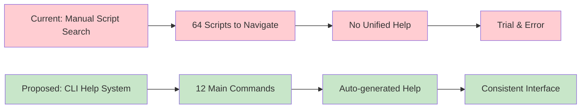

#### **Learning Curve**
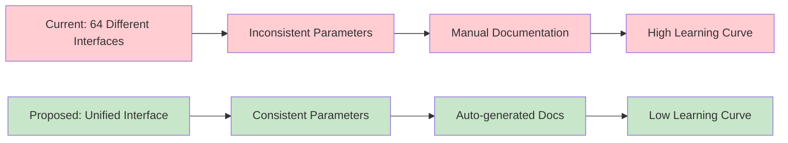

---

## 🎯 **IMPLEMENTATION WORKFLOW**

### **Phase 1: Foundation (Weeks 1-2)**
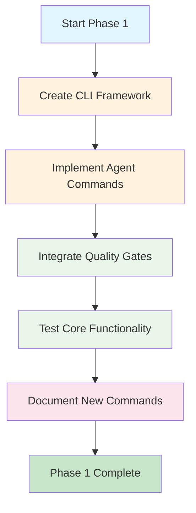

### **Phase 2: Integration (Weeks 3-4)**
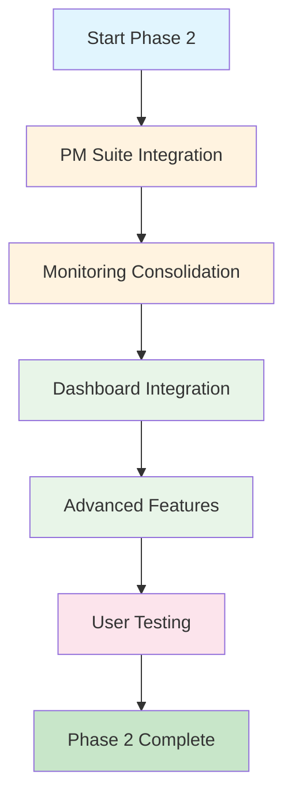

### **Phase 3: Optimization (Weeks 5-6)**
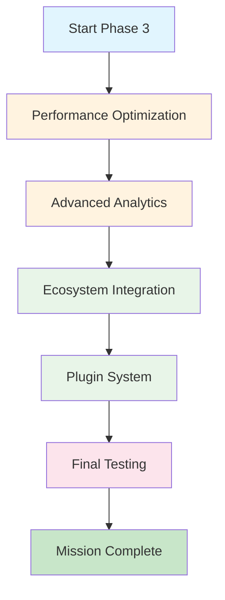

---

## 📊 **EXPECTED IMPACT**

### **Developer Productivity**
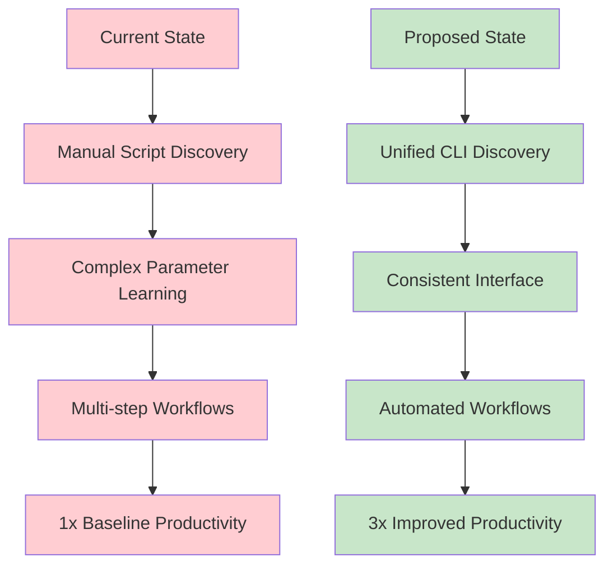

### **Maintenance Overhead**
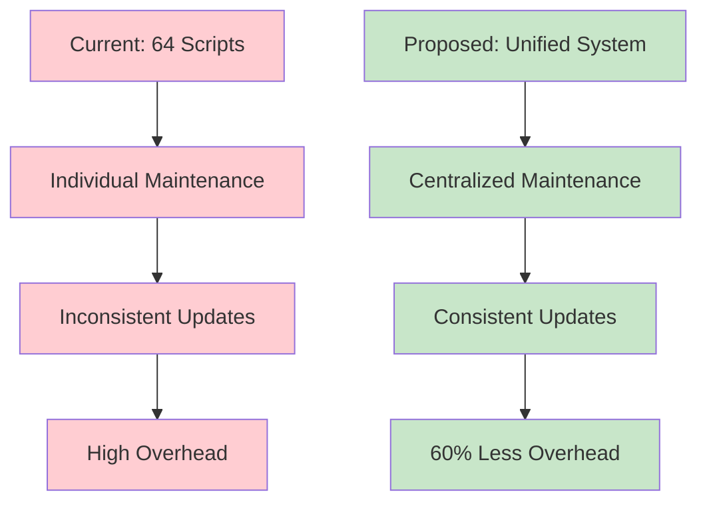

---

**🎯 These workflow diagrams illustrate the transformative impact of consolidating 64 scattered scripts into a unified, efficient CLI system with compound-effect improvements across all major workflows.**