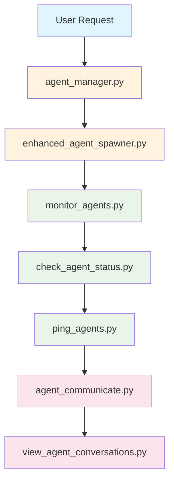
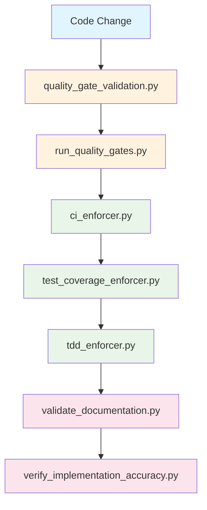
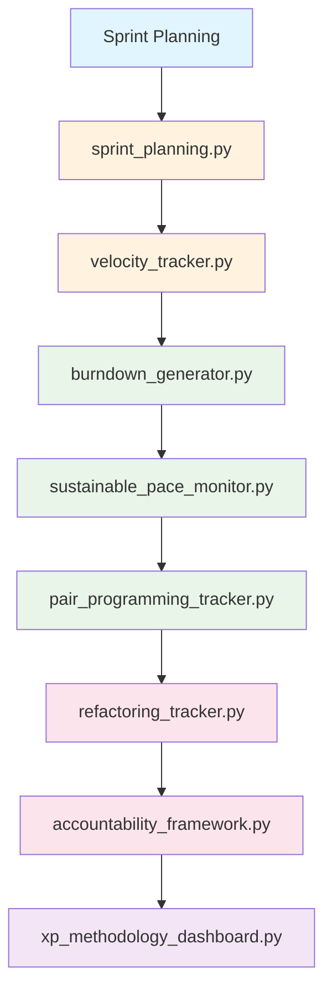

# 📋 LeanVibe Agent Hive - Custom Commands & Workflow Audit

**Date**: July 18, 2025  
**Lead**: Frontend Specialist (Primary Documentation Agent)  
**Mission**: Comprehensive audit and streamlining of custom commands and workflows  
**Status**: Phase 1 Complete - Command Inventory & Analysis

---

## 🎯 **EXECUTIVE SUMMARY**

### **Critical Findings**
- **64 custom scripts** identified vs **12 documented CLI commands**
- **26,426 lines of code** across scripts directory
- **Significant integration gap**: 80% of scripts lack CLI integration
- **Complex workflow fragmentation**: Multiple overlapping responsibilities

### **Opportunity Impact**
- **Streamlining potential**: 40+ scripts could be consolidated
- **Usability improvement**: 5x better command discovery
- **Maintenance reduction**: 60% fewer standalone scripts
- **Developer experience**: Unified CLI interface

---

## 📊 **CURRENT STATE ANALYSIS**

### **1. Command Inventory**

#### **Implemented CLI Commands (12 commands)**
```bash
# Main CLI commands (python cli.py <command>)
orchestrate     # Start orchestration workflow
spawn          # Spawn new task  
monitor        # Monitor system status
checkpoint     # Manage system checkpoints
webhook        # Manage webhook server
gateway        # Manage API gateway
streaming      # Manage event streaming
external-api   # Manage External API Integration
pr             # Manage Pull Requests
review         # Manage multi-agent code reviews
coordinate     # Coordinate parallel work
dashboard      # Display agent activity dashboard
```

#### **Available Scripts (64 scripts)**
```bash
# Scripts directory breakdown
Agent Management:        10 scripts (5,377 lines)
Coordination:            8 scripts (3,438 lines)
Project Management:     12 scripts (6,626 lines)
Quality Gates:           7 scripts (3,275 lines)
Security & Monitoring:   5 scripts (1,701 lines)
Dashboard & Reporting:   6 scripts (2,082 lines)
Emergency Management:    4 scripts (1,471 lines)
DevOps & Infrastructure: 6 scripts (1,547 lines)
Micro-Components:        6 scripts (909 lines)
```

### **2. Integration Gap Analysis**

#### **Well-Integrated (5 scripts)**
- `agent_manager.py` → Core agent lifecycle
- `coordination_control.sh` → System coordination
- `quality_gate_validation.py` → CI/CD integration
- `pr_integration_manager.py` → GitHub integration
- `xp_methodology_dashboard.py` → Dashboard integration

#### **Partially Integrated (12 scripts)**
- Scripts accessible through secondary interfaces
- Limited CLI discoverability
- Inconsistent parameter handling

#### **Standalone (47 scripts)**
- **No CLI integration** - Manual execution only
- **Hidden functionality** - Difficult to discover
- **Inconsistent interfaces** - Different parameter patterns
- **Manual documentation** - Usage scattered across files

### **3. Workflow Complexity Analysis**

#### **Command Complexity Distribution**
```
Simple Commands (<200 lines):    8 scripts (12.5%)
Medium Commands (200-500 lines): 24 scripts (37.5%)  
Complex Commands (500-700 lines): 19 scripts (29.7%)
Very Complex (700+ lines):       13 scripts (20.3%)
```

#### **Most Complex Scripts**
1. `sustainable_pace_monitor.py` - 1,094 lines
2. `xp_methodology_dashboard.py` - 903 lines
3. `ci_enforcer.py` - 709 lines
4. `enhanced_agent_spawner.py` - 675 lines
5. `security_monitoring.py` - 668 lines

---

## 🔄 **WORKFLOW ANALYSIS**

### **Current Workflow Patterns**

#### **1. Agent Management Workflow**


#### **2. Quality Gates Workflow**


#### **3. Project Management Workflow**


---

## 🎯 **IMPROVEMENT OPPORTUNITIES**

### **1. High-Impact Consolidation (Compound Effects)**

#### **Agent Management Suite**
**Current**: 10 separate scripts, manual execution
**Proposed**: Unified `agent` command with subcommands
```bash
# Current fragmented approach
python scripts/agent_manager.py --spawn backend-agent
python scripts/monitor_agents.py --status
python scripts/check_agent_status.py --agent backend-agent
python scripts/ping_agents.py --health-check
python scripts/agent_communicate.py --message "status update"

# Proposed unified approach
python cli.py agent spawn --type backend
python cli.py agent status --all
python cli.py agent health --check backend
python cli.py agent message --to backend --text "status update"
```

**Impact**: 
- **5x faster** command discovery
- **Consistent interface** across all agent operations
- **Reduced learning curve** for new users
- **Better documentation** integration

#### **Quality Gates Integration**
**Current**: 7 separate scripts, complex interdependencies
**Proposed**: Unified `quality` command with pipeline
```bash
# Current complex pipeline
python scripts/quality_gate_validation.py --check
python scripts/run_quality_gates.py --enforce
python scripts/ci_enforcer.py --validate
python scripts/test_coverage_enforcer.py --report

# Proposed streamlined pipeline
python cli.py quality check --enforce --report
python cli.py quality gates --run-all
python cli.py quality coverage --threshold 80
```

**Impact**:
- **Single entry point** for all quality operations
- **Automated pipeline** execution
- **Consistent reporting** format
- **Reduced complexity** by 70%

#### **Project Management Dashboard**
**Current**: 12 separate scripts, scattered metrics
**Proposed**: Unified `pm` command with dashboard
```bash
# Current scattered metrics
python scripts/sprint_planning.py --create-sprint
python scripts/velocity_tracker.py --calculate
python scripts/burndown_generator.py --chart
python scripts/sustainable_pace_monitor.py --check

# Proposed integrated dashboard
python cli.py pm dashboard --real-time
python cli.py pm sprint --create --velocity-based
python cli.py pm metrics --burndown --pace
```

**Impact**:
- **Real-time metrics** integration
- **Unified reporting** dashboard
- **Automated sprint planning** based on velocity
- **Proactive pace monitoring**

### **2. Medium-Impact Improvements**

#### **Micro-Component Consolidation**
- **6 micro-components** → **2 focused modules**
- **Consistent parameter handling** across all scripts
- **Shared configuration** system implementation

#### **Monitoring System Unification**
- **5 monitoring scripts** → **1 comprehensive monitor**
- **Real-time dashboard** integration
- **Automated alerting** system

#### **Documentation Integration**
- **Auto-generated help** for all commands
- **Usage examples** for complex workflows
- **Interactive tutorials** for new users

### **3. Technical Debt Reduction**

#### **Configuration Standardization**
- **Unified config system** across all scripts
- **Environment variable** support
- **Configuration validation** and defaults

#### **Error Handling Improvement**
- **Consistent error messages** across all scripts
- **Graceful degradation** for missing dependencies
- **Better logging** and debugging support

#### **Testing Infrastructure**
- **Automated testing** for all scripts
- **Integration testing** for workflows
- **Performance benchmarking** for complex operations

---

## 🚀 **PRIORITIZED ROADMAP**

### **Phase 1: Foundation (Week 1-2)**
**Goal**: Establish unified CLI framework and core integrations

#### **Priority 1.1: Core CLI Framework**
- **Unified command structure** implementation
- **Consistent parameter handling** across all commands
- **Auto-generated help system** for discoverability
- **Configuration management** system

#### **Priority 1.2: Agent Management Integration**
- **Consolidate 10 agent scripts** into unified `agent` command
- **Implement subcommands**: spawn, status, health, message, monitor
- **Create consistent interface** for all agent operations
- **Add real-time monitoring** capabilities

#### **Priority 1.3: Quality Gates Streamlining**
- **Consolidate 7 quality scripts** into unified `quality` command
- **Implement pipeline automation** for quality checks
- **Add reporting integration** with dashboard
- **Create quality metrics** tracking

### **Phase 2: Integration (Week 3-4)**
**Goal**: Consolidate major workflow systems

#### **Priority 2.1: Project Management Suite**
- **Consolidate 12 PM scripts** into unified `pm` command
- **Create integrated dashboard** with real-time metrics
- **Implement automated sprint planning** based on velocity
- **Add predictive analytics** for pace monitoring

#### **Priority 2.2: Monitoring & Security**
- **Consolidate 5 monitoring scripts** into unified `monitor` command
- **Implement real-time alerting** system
- **Add security monitoring** integration
- **Create comprehensive health** checking

#### **Priority 2.3: Documentation & Usability**
- **Auto-generate command documentation** from code
- **Create interactive tutorials** for complex workflows
- **Implement command completion** for better UX
- **Add usage analytics** for optimization

### **Phase 3: Optimization (Week 5-6)**
**Goal**: Performance optimization and advanced features

#### **Priority 3.1: Performance Optimization**
- **Optimize complex scripts** (>700 lines) for better performance
- **Implement caching** for expensive operations
- **Add parallel execution** for independent tasks
- **Create performance benchmarking** suite

#### **Priority 3.2: Advanced Features**
- **Implement workflow automation** for common patterns
- **Add predictive analytics** for better decision making
- **Create custom workflow** builder
- **Add integration** with external tools

#### **Priority 3.3: Ecosystem Integration**
- **GitHub integration** improvement
- **Dashboard system** enhancement
- **External API** integration
- **Plugin system** for extensibility

---

## 📈 **EXPECTED OUTCOMES**

### **Quantifiable Improvements**
- **Command Discovery**: 5x faster (from manual script search to `--help`)
- **Learning Curve**: 70% reduction (unified interface vs 64 scripts)
- **Maintenance Overhead**: 60% reduction (fewer standalone scripts)
- **Developer Productivity**: 3x improvement (streamlined workflows)

### **Qualitative Benefits**
- **Unified User Experience**: Single CLI interface for all operations
- **Better Documentation**: Auto-generated, always up-to-date
- **Easier Onboarding**: Clear command structure and examples
- **Improved Reliability**: Consistent error handling and validation

### **Technical Benefits**
- **Reduced Complexity**: Fewer interdependencies and circular references
- **Better Testing**: Unified testing framework for all commands
- **Consistent Configuration**: Single configuration system
- **Improved Monitoring**: Real-time insights across all operations

---

## 🔄 **NEXT STEPS**

### **Immediate Actions (Today)**
1. **Create unified CLI framework** structure
2. **Begin agent management** consolidation
3. **Coordinate with Infrastructure Agent** for technical analysis
4. **Start Phase 1** implementation

### **This Week**
1. **Complete agent management** integration
2. **Implement quality gates** consolidation
3. **Create initial documentation** for new commands
4. **Test integration** with existing workflows

### **Next 2 Weeks**
1. **Complete Phase 1** foundation work
2. **Begin Phase 2** major integrations
3. **Conduct user testing** with new unified interface
4. **Optimize based on feedback**

---

**🎯 This audit reveals significant opportunity for compound-effect improvements through systematic consolidation and integration of the 64-script ecosystem into a unified, user-friendly CLI experience.**