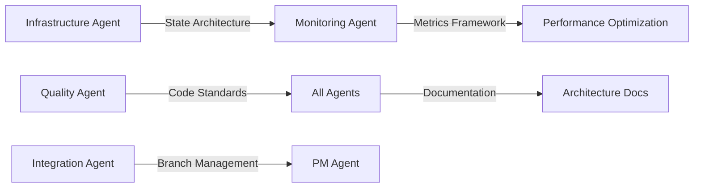

# Multi-Agent Workflow Protocols
## Enhanced Integration Framework for Foundation Epic Phase 2+

### 🎯 Protocol Overview

Based on Gemini expert analysis and current Foundation Epic execution, establish robust multi-agent coordination protocols that scale with system complexity while maintaining production-grade quality standards.

## 🔄 Core Workflow Architecture

### 1. Agent Lifecycle Management

#### Agent Spawning Protocol
```yaml
Agent Spawn Sequence:
  1. Mission Definition:
     - Clear, specific task description
     - Measurable success criteria
     - Escalation triggers defined
     - Timeline with checkpoints
  
  2. Resource Allocation:
     - Dedicated worktree for isolation
     - Unique tmux session for monitoring
     - Branch creation for safe experimentation
     - Enhanced State Manager registration
  
  3. Coordination Setup:
     - PM agent assignment for oversight
     - Inter-agent dependency mapping
     - Conflict resolution protocols
     - Progress reporting schedule
```

#### Agent Coordination Hierarchy
```
Product Manager Agent (PM)
├── Critical Path Agents
│   ├── Infrastructure (state management, scalability)
│   └── Quality (technical debt, CI/CD)
├── High Priority Agents
│   ├── Integration (repository management)
│   ├── Monitoring (observability, alerting)
│   └── Documentation (architecture, knowledge)
└── Specialized Agents
    ├── Security (authentication, authorization)
    ├── Performance (optimization, benchmarking)
    └── Frontend (UI/UX, user experience)
```

### 2. Inter-Agent Communication Protocol

#### Communication Rules
1. **No Direct Agent-to-Agent Communication**
   - All coordination flows through PM agent
   - Prevents coordination chaos and conflicting instructions
   - Enables centralized conflict resolution

2. **Structured Progress Reporting**
   ```json
   {
     "agent_id": "infrastructure-Jul-17-0822",
     "timestamp": "2025-07-17T08:25:00Z",
     "status": "in_progress",
     "progress_percentage": 45,
     "completed_deliverables": ["SQLite analysis", "PostgreSQL research"],
     "current_task": "Redis integration implementation",
     "blockers": [],
     "next_checkpoint": "2025-07-17T09:25:00Z",
     "estimated_completion": "2025-07-17T12:25:00Z"
   }
   ```

3. **Escalation Triggers**
   - **Technical Complexity:** Task exceeds agent's capability or timeline
   - **Cross-Agent Dependencies:** Agent needs input/coordination from other agents
   - **Quality Gate Failures:** Agent's work fails validation criteria
   - **Resource Conflicts:** Multiple agents competing for same resources

#### Dependency Management


### 3. Branch & Repository Management

#### Branch Isolation Strategy
```bash
# Agent branch naming convention
{agent-type}-{timestamp}-{mission-slug}

# Examples:
infrastructure-Jul-17-0822-state-management-scalability
performance-Jul-17-0823-technical-debt-reduction
integration-specialist-Jul-17-0824-repository-cleanup
```

#### Merge Coordination Protocol
1. **Agent Completion Validation**
   - All success criteria met
   - Quality gates passed
   - No outstanding escalations

2. **Cross-Agent Impact Analysis**
   - Review changes for conflicts with other agents
   - Validate no breaking changes to shared components
   - Confirm compatibility with ongoing agent work

3. **Staged Integration Process**
   ```
   Agent Branch → Integration Staging → Quality Validation → Main Branch
   ```

4. **Rollback Procedures**
   - Maintain rollback points before each integration
   - Agent-specific rollback capabilities
   - Coordination rollback for multi-agent conflicts

### 4. Quality Assurance Framework

#### Enhanced Quality Gates
```yaml
Pre-Commit Gates:
  - Code Syntax Validation: Python/JS/etc syntax check
  - Type Checking: mypy validation with zero violations
  - Code Quality: pylint validation with zero violations
  - Security Scanning: bandit security analysis
  - Test Coverage: Minimum 80% coverage for modified code
  - Dead Code Detection: No unused imports or functions

Pre-Integration Gates:
  - Cross-Agent Compatibility: No conflicts with other agent work
  - Performance Benchmarks: No regression in critical metrics
  - Documentation Update: Architecture docs reflect changes
  - Integration Testing: End-to-end workflow validation
  
Production Gates:
  - Load Testing: System performance under agent coordination load
  - Monitoring Validation: All metrics and alerts operational
  - Security Review: Production security standards met
  - Rollback Tested: Rollback procedures validated
```

#### Technical Debt Prevention
- **Zero Tolerance Policy:** No new technical debt introduced
- **Automated Enforcement:** Enhanced pre-commit hooks prevent debt accumulation
- **Continuous Monitoring:** Regular technical debt analysis and reporting
- **Agent Accountability:** Each agent responsible for maintaining quality standards

### 5. Monitoring & Observability

#### Agent Performance Metrics
```yaml
Business Metrics:
  - Task Completion Rate: % of tasks completed within timeline
  - Quality Score: % of deliverables passing quality gates
  - Coordination Efficiency: Time spent on cross-agent coordination
  - Escalation Rate: % of tasks requiring PM intervention

Technical Metrics:
  - Resource Utilization: CPU/Memory usage per agent
  - Branch Lifecycle: Time from creation to merge
  - Conflict Resolution Time: Time to resolve cross-agent conflicts
  - Code Quality Trend: Technical debt over time

System Metrics:
  - State Manager Performance: Database operation latency
  - Context Usage: Memory consumption patterns
  - Communication Overhead: Inter-agent coordination cost
  - Production Readiness: Overall system stability score
```

#### Alerting Framework
```yaml
Critical Alerts:
  - Agent Failure: Agent stops responding or crashes
  - Quality Gate Failure: Critical quality standards violated
  - Resource Exhaustion: System resources critically low
  - Security Incident: Security vulnerability detected

Warning Alerts:
  - Timeline Deviation: Agent behind schedule by >20%
  - Quality Degradation: Decreasing quality trends
  - Resource Pressure: System resources under pressure
  - Coordination Overhead: Excessive cross-agent communication

Info Alerts:
  - Milestone Achievement: Major deliverable completed
  - Quality Improvement: Technical debt reduction achieved
  - Performance Optimization: System performance improved
  - Documentation Update: Architecture documentation updated
```

### 6. Scalability Architecture

#### Horizontal Agent Scaling
```yaml
Agent Pool Management:
  - Dynamic Agent Spawning: Create agents based on workload
  - Agent Specialization: Specialized agents for specific domains
  - Load Balancing: Distribute work across available agents
  - Resource Optimization: Scale agent resources based on demand

Agent Coordination Scaling:
  - Hierarchical Coordination: Sub-PM agents for complex coordination
  - Distributed State Management: Multiple state managers for scale
  - Event-Driven Architecture: Async communication for performance
  - Circuit Breakers: Fault tolerance for agent failures
```

#### State Management Evolution
```yaml
Current (Foundation Epic Phase 2):
  - SQLite for development and small-scale coordination
  - Redis for ephemeral state and event queues
  - Enhanced State Manager for agent lifecycle

Target (Production Scale):
  - PostgreSQL for production state persistence
  - Redis Cluster for distributed caching and queuing
  - Distributed state management across multiple nodes
  - Event streaming for real-time coordination
```

### 7. Integration with External Systems

#### GitHub Integration Protocol
```yaml
Issue Management:
  - Automated issue creation for agent tasks
  - Progress tracking via issue comments
  - Milestone tracking for epic completion
  - Automated status updates based on agent progress

Pull Request Coordination:
  - Automated PR creation for agent branches
  - Cross-agent dependency validation
  - Automated review assignment
  - Integration staging coordination

Project Board Management:
  - Real-time status updates
  - Automated card movement based on agent progress
  - Epic/sprint tracking integration
  - Velocity and burndown calculation
```

#### CI/CD Integration
```yaml
Continuous Integration:
  - Automated testing on agent branches
  - Cross-agent compatibility testing
  - Performance regression detection
  - Security vulnerability scanning

Continuous Deployment:
  - Staging environment for integration testing
  - Production deployment coordination
  - Rollback automation for failures
  - Blue-green deployment for zero downtime
```

### 8. Learning & Optimization

#### Adaptive Workflow Evolution
```yaml
Continuous Improvement:
  - Agent performance analysis
  - Workflow optimization based on metrics
  - Quality gate refinement
  - Coordination protocol evolution

Knowledge Management:
  - Agent task pattern recognition
  - Best practice documentation
  - Failure analysis and prevention
  - Success pattern replication
```

#### Feedback Loops
```yaml
Agent-Level Feedback:
  - Task completion analysis
  - Quality improvement suggestions
  - Resource optimization recommendations
  - Skill development tracking

System-Level Feedback:
  - Coordination efficiency analysis
  - Scalability bottleneck identification
  - Performance optimization opportunities
  - Architecture evolution planning
```

## 🎯 Implementation Roadmap

### Phase 1: Current Implementation (Foundation Epic Phase 2)
- ✅ Basic multi-agent spawning and coordination
- ✅ Branch isolation and basic conflict resolution
- ✅ Enhanced State Manager for agent tracking
- 🔄 Quality gate enhancement and technical debt elimination

### Phase 2: Enhanced Coordination (Sprint 1)
- 🎯 Automated progress reporting and monitoring
- 🎯 Advanced conflict resolution protocols
- 🎯 Performance metrics and alerting framework
- 🎯 Production-ready state management migration

### Phase 3: Production Scaling (Sprint 2-4)
- 🎯 Horizontal agent scaling capabilities
- 🎯 Distributed state management architecture
- 🎯 Advanced observability and debugging tools
- 🎯 Full CI/CD integration and automation

### Phase 4: Intelligence & Optimization (Future)
- 🎯 AI-driven task allocation and optimization
- 🎯 Predictive failure detection and prevention
- 🎯 Automated workflow evolution and adaptation
- 🎯 Self-healing and self-optimizing coordination

This framework provides the foundation for scaling from the current 5-agent coordination to enterprise-scale multi-agent development orchestration while maintaining quality, reliability, and production readiness standards.