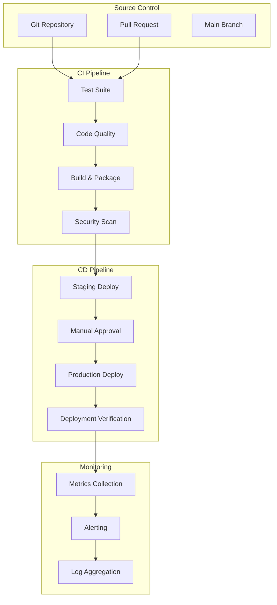

# CI/CD Operations Guide

**Version**: 1.0  
**Last Updated**: July 15, 2025  
**Status**: Production Ready  

## Overview

This guide provides comprehensive CI/CD operations for LeanVibe Agent Hive, covering automated testing, deployment pipelines, quality gates, and operational procedures.

## CI/CD Architecture

### Pipeline Overview



### Quality Gates

#### Pre-commit Hooks
```bash
#!/bin/bash
# .git/hooks/pre-commit
set -e

echo "🔍 Running pre-commit quality checks..."

# Python syntax check
python -m py_compile $(find . -name "*.py" | grep -v __pycache__ | head -20)

# Import validation
python -c "
import sys
sys.path.insert(0, '.')
try:
    from advanced_orchestration import MultiAgentCoordinator
    from external_api import ApiGateway
    from ml_enhancements import AdaptiveLearning
    print('✅ Import validation passed')
except ImportError as e:
    print(f'❌ Import validation failed: {e}')
    sys.exit(1)
"

# Run critical tests
python -m pytest tests/unit/test_orchestrator.py -v --tb=short

echo "✅ Pre-commit checks passed!"
```

#### Pre-push Hooks
```bash
#!/bin/bash
# .git/hooks/pre-push
set -e

echo "🚀 Running pre-push validation..."

# Full test suite
uv run pytest --cov=advanced_orchestration --cov=external_api --cov=ml_enhancements --cov-report=term-missing

# Security scan
uv run bandit -r . -f json -o security_report.json || echo "Security scan completed with warnings"

# Performance benchmarks
uv run pytest tests/performance/ -v

echo "✅ Pre-push validation passed!"
```

## GitHub Actions Workflows

### Main CI/CD Pipeline

```yaml
# .github/workflows/ci-cd.yml
name: CI/CD Pipeline

on:
  push:
    branches: [main, develop]
  pull_request:
    branches: [main, develop]
  release:
    types: [published]

env:
  REGISTRY: ghcr.io
  IMAGE_NAME: leanvibe/agent-hive

jobs:
  test:
    name: Test Suite
    runs-on: ubuntu-latest
    strategy:
      matrix:
        python-version: ['3.12']
    
    steps:
    - name: Checkout code
      uses: actions/checkout@v4
      
    - name: Set up Python
      uses: actions/setup-python@v4
      with:
        python-version: ${{ matrix.python-version }}
        
    - name: Install UV
      run: |
        curl -LsSf https://astral.sh/uv/install.sh | sh
        source ~/.bashrc
        
    - name: Cache dependencies
      uses: actions/cache@v3
      with:
        path: ~/.cache/uv
        key: ${{ runner.os }}-uv-${{ hashFiles('**/pyproject.toml') }}
        restore-keys: |
          ${{ runner.os }}-uv-
          
    - name: Install dependencies
      run: uv sync
      
    - name: Run tests
      run: |
        uv run pytest \
          --cov=advanced_orchestration \
          --cov=external_api \
          --cov=ml_enhancements \
          --cov-report=xml \
          --cov-report=term-missing \
          --junitxml=test-results.xml
          
    - name: Upload coverage to Codecov
      uses: codecov/codecov-action@v3
      with:
        files: ./coverage.xml
        fail_ci_if_error: true
        
    - name: Upload test results
      uses: actions/upload-artifact@v3
      if: always()
      with:
        name: test-results
        path: test-results.xml

  quality:
    name: Code Quality
    runs-on: ubuntu-latest
    needs: test
    
    steps:
    - name: Checkout code
      uses: actions/checkout@v4
      
    - name: Set up Python
      uses: actions/setup-python@v4
      with:
        python-version: '3.12'
        
    - name: Install UV
      run: |
        curl -LsSf https://astral.sh/uv/install.sh | sh
        source ~/.bashrc
        
    - name: Install dependencies
      run: uv sync
      
    - name: Run linting
      run: |
        uv run flake8 . --count --select=E9,F63,F7,F82 --show-source --statistics
        uv run flake8 . --count --exit-zero --max-complexity=10 --max-line-length=127 --statistics
        
    - name: Run type checking
      run: uv run mypy . --ignore-missing-imports
      
    - name: Run security scan
      run: |
        uv run bandit -r . -f json -o bandit-report.json
        uv run safety check --json --output safety-report.json
        
    - name: Upload security reports
      uses: actions/upload-artifact@v3
      with:
        name: security-reports
        path: |
          bandit-report.json
          safety-report.json

  performance:
    name: Performance Tests
    runs-on: ubuntu-latest
    needs: test
    
    steps:
    - name: Checkout code
      uses: actions/checkout@v4
      
    - name: Set up Python
      uses: actions/setup-python@v4
      with:
        python-version: '3.12'
        
    - name: Install UV
      run: |
        curl -LsSf https://astral.sh/uv/install.sh | sh
        source ~/.bashrc
        
    - name: Install dependencies
      run: uv sync
      
    - name: Run performance tests
      run: |
        uv run pytest tests/performance/ \
          --benchmark-json=benchmark-results.json \
          --benchmark-compare-fail=min:5% \
          --benchmark-sort=mean
          
    - name: Upload performance results
      uses: actions/upload-artifact@v3
      with:
        name: performance-results
        path: benchmark-results.json

  build:
    name: Build & Package
    runs-on: ubuntu-latest
    needs: [test, quality, performance]
    outputs:
      image: ${{ steps.image.outputs.image }}
      digest: ${{ steps.build.outputs.digest }}
    
    steps:
    - name: Checkout code
      uses: actions/checkout@v4
      
    - name: Set up Docker Buildx
      uses: docker/setup-buildx-action@v3
      
    - name: Log in to Container Registry
      uses: docker/login-action@v3
      with:
        registry: ${{ env.REGISTRY }}
        username: ${{ github.actor }}
        password: ${{ secrets.GITHUB_TOKEN }}
        
    - name: Extract metadata
      id: meta
      uses: docker/metadata-action@v5
      with:
        images: ${{ env.REGISTRY }}/${{ env.IMAGE_NAME }}
        tags: |
          type=ref,event=branch
          type=ref,event=pr
          type=semver,pattern={{version}}
          type=semver,pattern={{major}}.{{minor}}
          type=sha
          
    - name: Build and push Docker image
      id: build
      uses: docker/build-push-action@v5
      with:
        context: .
        platforms: linux/amd64,linux/arm64
        push: true
        tags: ${{ steps.meta.outputs.tags }}
        labels: ${{ steps.meta.outputs.labels }}
        cache-from: type=gha
        cache-to: type=gha,mode=max
        
    - name: Output image details
      id: image
      run: |
        echo "image=${{ env.REGISTRY }}/${{ env.IMAGE_NAME }}:${{ steps.meta.outputs.version }}" >> $GITHUB_OUTPUT

  deploy-staging:
    name: Deploy to Staging
    runs-on: ubuntu-latest
    needs: build
    if: github.ref == 'refs/heads/develop'
    environment: staging
    
    steps:
    - name: Checkout code
      uses: actions/checkout@v4
      
    - name: Configure kubectl
      run: |
        echo "${{ secrets.KUBE_CONFIG_STAGING }}" | base64 -d > /tmp/kubeconfig
        export KUBECONFIG=/tmp/kubeconfig
        
    - name: Deploy to staging
      run: |
        kubectl set image deployment/agent-hive-orchestrator \
          orchestrator=${{ needs.build.outputs.image }} \
          -n agent-hive-staging
        kubectl rollout status deployment/agent-hive-orchestrator \
          -n agent-hive-staging \
          --timeout=300s
          
    - name: Verify deployment
      run: |
        kubectl get pods -n agent-hive-staging
        kubectl logs -n agent-hive-staging -l app=agent-hive --tail=50
        
    - name: Run integration tests
      run: |
        uv run pytest tests/integration/ \
          --base-url=https://staging.agent-hive.com \
          --api-key=${{ secrets.STAGING_API_KEY }}

  deploy-production:
    name: Deploy to Production
    runs-on: ubuntu-latest
    needs: [build, deploy-staging]
    if: github.ref == 'refs/heads/main'
    environment: production
    
    steps:
    - name: Checkout code
      uses: actions/checkout@v4
      
    - name: Configure kubectl
      run: |
        echo "${{ secrets.KUBE_CONFIG_PRODUCTION }}" | base64 -d > /tmp/kubeconfig
        export KUBECONFIG=/tmp/kubeconfig
        
    - name: Deploy to production
      run: |
        kubectl set image deployment/agent-hive-orchestrator \
          orchestrator=${{ needs.build.outputs.image }} \
          -n agent-hive-production
        kubectl rollout status deployment/agent-hive-orchestrator \
          -n agent-hive-production \
          --timeout=600s
          
    - name: Verify deployment
      run: |
        kubectl get pods -n agent-hive-production
        kubectl logs -n agent-hive-production -l app=agent-hive --tail=50
        
    - name: Run smoke tests
      run: |
        uv run pytest tests/smoke/ \
          --base-url=https://api.agent-hive.com \
          --api-key=${{ secrets.PRODUCTION_API_KEY }}
          
    - name: Update deployment status
      run: |
        curl -X POST \
          -H "Authorization: Bearer ${{ secrets.GITHUB_TOKEN }}" \
          -H "Accept: application/vnd.github.v3+json" \
          https://api.github.com/repos/${{ github.repository }}/deployments \
          -d '{
            "ref": "${{ github.sha }}",
            "environment": "production",
            "description": "Production deployment",
            "auto_merge": false
          }'

  notify:
    name: Notify Team
    runs-on: ubuntu-latest
    needs: [deploy-production]
    if: always()
    
    steps:
    - name: Notify Slack
      uses: 8398a7/action-slack@v3
      with:
        status: ${{ job.status }}
        channel: '#deployments'
        webhook_url: ${{ secrets.SLACK_WEBHOOK }}
        fields: repo,message,commit,author,action,eventName,ref,workflow
```

### Security Scanning Workflow

```yaml
# .github/workflows/security.yml
name: Security Scan

on:
  schedule:
    - cron: '0 2 * * *'  # Daily at 2 AM
  pull_request:
    branches: [main]
  push:
    branches: [main]

jobs:
  security-scan:
    name: Security Analysis
    runs-on: ubuntu-latest
    
    steps:
    - name: Checkout code
      uses: actions/checkout@v4
      
    - name: Run Trivy vulnerability scanner
      uses: aquasecurity/trivy-action@master
      with:
        scan-type: 'fs'
        scan-ref: '.'
        format: 'sarif'
        output: 'trivy-results.sarif'
        
    - name: Upload Trivy scan results
      uses: github/codeql-action/upload-sarif@v2
      with:
        sarif_file: 'trivy-results.sarif'
        
    - name: Run CodeQL Analysis
      uses: github/codeql-action/analyze@v2
      with:
        languages: python
        
    - name: Run Snyk security scan
      uses: snyk/actions/python@master
      env:
        SNYK_TOKEN: ${{ secrets.SNYK_TOKEN }}
      with:
        args: --severity-threshold=high
```

## Automated Testing Strategy

### Test Categories

#### Unit Tests
```python
# tests/unit/test_coordinator.py
import pytest
from advanced_orchestration import MultiAgentCoordinator
from advanced_orchestration.models import CoordinatorConfig

@pytest.mark.asyncio
async def test_agent_registration():
    """Test agent registration functionality."""
    coordinator = MultiAgentCoordinator()
    
    # Test successful registration
    agent = MockAgent("test-agent")
    success = await coordinator.register_agent(agent)
    assert success is True
    
    # Test duplicate registration
    duplicate_success = await coordinator.register_agent(agent)
    assert duplicate_success is False

@pytest.mark.asyncio
async def test_task_assignment():
    """Test task assignment with load balancing."""
    coordinator = MultiAgentCoordinator()
    
    # Register agents
    agent1 = MockAgent("agent-1")
    agent2 = MockAgent("agent-2")
    await coordinator.register_agent(agent1)
    await coordinator.register_agent(agent2)
    
    # Assign task
    task = MockTask("test-task")
    assignment = await coordinator.assign_task(task)
    
    assert assignment.agent_id in ["agent-1", "agent-2"]
    assert assignment.confidence_score > 0.5
```

#### Integration Tests
```python
# tests/integration/test_api_integration.py
import pytest
import aiohttp
from external_api import ApiGateway, WebhookServer

@pytest.mark.asyncio
async def test_full_api_integration():
    """Test complete API integration workflow."""
    
    # Start services
    gateway = ApiGateway()
    webhook_server = WebhookServer()
    
    await gateway.start()
    await webhook_server.start()
    
    try:
        # Test API Gateway
        async with aiohttp.ClientSession() as session:
            async with session.get("http://localhost:8081/health") as resp:
                assert resp.status == 200
                health = await resp.json()
                assert health["status"] == "healthy"
        
        # Test webhook processing
        webhook_data = {"event": "test", "data": {"key": "value"}}
        async with aiohttp.ClientSession() as session:
            async with session.post(
                "http://localhost:8080/webhook/test",
                json=webhook_data
            ) as resp:
                assert resp.status == 200
                
    finally:
        await gateway.stop()
        await webhook_server.stop()
```

#### Performance Tests
```python
# tests/performance/test_coordination_performance.py
import pytest
import asyncio
from advanced_orchestration import MultiAgentCoordinator

@pytest.mark.asyncio
async def test_coordination_performance():
    """Test coordination performance under load."""
    coordinator = MultiAgentCoordinator()
    
    # Register multiple agents
    agents = [MockAgent(f"agent-{i}") for i in range(10)]
    for agent in agents:
        await coordinator.register_agent(agent)
    
    # Create multiple tasks
    tasks = [MockTask(f"task-{i}") for i in range(100)]
    
    # Measure assignment time
    start_time = asyncio.get_event_loop().time()
    
    assignments = await asyncio.gather(*[
        coordinator.assign_task(task) for task in tasks
    ])
    
    end_time = asyncio.get_event_loop().time()
    
    # Performance assertions
    total_time = end_time - start_time
    assert total_time < 5.0  # Should complete in under 5 seconds
    assert len(assignments) == 100
    assert all(a.confidence_score > 0.5 for a in assignments)
```

### Test Data Management

#### Test Fixtures
```python
# tests/conftest.py
import pytest
from unittest.mock import Mock
from advanced_orchestration.models import CoordinatorConfig

@pytest.fixture
def mock_agent():
    """Create a mock agent for testing."""
    agent = Mock()
    agent.agent_id = "test-agent"
    agent.capabilities = ["backend", "api"]
    agent.status = "active"
    agent.health_check = Mock(return_value=True)
    return agent

@pytest.fixture
def coordinator_config():
    """Create test coordinator configuration."""
    return CoordinatorConfig(
        max_agents=5,
        health_check_interval=10,
        load_balancing_strategy="round_robin"
    )

@pytest.fixture
async def test_coordinator(coordinator_config):
    """Create coordinator instance for testing."""
    coordinator = MultiAgentCoordinator(coordinator_config)
    yield coordinator
    # Cleanup
    await coordinator.shutdown()
```

## Deployment Strategies

### Blue-Green Deployment

```bash
#!/bin/bash
# deploy-blue-green.sh

NAMESPACE="agent-hive-production"
NEW_VERSION=$1
CURRENT_VERSION=$(kubectl get deployment agent-hive-orchestrator -n $NAMESPACE -o jsonpath='{.spec.template.spec.containers[0].image}')

echo "Deploying version $NEW_VERSION (current: $CURRENT_VERSION)"

# Create new deployment
kubectl patch deployment agent-hive-orchestrator -n $NAMESPACE \
  -p '{"spec":{"template":{"spec":{"containers":[{"name":"orchestrator","image":"'$NEW_VERSION'"}]}}}}'

# Wait for rollout
kubectl rollout status deployment/agent-hive-orchestrator -n $NAMESPACE --timeout=300s

# Verify deployment
HEALTH_CHECK=$(kubectl exec -n $NAMESPACE deployment/agent-hive-orchestrator -- curl -s localhost:8080/health | jq -r '.status')

if [ "$HEALTH_CHECK" = "healthy" ]; then
    echo "✅ Deployment successful"
    # Update service to point to new version
    kubectl patch service agent-hive-service -n $NAMESPACE \
      -p '{"spec":{"selector":{"version":"'$NEW_VERSION'"}}}'
else
    echo "❌ Deployment failed, rolling back"
    kubectl rollout undo deployment/agent-hive-orchestrator -n $NAMESPACE
    exit 1
fi
```

### Canary Deployment

```yaml
# canary-deployment.yaml
apiVersion: argoproj.io/v1alpha1
kind: Rollout
metadata:
  name: agent-hive-canary
  namespace: agent-hive-production
spec:
  replicas: 10
  strategy:
    canary:
      steps:
      - setWeight: 10
      - pause: {duration: 300}
      - setWeight: 25
      - pause: {duration: 300}
      - setWeight: 50
      - pause: {duration: 300}
      - setWeight: 75
      - pause: {duration: 300}
  selector:
    matchLabels:
      app: agent-hive
  template:
    metadata:
      labels:
        app: agent-hive
    spec:
      containers:
      - name: orchestrator
        image: leanvibe/agent-hive:latest
        ports:
        - containerPort: 8080
```

## Monitoring and Alerting

### Prometheus Rules

```yaml
# monitoring/prometheus-rules.yml
groups:
  - name: agent-hive-alerts
    rules:
    - alert: HighErrorRate
      expr: rate(agent_hive_errors_total[5m]) > 0.1
      for: 5m
      labels:
        severity: warning
      annotations:
        summary: "High error rate detected"
        description: "Error rate is {{ $value }} errors per second"
        
    - alert: HighResponseTime
      expr: histogram_quantile(0.95, rate(agent_hive_response_time_seconds_bucket[5m])) > 1.0
      for: 2m
      labels:
        severity: warning
      annotations:
        summary: "High response time detected"
        description: "95th percentile response time is {{ $value }} seconds"
        
    - alert: LowAgentCount
      expr: agent_hive_active_agents < 3
      for: 1m
      labels:
        severity: critical
      annotations:
        summary: "Low agent count"
        description: "Only {{ $value }} agents are active"
```

### Grafana Dashboard

```json
{
  "dashboard": {
    "title": "Agent Hive CI/CD Dashboard",
    "panels": [
      {
        "title": "Deployment Frequency",
        "type": "stat",
        "targets": [
          {
            "expr": "increase(agent_hive_deployments_total[7d])"
          }
        ]
      },
      {
        "title": "Lead Time",
        "type": "graph",
        "targets": [
          {
            "expr": "agent_hive_lead_time_seconds"
          }
        ]
      },
      {
        "title": "Change Failure Rate",
        "type": "stat",
        "targets": [
          {
            "expr": "rate(agent_hive_failed_deployments_total[7d]) / rate(agent_hive_deployments_total[7d])"
          }
        ]
      }
    ]
  }
}
```

## Quality Metrics

### DORA Metrics

```python
# metrics/dora_metrics.py
from prometheus_client import Counter, Histogram, Gauge
from datetime import datetime

# Deployment frequency
deployment_counter = Counter(
    'agent_hive_deployments_total',
    'Total number of deployments',
    ['environment', 'status']
)

# Lead time
lead_time_histogram = Histogram(
    'agent_hive_lead_time_seconds',
    'Time from commit to production',
    buckets=(300, 600, 1800, 3600, 7200, 14400, 28800, 86400)
)

# Change failure rate
change_failure_counter = Counter(
    'agent_hive_failed_deployments_total',
    'Failed deployments',
    ['environment', 'reason']
)

# Recovery time
recovery_time_histogram = Histogram(
    'agent_hive_recovery_time_seconds',
    'Time to recover from failure',
    buckets=(60, 300, 900, 1800, 3600, 7200, 14400)
)

class DORAMetrics:
    def record_deployment(self, environment: str, status: str, lead_time: float):
        deployment_counter.labels(environment=environment, status=status).inc()
        if status == 'success':
            lead_time_histogram.observe(lead_time)
        else:
            change_failure_counter.labels(environment=environment, reason=status).inc()
    
    def record_recovery(self, recovery_time: float):
        recovery_time_histogram.observe(recovery_time)
```

## Troubleshooting

### Common CI/CD Issues

#### Test Failures
```bash
# Debug test failures
uv run pytest tests/unit/test_failing.py -v -s --tb=long

# Run specific test with debugging
uv run pytest tests/unit/test_coordinator.py::test_agent_registration -v --pdb
```

#### Build Failures
```bash
# Check Docker build logs
docker build -t agent-hive:debug . --no-cache

# Debug dependency issues
uv run pip-audit --desc

# Check for import issues
python -c "import advanced_orchestration; print('OK')"
```

#### Deployment Issues
```bash
# Check deployment status
kubectl get pods -n agent-hive-production
kubectl describe deployment agent-hive-orchestrator -n agent-hive-production

# View logs
kubectl logs -n agent-hive-production -l app=agent-hive --tail=100

# Check rollout status
kubectl rollout status deployment/agent-hive-orchestrator -n agent-hive-production
```

### Performance Issues

#### Slow Tests
```bash
# Profile test performance
uv run pytest tests/ --durations=10

# Run tests with coverage profiling
uv run pytest tests/ --cov-report=html --cov-report=term-missing
```

#### Build Performance
```bash
# Use Docker build cache
docker build --cache-from leanvibe/agent-hive:latest -t leanvibe/agent-hive:new .

# Multi-stage build optimization
docker build --target=production -t leanvibe/agent-hive:prod .
```

## Best Practices

### Code Quality
- Maintain >95% test coverage
- Use type hints for all functions
- Follow PEP 8 style guidelines
- Document all public APIs
- Use meaningful commit messages

### Security
- Scan all dependencies for vulnerabilities
- Use secrets management for sensitive data
- Implement proper authentication and authorization
- Regular security audits and penetration testing
- Monitor for security incidents

### Performance
- Benchmark critical paths
- Monitor resource usage
- Optimize Docker images
- Use caching strategies
- Profile production workloads

## Conclusion

This CI/CD operations guide provides comprehensive automation for LeanVibe Agent Hive, ensuring reliable, secure, and efficient deployment pipelines. Regular monitoring and continuous improvement of these processes will maintain high quality and reliability standards.

For specific issues or improvements, consult the troubleshooting section or reach out to the development team.

---

**Next Steps**:
- Set up your CI/CD pipeline using the provided workflows
- Configure monitoring and alerting
- Implement security scanning
- Establish performance benchmarks