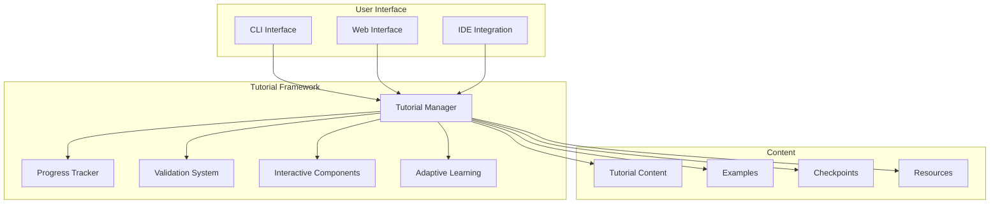

# Interactive Tutorial Framework

**Status**: ✅ Production Ready  
**Version**: 1.0  
**Last Updated**: July 15, 2025

## Overview

The Interactive Tutorial Framework provides a structured, guided learning experience for LeanVibe Agent Hive users. It includes progress tracking, validation checkpoints, and adaptive learning paths based on user skill level and goals.

## Table of Contents

- [Framework Architecture](#framework-architecture)
- [Tutorial Structure](#tutorial-structure)
- [Progress Tracking](#progress-tracking)
- [Validation System](#validation-system)
- [Interactive Components](#interactive-components)
- [Adaptive Learning](#adaptive-learning)
- [Implementation Guide](#implementation-guide)

## Framework Architecture

### Core Components



### Tutorial Manager

```python
# tutorial_framework/tutorial_manager.py
from typing import Dict, List, Optional, Any
from dataclasses import dataclass
from enum import Enum
import json
import os
from datetime import datetime

class TutorialStatus(Enum):
    NOT_STARTED = "not_started"
    IN_PROGRESS = "in_progress"
    COMPLETED = "completed"
    FAILED = "failed"
    SKIPPED = "skipped"

class DifficultyLevel(Enum):
    BEGINNER = "beginner"
    INTERMEDIATE = "intermediate"
    ADVANCED = "advanced"

@dataclass
class TutorialStep:
    """Individual tutorial step with validation."""
    step_id: str
    title: str
    description: str
    instructions: List[str]
    code_examples: List[str]
    validation_command: Optional[str] = None
    expected_output: Optional[str] = None
    hints: List[str] = None
    estimated_time: int = 5  # minutes
    
    def __post_init__(self):
        if self.hints is None:
            self.hints = []

@dataclass
class TutorialMetadata:
    """Tutorial metadata and configuration."""
    tutorial_id: str
    title: str
    description: str
    difficulty: DifficultyLevel
    estimated_time: int  # minutes
    prerequisites: List[str]
    learning_objectives: List[str]
    tags: List[str]
    version: str = "1.0"
    author: str = "LeanVibe Team"
    
@dataclass
class UserProgress:
    """User progress tracking."""
    user_id: str
    tutorial_id: str
    current_step: int
    status: TutorialStatus
    started_at: datetime
    completed_at: Optional[datetime] = None
    step_progress: Dict[str, TutorialStatus] = None
    hints_used: List[str] = None
    time_spent: int = 0  # minutes
    
    def __post_init__(self):
        if self.step_progress is None:
            self.step_progress = {}
        if self.hints_used is None:
            self.hints_used = []

class TutorialManager:
    """Main tutorial management system."""
    
    def __init__(self, tutorial_path: str = "tutorials"):
        self.tutorial_path = tutorial_path
        self.tutorials: Dict[str, 'Tutorial'] = {}
        self.user_progress: Dict[str, Dict[str, UserProgress]] = {}
        self.load_tutorials()
        
    def load_tutorials(self):
        """Load all available tutorials."""
        tutorial_dir = os.path.join(self.tutorial_path, "content")
        if not os.path.exists(tutorial_dir):
            return
            
        for filename in os.listdir(tutorial_dir):
            if filename.endswith('.json'):
                tutorial_file = os.path.join(tutorial_dir, filename)
                try:
                    with open(tutorial_file, 'r') as f:
                        tutorial_data = json.load(f)
                        tutorial = Tutorial.from_dict(tutorial_data)
                        self.tutorials[tutorial.metadata.tutorial_id] = tutorial
                except Exception as e:
                    print(f"Error loading tutorial {filename}: {e}")
    
    def get_tutorial(self, tutorial_id: str) -> Optional['Tutorial']:
        """Get tutorial by ID."""
        return self.tutorials.get(tutorial_id)
    
    def list_tutorials(self, difficulty: Optional[DifficultyLevel] = None) -> List['Tutorial']:
        """List available tutorials, optionally filtered by difficulty."""
        tutorials = list(self.tutorials.values())
        if difficulty:
            tutorials = [t for t in tutorials if t.metadata.difficulty == difficulty]
        return sorted(tutorials, key=lambda t: t.metadata.estimated_time)
    
    def start_tutorial(self, user_id: str, tutorial_id: str) -> bool:
        """Start a tutorial for a user."""
        tutorial = self.get_tutorial(tutorial_id)
        if not tutorial:
            return False
            
        if user_id not in self.user_progress:
            self.user_progress[user_id] = {}
            
        progress = UserProgress(
            user_id=user_id,
            tutorial_id=tutorial_id,
            current_step=0,
            status=TutorialStatus.IN_PROGRESS,
            started_at=datetime.now()
        )
        
        self.user_progress[user_id][tutorial_id] = progress
        self.save_progress(user_id)
        return True
    
    def get_progress(self, user_id: str, tutorial_id: str) -> Optional[UserProgress]:
        """Get user progress for a tutorial."""
        return self.user_progress.get(user_id, {}).get(tutorial_id)
    
    def complete_step(self, user_id: str, tutorial_id: str, step_id: str) -> bool:
        """Mark a step as completed."""
        progress = self.get_progress(user_id, tutorial_id)
        if not progress:
            return False
            
        progress.step_progress[step_id] = TutorialStatus.COMPLETED
        progress.current_step += 1
        
        tutorial = self.get_tutorial(tutorial_id)
        if tutorial and progress.current_step >= len(tutorial.steps):
            progress.status = TutorialStatus.COMPLETED
            progress.completed_at = datetime.now()
            
        self.save_progress(user_id)
        return True
    
    def save_progress(self, user_id: str):
        """Save user progress to file."""
        progress_file = os.path.join(self.tutorial_path, "progress", f"{user_id}.json")
        os.makedirs(os.path.dirname(progress_file), exist_ok=True)
        
        progress_data = {}
        for tutorial_id, progress in self.user_progress.get(user_id, {}).items():
            progress_data[tutorial_id] = {
                "user_id": progress.user_id,
                "tutorial_id": progress.tutorial_id,
                "current_step": progress.current_step,
                "status": progress.status.value,
                "started_at": progress.started_at.isoformat(),
                "completed_at": progress.completed_at.isoformat() if progress.completed_at else None,
                "step_progress": {k: v.value for k, v in progress.step_progress.items()},
                "hints_used": progress.hints_used,
                "time_spent": progress.time_spent
            }
        
        with open(progress_file, 'w') as f:
            json.dump(progress_data, f, indent=2)

class Tutorial:
    """Complete tutorial with steps and metadata."""
    
    def __init__(self, metadata: TutorialMetadata, steps: List[TutorialStep]):
        self.metadata = metadata
        self.steps = steps
        
    @classmethod
    def from_dict(cls, data: Dict[str, Any]) -> 'Tutorial':
        """Create tutorial from dictionary."""
        metadata = TutorialMetadata(
            tutorial_id=data['metadata']['tutorial_id'],
            title=data['metadata']['title'],
            description=data['metadata']['description'],
            difficulty=DifficultyLevel(data['metadata']['difficulty']),
            estimated_time=data['metadata']['estimated_time'],
            prerequisites=data['metadata']['prerequisites'],
            learning_objectives=data['metadata']['learning_objectives'],
            tags=data['metadata']['tags'],
            version=data['metadata'].get('version', '1.0'),
            author=data['metadata'].get('author', 'LeanVibe Team')
        )
        
        steps = []
        for step_data in data['steps']:
            step = TutorialStep(
                step_id=step_data['step_id'],
                title=step_data['title'],
                description=step_data['description'],
                instructions=step_data['instructions'],
                code_examples=step_data['code_examples'],
                validation_command=step_data.get('validation_command'),
                expected_output=step_data.get('expected_output'),
                hints=step_data.get('hints', []),
                estimated_time=step_data.get('estimated_time', 5)
            )
            steps.append(step)
        
        return cls(metadata, steps)
    
    def to_dict(self) -> Dict[str, Any]:
        """Convert tutorial to dictionary."""
        return {
            "metadata": {
                "tutorial_id": self.metadata.tutorial_id,
                "title": self.metadata.title,
                "description": self.metadata.description,
                "difficulty": self.metadata.difficulty.value,
                "estimated_time": self.metadata.estimated_time,
                "prerequisites": self.metadata.prerequisites,
                "learning_objectives": self.metadata.learning_objectives,
                "tags": self.metadata.tags,
                "version": self.metadata.version,
                "author": self.metadata.author
            },
            "steps": [
                {
                    "step_id": step.step_id,
                    "title": step.title,
                    "description": step.description,
                    "instructions": step.instructions,
                    "code_examples": step.code_examples,
                    "validation_command": step.validation_command,
                    "expected_output": step.expected_output,
                    "hints": step.hints,
                    "estimated_time": step.estimated_time
                }
                for step in self.steps
            ]
        }
```

### CLI Interface

```python
# tutorial_framework/cli_interface.py
import click
import sys
import subprocess
import time
from typing import Optional
from .tutorial_manager import TutorialManager, TutorialStatus, DifficultyLevel

class TutorialCLI:
    """CLI interface for interactive tutorials."""
    
    def __init__(self):
        self.manager = TutorialManager()
        self.current_user = "default"  # Simple user system
        
    def run(self):
        """Run the interactive tutorial CLI."""
        click.echo("🎓 Welcome to LeanVibe Agent Hive Interactive Tutorials!")
        click.echo("=" * 60)
        
        while True:
            try:
                action = self.show_main_menu()
                if action == 'quit':
                    break
                elif action == 'list':
                    self.list_tutorials()
                elif action == 'start':
                    self.start_tutorial()
                elif action == 'continue':
                    self.continue_tutorial()
                elif action == 'progress':
                    self.show_progress()
                    
            except KeyboardInterrupt:
                click.echo("\n👋 Thanks for using LeanVibe tutorials!")
                break
            except Exception as e:
                click.echo(f"❌ Error: {e}", err=True)
    
    def show_main_menu(self) -> str:
        """Show main menu and get user choice."""
        click.echo("\n📚 Main Menu:")
        click.echo("1. List available tutorials")
        click.echo("2. Start a new tutorial")
        click.echo("3. Continue existing tutorial")
        click.echo("4. Show progress")
        click.echo("5. Quit")
        
        choice = click.prompt("Choose an option (1-5)", type=int)
        
        actions = {
            1: 'list',
            2: 'start',
            3: 'continue',
            4: 'progress',
            5: 'quit'
        }
        
        return actions.get(choice, 'list')
    
    def list_tutorials(self):
        """List available tutorials."""
        click.echo("\n📖 Available Tutorials:")
        click.echo("-" * 40)
        
        tutorials = self.manager.list_tutorials()
        for i, tutorial in enumerate(tutorials, 1):
            status_icon = self.get_status_icon(tutorial.metadata.tutorial_id)
            difficulty_color = self.get_difficulty_color(tutorial.metadata.difficulty)
            
            click.echo(f"{i}. {status_icon} {tutorial.metadata.title}")
            click.echo(f"   {difficulty_color}{tutorial.metadata.difficulty.value.title()}{click.Style.RESET_ALL} • {tutorial.metadata.estimated_time} min")
            click.echo(f"   {tutorial.metadata.description}")
            click.echo()
    
    def start_tutorial(self):
        """Start a new tutorial."""
        tutorials = self.manager.list_tutorials()
        if not tutorials:
            click.echo("❌ No tutorials available.")
            return
            
        click.echo("\n🚀 Select a tutorial to start:")
        for i, tutorial in enumerate(tutorials, 1):
            difficulty_color = self.get_difficulty_color(tutorial.metadata.difficulty)
            click.echo(f"{i}. {tutorial.metadata.title} ({difficulty_color}{tutorial.metadata.difficulty.value}{click.Style.RESET_ALL})")
        
        choice = click.prompt("Choose tutorial number", type=int)
        if 1 <= choice <= len(tutorials):
            tutorial = tutorials[choice - 1]
            
            if self.manager.start_tutorial(self.current_user, tutorial.metadata.tutorial_id):
                click.echo(f"✅ Started tutorial: {tutorial.metadata.title}")
                self.run_tutorial(tutorial.metadata.tutorial_id)
            else:
                click.echo("❌ Failed to start tutorial.")
    
    def continue_tutorial(self):
        """Continue an existing tutorial."""
        # Get user's in-progress tutorials
        user_progress = self.manager.user_progress.get(self.current_user, {})
        in_progress = [(tid, progress) for tid, progress in user_progress.items() 
                      if progress.status == TutorialStatus.IN_PROGRESS]
        
        if not in_progress:
            click.echo("📝 No tutorials in progress.")
            return
        
        click.echo("\n🔄 Continue tutorial:")
        for i, (tutorial_id, progress) in enumerate(in_progress, 1):
            tutorial = self.manager.get_tutorial(tutorial_id)
            if tutorial:
                click.echo(f"{i}. {tutorial.metadata.title} (Step {progress.current_step + 1}/{len(tutorial.steps)})")
        
        choice = click.prompt("Choose tutorial number", type=int)
        if 1 <= choice <= len(in_progress):
            tutorial_id, _ = in_progress[choice - 1]
            self.run_tutorial(tutorial_id)
    
    def run_tutorial(self, tutorial_id: str):
        """Run a specific tutorial."""
        tutorial = self.manager.get_tutorial(tutorial_id)
        progress = self.manager.get_progress(self.current_user, tutorial_id)
        
        if not tutorial or not progress:
            click.echo("❌ Tutorial not found or not started.")
            return
        
        click.echo(f"\n🎯 Tutorial: {tutorial.metadata.title}")
        click.echo(f"📋 {tutorial.metadata.description}")
        click.echo(f"⏱️  Estimated time: {tutorial.metadata.estimated_time} minutes")
        click.echo(f"🎚️  Difficulty: {tutorial.metadata.difficulty.value.title()}")
        click.echo()
        
        # Show learning objectives
        click.echo("🎯 Learning Objectives:")
        for obj in tutorial.metadata.learning_objectives:
            click.echo(f"  • {obj}")
        click.echo()
        
        # Run steps
        for i, step in enumerate(tutorial.steps[progress.current_step:], progress.current_step):
            if not self.run_step(tutorial_id, step, i + 1, len(tutorial.steps)):
                break
    
    def run_step(self, tutorial_id: str, step: TutorialStep, step_num: int, total_steps: int) -> bool:
        """Run a single tutorial step."""
        click.echo(f"\n📍 Step {step_num}/{total_steps}: {step.title}")
        click.echo("=" * 50)
        click.echo(step.description)
        click.echo()
        
        # Show instructions
        click.echo("📝 Instructions:")
        for i, instruction in enumerate(step.instructions, 1):
            click.echo(f"{i}. {instruction}")
        click.echo()
        
        # Show code examples
        if step.code_examples:
            click.echo("💻 Code Examples:")
            for example in step.code_examples:
                click.echo(f"```")
                click.echo(example)
                click.echo("```")
            click.echo()
        
        # Wait for user to complete step
        while True:
            action = click.prompt(
                "\nChoose action: (c)ontinue, (h)int, (v)alidate, (s)kip, (q)uit",
                type=str, default='c'
            ).lower()
            
            if action == 'c':
                # Continue to next step
                if step.validation_command:
                    if self.validate_step(step):
                        self.manager.complete_step(self.current_user, tutorial_id, step.step_id)
                        click.echo("✅ Step completed!")
                        return True
                    else:
                        click.echo("❌ Validation failed. Please try again.")
                        continue
                else:
                    # No validation required
                    self.manager.complete_step(self.current_user, tutorial_id, step.step_id)
                    click.echo("✅ Step completed!")
                    return True
                    
            elif action == 'h':
                # Show hints
                if step.hints:
                    click.echo("💡 Hints:")
                    for hint in step.hints:
                        click.echo(f"  💡 {hint}")
                else:
                    click.echo("💡 No hints available for this step.")
                    
            elif action == 'v':
                # Validate step
                if step.validation_command:
                    self.validate_step(step)
                else:
                    click.echo("✅ No validation required for this step.")
                    
            elif action == 's':
                # Skip step
                click.echo("⏭️  Skipping step...")
                progress = self.manager.get_progress(self.current_user, tutorial_id)
                if progress:
                    progress.step_progress[step.step_id] = TutorialStatus.SKIPPED
                    progress.current_step += 1
                    self.manager.save_progress(self.current_user)
                return True
                
            elif action == 'q':
                # Quit tutorial
                click.echo("👋 Quitting tutorial...")
                return False
    
    def validate_step(self, step: TutorialStep) -> bool:
        """Validate a tutorial step."""
        if not step.validation_command:
            return True
        
        try:
            click.echo(f"🔍 Running validation: {step.validation_command}")
            result = subprocess.run(
                step.validation_command,
                shell=True,
                capture_output=True,
                text=True,
                timeout=30
            )
            
            if result.returncode == 0:
                if step.expected_output:
                    if step.expected_output in result.stdout:
                        click.echo("✅ Validation passed!")
                        return True
                    else:
                        click.echo(f"❌ Expected output not found.")
                        click.echo(f"Expected: {step.expected_output}")
                        click.echo(f"Got: {result.stdout.strip()}")
                        return False
                else:
                    click.echo("✅ Validation passed!")
                    return True
            else:
                click.echo(f"❌ Validation failed: {result.stderr}")
                return False
                
        except subprocess.TimeoutExpired:
            click.echo("❌ Validation timed out.")
            return False
        except Exception as e:
            click.echo(f"❌ Validation error: {e}")
            return False
    
    def show_progress(self):
        """Show user progress across all tutorials."""
        user_progress = self.manager.user_progress.get(self.current_user, {})
        
        if not user_progress:
            click.echo("📊 No tutorial progress found.")
            return
        
        click.echo("\n📊 Your Progress:")
        click.echo("-" * 30)
        
        for tutorial_id, progress in user_progress.items():
            tutorial = self.manager.get_tutorial(tutorial_id)
            if tutorial:
                status_icon = self.get_status_icon(tutorial_id)
                completion_rate = (progress.current_step / len(tutorial.steps)) * 100
                
                click.echo(f"{status_icon} {tutorial.metadata.title}")
                click.echo(f"   Progress: {progress.current_step}/{len(tutorial.steps)} steps ({completion_rate:.1f}%)")
                click.echo(f"   Status: {progress.status.value.title()}")
                click.echo(f"   Time spent: {progress.time_spent} minutes")
                click.echo()
    
    def get_status_icon(self, tutorial_id: str) -> str:
        """Get status icon for tutorial."""
        progress = self.manager.get_progress(self.current_user, tutorial_id)
        if not progress:
            return "⚪"
        
        if progress.status == TutorialStatus.COMPLETED:
            return "✅"
        elif progress.status == TutorialStatus.IN_PROGRESS:
            return "🔄"
        elif progress.status == TutorialStatus.FAILED:
            return "❌"
        else:
            return "⚪"
    
    def get_difficulty_color(self, difficulty: DifficultyLevel) -> str:
        """Get color for difficulty level."""
        colors = {
            DifficultyLevel.BEGINNER: click.style("", fg='green'),
            DifficultyLevel.INTERMEDIATE: click.style("", fg='yellow'),
            DifficultyLevel.ADVANCED: click.style("", fg='red')
        }
        return colors.get(difficulty, "")

# CLI entry point
@click.command()
def run_tutorials():
    """Run interactive tutorials."""
    cli = TutorialCLI()
    cli.run()

if __name__ == '__main__':
    run_tutorials()
```

### Tutorial Content Example

```json
{
  "metadata": {
    "tutorial_id": "getting-started",
    "title": "Getting Started with LeanVibe Agent Hive",
    "description": "Learn the basics of LeanVibe Agent Hive, including installation, basic concepts, and creating your first agent workflow.",
    "difficulty": "beginner",
    "estimated_time": 30,
    "prerequisites": ["Basic Python knowledge", "Command line familiarity"],
    "learning_objectives": [
      "Understand LeanVibe Agent Hive architecture",
      "Install and configure the system",
      "Create your first multi-agent workflow",
      "Monitor and debug agent interactions"
    ],
    "tags": ["basics", "installation", "first-steps"],
    "version": "1.0",
    "author": "LeanVibe Team"
  },
  "steps": [
    {
      "step_id": "installation",
      "title": "Installation and Setup",
      "description": "Install LeanVibe Agent Hive and verify the installation.",
      "instructions": [
        "Clone the repository: git clone https://github.com/leanvibe/agent-hive.git",
        "Navigate to the project directory: cd agent-hive",
        "Install dependencies: uv sync",
        "Verify installation: python cli.py --help"
      ],
      "code_examples": [
        "git clone https://github.com/leanvibe/agent-hive.git\ncd agent-hive\nuv sync\npython cli.py --help"
      ],
      "validation_command": "python cli.py --help",
      "expected_output": "LeanVibe Agent Hive",
      "hints": [
        "Make sure you have Python 3.12+ installed",
        "Install UV first: curl -LsSf https://astral.sh/uv/install.sh | sh",
        "If you get permission errors, check your Python environment"
      ],
      "estimated_time": 10
    },
    {
      "step_id": "basic-concepts",
      "title": "Understanding Basic Concepts",
      "description": "Learn about agents, coordinators, and the basic architecture.",
      "instructions": [
        "Read about the MultiAgentCoordinator in the API documentation",
        "Understand the concept of agent registration and task assignment",
        "Learn about resource management and scaling",
        "Explore the CLI commands available"
      ],
      "code_examples": [
        "from advanced_orchestration import MultiAgentCoordinator\nfrom advanced_orchestration.models import CoordinatorConfig\n\n# Create coordinator\nconfig = CoordinatorConfig()\ncoordinator = MultiAgentCoordinator(config)\nprint('Coordinator created successfully!')"
      ],
      "validation_command": "python -c \"from advanced_orchestration import MultiAgentCoordinator; print('Import successful')\"",
      "expected_output": "Import successful",
      "hints": [
        "Check the API_REFERENCE.md for detailed documentation",
        "The coordinator is the central component that manages all agents",
        "Each agent has specific capabilities and resource requirements"
      ],
      "estimated_time": 15
    },
    {
      "step_id": "first-workflow",
      "title": "Create Your First Workflow",
      "description": "Set up a simple multi-agent workflow with task assignment.",
      "instructions": [
        "Create a simple Python script that initializes the coordinator",
        "Register mock agents with different capabilities",
        "Create and assign tasks to agents",
        "Monitor the workflow execution"
      ],
      "code_examples": [
        "# first_workflow.py\nimport asyncio\nfrom advanced_orchestration import MultiAgentCoordinator\nfrom advanced_orchestration.models import CoordinatorConfig\n\nasync def main():\n    # Initialize coordinator\n    config = CoordinatorConfig()\n    coordinator = MultiAgentCoordinator(config)\n    \n    print('🚀 First workflow created!')\n    print('Coordinator initialized with default configuration')\n    \n    # Add your agent registration and task assignment here\n    \nif __name__ == '__main__':\n    asyncio.run(main())"
      ],
      "validation_command": "python first_workflow.py",
      "expected_output": "🚀 First workflow created!",
      "hints": [
        "Create the file first_workflow.py in your project directory",
        "Use async/await for all coordinator operations",
        "Start simple with just the coordinator initialization"
      ],
      "estimated_time": 5
    }
  ]
}
```

## Progress Tracking

The framework includes comprehensive progress tracking with:

- **Step-by-step progress**: Track completion of individual tutorial steps
- **Time tracking**: Monitor time spent on each tutorial and step
- **Hint usage**: Track when users request hints
- **Validation results**: Store validation outcomes and retry attempts
- **Adaptive suggestions**: Recommend next tutorials based on progress

## Validation System

### Automated Validation

```python
# tutorial_framework/validation.py
import subprocess
import re
from typing import Dict, List, Optional, Tuple
from dataclasses import dataclass

@dataclass
class ValidationResult:
    """Result of step validation."""
    success: bool
    message: str
    output: Optional[str] = None
    error: Optional[str] = None
    execution_time: float = 0.0

class StepValidator:
    """Validates tutorial steps."""
    
    def __init__(self):
        self.timeout = 30  # seconds
        
    def validate_command(self, command: str, expected_output: Optional[str] = None) -> ValidationResult:
        """Validate a command execution."""
        try:
            start_time = time.time()
            result = subprocess.run(
                command,
                shell=True,
                capture_output=True,
                text=True,
                timeout=self.timeout
            )
            execution_time = time.time() - start_time
            
            if result.returncode == 0:
                if expected_output and expected_output not in result.stdout:
                    return ValidationResult(
                        success=False,
                        message=f"Expected output '{expected_output}' not found",
                        output=result.stdout,
                        execution_time=execution_time
                    )
                
                return ValidationResult(
                    success=True,
                    message="Command executed successfully",
                    output=result.stdout,
                    execution_time=execution_time
                )
            else:
                return ValidationResult(
                    success=False,
                    message=f"Command failed with return code {result.returncode}",
                    error=result.stderr,
                    execution_time=execution_time
                )
                
        except subprocess.TimeoutExpired:
            return ValidationResult(
                success=False,
                message="Command timed out",
                execution_time=self.timeout
            )
        except Exception as e:
            return ValidationResult(
                success=False,
                message=f"Validation error: {str(e)}",
                execution_time=0.0
            )
    
    def validate_file_exists(self, filepath: str) -> ValidationResult:
        """Validate that a file exists."""
        if os.path.exists(filepath):
            return ValidationResult(
                success=True,
                message=f"File {filepath} exists"
            )
        else:
            return ValidationResult(
                success=False,
                message=f"File {filepath} does not exist"
            )
    
    def validate_import(self, module_name: str) -> ValidationResult:
        """Validate that a Python module can be imported."""
        try:
            __import__(module_name)
            return ValidationResult(
                success=True,
                message=f"Module {module_name} imported successfully"
            )
        except ImportError as e:
            return ValidationResult(
                success=False,
                message=f"Failed to import {module_name}: {str(e)}"
            )
```

## Interactive Components

### Web Interface Integration

```html
<!-- tutorial_framework/web/tutorial.html -->
<!DOCTYPE html>
<html lang="en">
<head>
    <meta charset="UTF-8">
    <meta name="viewport" content="width=device-width, initial-scale=1.0">
    <title>LeanVibe Agent Hive - Interactive Tutorial</title>
    <link href="https://cdn.jsdelivr.net/npm/tailwindcss@2.2.19/dist/tailwind.min.css" rel="stylesheet">
    <script src="https://unpkg.com/prismjs@1.29.0/components/prism-core.min.js"></script>
    <script src="https://unpkg.com/prismjs@1.29.0/components/prism-python.min.js"></script>
    <link href="https://unpkg.com/prismjs@1.29.0/themes/prism-tomorrow.css" rel="stylesheet">
</head>
<body class="bg-gray-50 min-h-screen">
    <div class="container mx-auto px-4 py-8">
        <div class="max-w-4xl mx-auto">
            <!-- Tutorial Header -->
            <div class="bg-white rounded-lg shadow-lg p-6 mb-6">
                <h1 class="text-3xl font-bold text-gray-800 mb-2" id="tutorial-title">Loading...</h1>
                <p class="text-gray-600 mb-4" id="tutorial-description">Loading tutorial...</p>
                
                <div class="flex items-center space-x-4">
                    <span class="px-3 py-1 bg-blue-100 text-blue-800 rounded-full text-sm" id="difficulty-badge">Beginner</span>
                    <span class="text-gray-500 text-sm" id="estimated-time">30 minutes</span>
                    <div class="flex-1"></div>
                    <div class="w-64 bg-gray-200 rounded-full h-2" id="progress-bar-container">
                        <div class="bg-blue-600 h-2 rounded-full transition-all duration-300" id="progress-bar" style="width: 0%"></div>
                    </div>
                    <span class="text-sm text-gray-500" id="progress-text">0/0</span>
                </div>
            </div>
            
            <!-- Tutorial Content -->
            <div class="bg-white rounded-lg shadow-lg p-6" id="tutorial-content">
                <div class="mb-6">
                    <h2 class="text-2xl font-semibold text-gray-800 mb-4" id="step-title">Step 1: Getting Started</h2>
                    <p class="text-gray-600 mb-4" id="step-description">Learn the basics...</p>
                </div>
                
                <!-- Instructions -->
                <div class="mb-6">
                    <h3 class="text-lg font-semibold text-gray-700 mb-3">📝 Instructions</h3>
                    <ol class="list-decimal list-inside space-y-2 text-gray-600" id="instructions-list">
                        <li>First instruction...</li>
                        <li>Second instruction...</li>
                    </ol>
                </div>
                
                <!-- Code Examples -->
                <div class="mb-6" id="code-examples-section">
                    <h3 class="text-lg font-semibold text-gray-700 mb-3">💻 Code Examples</h3>
                    <div class="bg-gray-900 rounded-lg p-4 overflow-x-auto">
                        <pre><code class="language-python" id="code-example">
# Your code here
print("Hello, LeanVibe!")
                        </code></pre>
                    </div>
                </div>
                
                <!-- Validation -->
                <div class="mb-6" id="validation-section">
                    <h3 class="text-lg font-semibold text-gray-700 mb-3">🔍 Validation</h3>
                    <div class="bg-gray-100 rounded-lg p-4">
                        <button class="bg-blue-600 text-white px-4 py-2 rounded hover:bg-blue-700" id="validate-btn">
                            Validate Step
                        </button>
                        <div class="mt-3 hidden" id="validation-result">
                            <div class="p-3 rounded-lg" id="validation-message"></div>
                        </div>
                    </div>
                </div>
                
                <!-- Hints -->
                <div class="mb-6" id="hints-section">
                    <h3 class="text-lg font-semibold text-gray-700 mb-3">💡 Hints</h3>
                    <button class="bg-yellow-500 text-white px-4 py-2 rounded hover:bg-yellow-600" id="show-hints-btn">
                        Show Hints
                    </button>
                    <div class="mt-3 hidden" id="hints-content">
                        <ul class="list-disc list-inside space-y-1 text-gray-600" id="hints-list">
                            <li>First hint...</li>
                        </ul>
                    </div>
                </div>
                
                <!-- Navigation -->
                <div class="flex justify-between items-center pt-6 border-t">
                    <button class="bg-gray-500 text-white px-6 py-2 rounded hover:bg-gray-600" id="prev-btn">
                        ← Previous
                    </button>
                    <div class="flex space-x-2">
                        <button class="bg-orange-500 text-white px-4 py-2 rounded hover:bg-orange-600" id="skip-btn">
                            Skip
                        </button>
                        <button class="bg-green-600 text-white px-6 py-2 rounded hover:bg-green-700" id="next-btn">
                            Next →
                        </button>
                    </div>
                </div>
            </div>
        </div>
    </div>
    
    <script src="tutorial.js"></script>
</body>
</html>
```

```javascript
// tutorial_framework/web/tutorial.js
class TutorialInterface {
    constructor() {
        this.currentTutorial = null;
        this.currentStep = 0;
        this.userId = 'web-user';
        this.init();
    }
    
    async init() {
        this.bindEvents();
        await this.loadTutorial();
    }
    
    bindEvents() {
        document.getElementById('validate-btn').addEventListener('click', () => this.validateStep());
        document.getElementById('show-hints-btn').addEventListener('click', () => this.showHints());
        document.getElementById('prev-btn').addEventListener('click', () => this.previousStep());
        document.getElementById('next-btn').addEventListener('click', () => this.nextStep());
        document.getElementById('skip-btn').addEventListener('click', () => this.skipStep());
    }
    
    async loadTutorial() {
        try {
            const response = await fetch('/api/tutorials/getting-started');
            this.currentTutorial = await response.json();
            this.updateUI();
        } catch (error) {
            console.error('Failed to load tutorial:', error);
        }
    }
    
    updateUI() {
        if (!this.currentTutorial) return;
        
        // Update header
        document.getElementById('tutorial-title').textContent = this.currentTutorial.metadata.title;
        document.getElementById('tutorial-description').textContent = this.currentTutorial.metadata.description;
        document.getElementById('difficulty-badge').textContent = this.currentTutorial.metadata.difficulty;
        document.getElementById('estimated-time').textContent = `${this.currentTutorial.metadata.estimated_time} minutes`;
        
        // Update progress
        const progress = (this.currentStep / this.currentTutorial.steps.length) * 100;
        document.getElementById('progress-bar').style.width = `${progress}%`;
        document.getElementById('progress-text').textContent = `${this.currentStep}/${this.currentTutorial.steps.length}`;
        
        // Update step content
        const step = this.currentTutorial.steps[this.currentStep];
        if (step) {
            document.getElementById('step-title').textContent = `Step ${this.currentStep + 1}: ${step.title}`;
            document.getElementById('step-description').textContent = step.description;
            
            // Update instructions
            const instructionsList = document.getElementById('instructions-list');
            instructionsList.innerHTML = '';
            step.instructions.forEach(instruction => {
                const li = document.createElement('li');
                li.textContent = instruction;
                instructionsList.appendChild(li);
            });
            
            // Update code examples
            if (step.code_examples && step.code_examples.length > 0) {
                document.getElementById('code-example').textContent = step.code_examples[0];
                Prism.highlightElement(document.getElementById('code-example'));
                document.getElementById('code-examples-section').classList.remove('hidden');
            } else {
                document.getElementById('code-examples-section').classList.add('hidden');
            }
            
            // Update validation
            if (step.validation_command) {
                document.getElementById('validation-section').classList.remove('hidden');
            } else {
                document.getElementById('validation-section').classList.add('hidden');
            }
            
            // Update hints
            if (step.hints && step.hints.length > 0) {
                document.getElementById('hints-section').classList.remove('hidden');
                const hintsList = document.getElementById('hints-list');
                hintsList.innerHTML = '';
                step.hints.forEach(hint => {
                    const li = document.createElement('li');
                    li.textContent = hint;
                    hintsList.appendChild(li);
                });
            } else {
                document.getElementById('hints-section').classList.add('hidden');
            }
        }
        
        // Update navigation buttons
        document.getElementById('prev-btn').disabled = this.currentStep === 0;
        document.getElementById('next-btn').disabled = this.currentStep >= this.currentTutorial.steps.length - 1;
    }
    
    async validateStep() {
        const step = this.currentTutorial.steps[this.currentStep];
        if (!step.validation_command) return;
        
        const resultDiv = document.getElementById('validation-result');
        const messageDiv = document.getElementById('validation-message');
        
        try {
            const response = await fetch('/api/validate', {
                method: 'POST',
                headers: {
                    'Content-Type': 'application/json',
                },
                body: JSON.stringify({
                    command: step.validation_command,
                    expected_output: step.expected_output
                })
            });
            
            const result = await response.json();
            
            if (result.success) {
                messageDiv.className = 'p-3 rounded-lg bg-green-100 text-green-800';
                messageDiv.textContent = '✅ Validation successful!';
            } else {
                messageDiv.className = 'p-3 rounded-lg bg-red-100 text-red-800';
                messageDiv.textContent = `❌ ${result.message}`;
            }
            
            resultDiv.classList.remove('hidden');
            
        } catch (error) {
            messageDiv.className = 'p-3 rounded-lg bg-red-100 text-red-800';
            messageDiv.textContent = `❌ Validation error: ${error.message}`;
            resultDiv.classList.remove('hidden');
        }
    }
    
    showHints() {
        const hintsContent = document.getElementById('hints-content');
        hintsContent.classList.toggle('hidden');
    }
    
    previousStep() {
        if (this.currentStep > 0) {
            this.currentStep--;
            this.updateUI();
        }
    }
    
    nextStep() {
        if (this.currentStep < this.currentTutorial.steps.length - 1) {
            this.currentStep++;
            this.updateUI();
        }
    }
    
    skipStep() {
        this.nextStep();
    }
}

// Initialize tutorial interface
document.addEventListener('DOMContentLoaded', () => {
    new TutorialInterface();
});
```

## Conclusion

The Interactive Tutorial Framework provides a comprehensive, user-friendly learning experience for LeanVibe Agent Hive. It includes:

- **Structured learning paths** with difficulty progression
- **Interactive validation** and immediate feedback
- **Progress tracking** and adaptive recommendations
- **Multiple interfaces** (CLI, web, IDE integration)
- **Comprehensive content management** system

This framework enables users to quickly learn and master LeanVibe Agent Hive concepts through hands-on, guided experiences with real-time validation and support.

---

**Next Steps**: 
- Implement tutorial content creation tools
- Add more interactive components
- Integrate with IDE plugins
- Create advanced tutorial paths