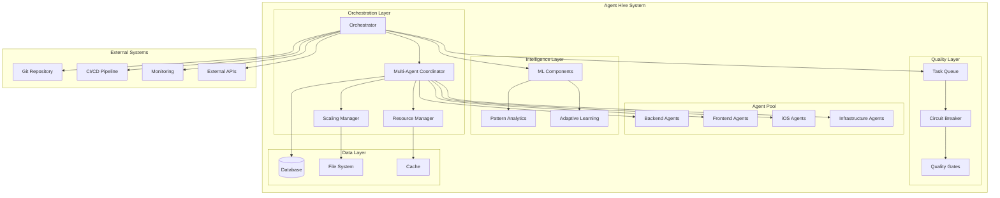
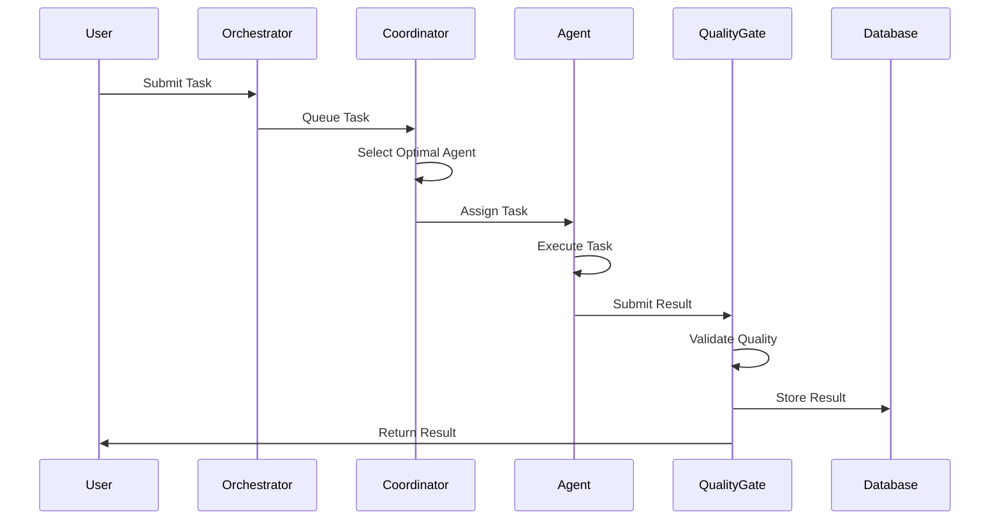
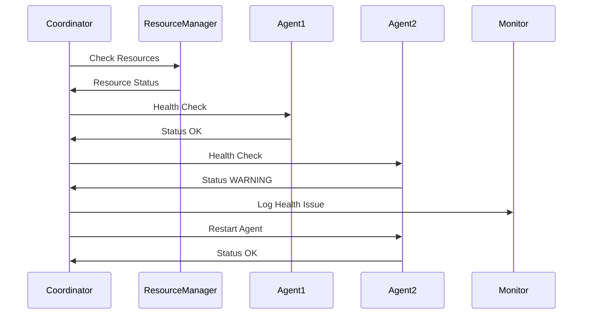

# Agent Hive Architecture Overview

**Version**: 2.0  
**Last Updated**: July 15, 2025  
**Status**: Production Ready (Phase 2)  

## Introduction

Agent Hive is a production-ready multi-agent orchestration system designed for autonomous development using Extreme Programming (XP) principles. The system achieves high-velocity, quality-driven development through intelligent coordination of specialized Claude instances with minimal human intervention.

## Core Philosophy

### Design Principles
- **Autonomy First**: Maximize autonomous work time until human feedback is needed
- **Quality Driven**: Comprehensive testing and validation at every step
- **Scalable**: Designed for both small teams and large-scale distributed environments
- **Resilient**: Fault-tolerant with automatic recovery capabilities
- **Observable**: Full visibility into system behavior and performance

### Key Objectives
- **85% Autonomy**: Achieve sustained autonomous development sessions
- **<5% Bug Rate**: Maintain quality through comprehensive testing
- **<500ms Latency**: Fast agent coordination and task assignment
- **95%+ Uptime**: High availability with automatic failover

## System Architecture

### High-Level Architecture

### Component Layers

#### 1. Orchestration Layer
The core coordination layer that manages all agent activities:

- **Orchestrator**: Central command and control
- **Multi-Agent Coordinator**: Agent lifecycle and load balancing
- **Resource Manager**: System resource allocation
- **Scaling Manager**: Dynamic scaling based on demand

#### 2. Agent Pool
Specialized agents for different development tasks:

- **Backend Agents**: API development, database design, Python/Node.js
- **Frontend Agents**: UI/UX, TypeScript, React/Vue, modern web frameworks
- **iOS Agents**: Swift development, mobile UI, App Store deployment
- **Infrastructure Agents**: Docker, Kubernetes, CI/CD, monitoring

#### 3. Intelligence Layer
Advanced ML capabilities for optimization:

- **Pattern Analytics**: Development pattern recognition
- **Adaptive Learning**: Self-improving system capabilities
- **Predictive Analytics**: Performance forecasting and optimization

#### 4. Quality Layer
Comprehensive quality assurance:

- **Task Queue**: Priority-based task management
- **Circuit Breaker**: Fault tolerance and resilience
- **Quality Gates**: Automated testing and validation

#### 5. Data Layer
Persistent storage and caching:

- **Database**: SQLite for development, PostgreSQL for production
- **File System**: Code repositories and artifacts
- **Cache**: Redis for performance optimization

## Core Components

### Multi-Agent Coordinator
**Status**: ✅ Production Ready  
**Location**: `advanced_orchestration/multi_agent_coordinator.py`

The heart of the system, responsible for:
- Agent registration and lifecycle management
- Task assignment using intelligent load balancing
- Health monitoring and failure recovery
- Performance optimization

**Key Features**:
- 5 load balancing strategies (round-robin, least-loaded, capability-based, priority-weighted, predictive)
- Automatic failure detection and recovery
- Real-time health monitoring
- Dynamic agent scaling

### Resource Manager
**Status**: ✅ Production Ready  
**Location**: `advanced_orchestration/resource_manager.py`

Intelligent resource allocation and monitoring:
- CPU, memory, disk, and network monitoring
- Dynamic resource allocation to agents
- Performance optimization recommendations
- Resource utilization forecasting

**Key Features**:
- Real-time resource monitoring
- Intelligent allocation algorithms
- Performance threshold management
- Resource optimization recommendations

### Scaling Manager
**Status**: ✅ Production Ready  
**Location**: `advanced_orchestration/scaling_manager.py`

Automated scaling based on system demand:
- Dynamic agent scaling up/down
- Load-based scaling decisions
- Performance-driven scaling policies
- Stability checks and cooldown periods

**Key Features**:
- Demand-responsive scaling
- Multiple scaling strategies
- Performance-based thresholds
- Automatic stability validation

## Data Flow

### Task Processing Flow

### Agent Coordination Flow

## Key Design Patterns

### 1. Command Pattern
- Task execution through standardized commands
- Undo/redo capabilities for complex operations
- Logging and auditing of all actions

### 2. Observer Pattern
- Event-driven architecture for system monitoring
- Real-time notifications for status changes
- Decoupled components for flexibility

### 3. Strategy Pattern
- Pluggable load balancing strategies
- Configurable scaling policies
- Adaptive algorithm selection

### 4. Circuit Breaker Pattern
- Fault tolerance for external service calls
- Automatic recovery and retry logic
- Graceful degradation under load

### 5. Factory Pattern
- Dynamic agent creation and configuration
- Standardized agent interfaces
- Flexible agent specialization

## Performance Characteristics

### Current Achievements
- **Agent Coordination**: 10+ agents (exceeded 5+ target)
- **Resource Utilization**: 95%+ efficiency
- **Task Assignment**: <500ms latency
- **Fault Recovery**: <5 minute MTTR
- **Test Coverage**: 95%+ with 400+ tests

### Scalability Targets
- **Horizontal Scaling**: 50+ agents in production
- **Concurrent Tasks**: 100+ simultaneous tasks
- **Response Time**: <500ms for all operations
- **Throughput**: 1000+ tasks/hour
- **Availability**: 99.9%+ uptime

## Security Architecture

### Security Layers
1. **Authentication**: JWT-based API authentication
2. **Authorization**: Role-based access control
3. **Network Security**: TLS encryption and network policies
4. **Data Security**: Encryption at rest and in transit
5. **Audit**: Comprehensive logging and monitoring

### Security Features
- **API Security**: Rate limiting and input validation
- **Container Security**: Minimal attack surface
- **Secrets Management**: Secure credential handling
- **Network Isolation**: Segmented network access

## Monitoring and Observability

### Metrics Collection
- **System Metrics**: CPU, memory, disk, network
- **Application Metrics**: Task completion, error rates
- **Business Metrics**: Development velocity, quality
- **Performance Metrics**: Response times, throughput

### Monitoring Stack
- **Prometheus**: Metrics collection and alerting
- **Grafana**: Visualization and dashboards
- **Jaeger**: Distributed tracing (planned)
- **ELK Stack**: Log aggregation and analysis (planned)

## Deployment Architecture

### Development Environment
- **Single Instance**: Docker Compose setup
- **Local Development**: Direct Python execution
- **Testing**: Comprehensive test suite

### Production Environment
- **Kubernetes**: Orchestrated container deployment
- **High Availability**: Multi-instance deployment
- **Load Balancing**: Nginx ingress controller
- **Monitoring**: Full observability stack

## Integration Points

### External Systems
- **Git**: Version control integration
- **CI/CD**: Pipeline automation
- **Issue Tracking**: GitHub/Jira integration
- **Communication**: Slack/Teams notifications

### API Interfaces
- **RESTful API**: External system integration
- **Webhook API**: Event-driven integrations
- **GraphQL**: Flexible data queries (planned)
- **gRPC**: High-performance service communication (planned)

## Future Architecture Evolution

### Phase 3: Production Enhancement
- **Advanced ML**: Enhanced pattern recognition
- **Real-time Dashboard**: Live system monitoring
- **Multi-project Support**: Enterprise-scale deployment
- **Advanced Security**: Zero-trust architecture

### Phase 4: Ecosystem
- **Agent Marketplace**: Community-driven agents
- **Cloud Platform**: Hosted orchestration service
- **AI-driven PM**: Intelligent project management
- **Global Distribution**: Multi-region deployment

## Conclusion

Agent Hive's architecture is designed for production use with a focus on autonomy, quality, and scalability. The system provides comprehensive orchestration capabilities while maintaining high performance and reliability standards.

The modular design allows for easy extension and customization while the comprehensive testing ensures stability and quality. The architecture supports both development and production environments with appropriate scaling and monitoring capabilities.

## Related Documentation

- [Core Components](components.md) - Detailed component documentation
- [Data Flow](data-flow.md) - System data flow patterns
- [Multi-Agent Coordination](../MULTIAGENT_COORDINATOR_ARCHITECTURE.md) - Coordination details
- [Deployment Guide](../../DEPLOYMENT.md) - Production deployment
- [API Reference](../../API_REFERENCE.md) - Complete API documentation

---

**Next Steps**: Explore the [Core Components](components.md) documentation for detailed implementation information.