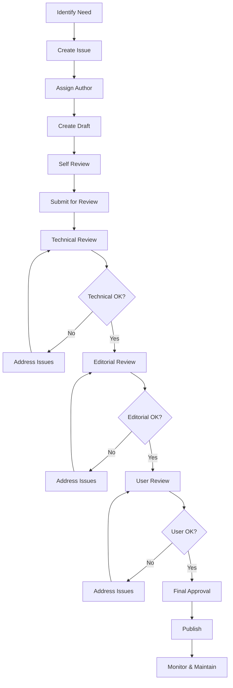
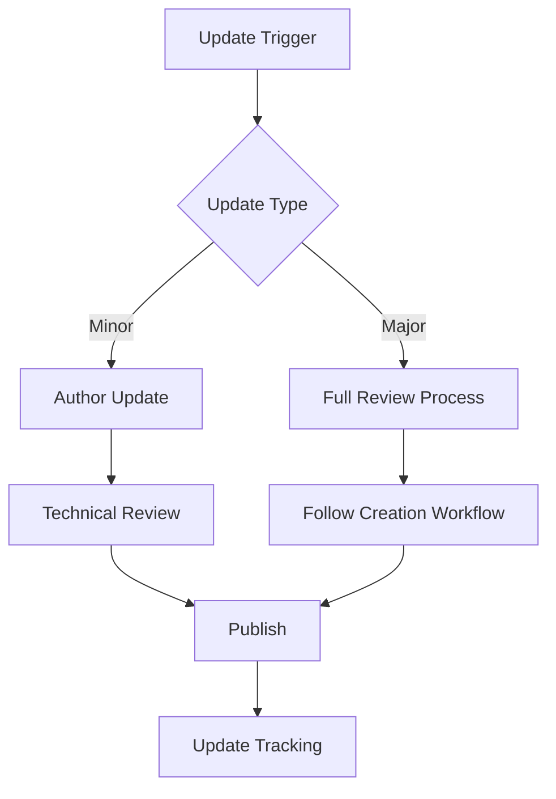
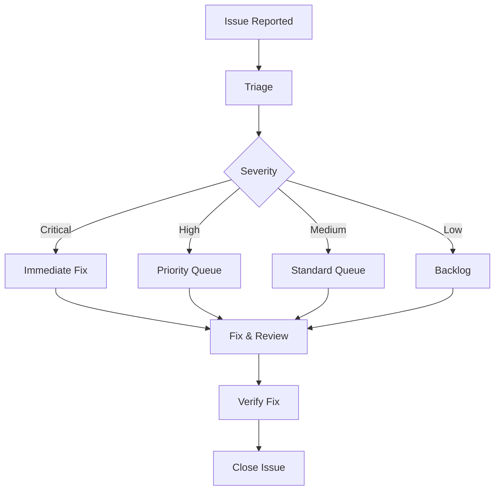

# Documentation Governance Framework

**Version**: 1.0  
**Effective Date**: July 15, 2025  
**Review Cycle**: Quarterly  

## Purpose

This governance framework establishes the processes, roles, and responsibilities for maintaining high-quality documentation across the agent-hive project. It ensures consistency, accuracy, and usability while enabling efficient collaboration and maintenance.

## Governance Structure

### Documentation Committee

#### Lead: Documentation Agent
- **Primary Responsibilities**:
  - Overall documentation strategy and vision
  - Quality assurance and standards enforcement
  - Template creation and maintenance
  - Governance framework updates
  - Final approval authority

#### Technical Reviewers
- **Primary Responsibilities**:
  - Technical accuracy validation
  - Code example testing
  - API documentation review
  - Integration testing of procedures

#### Editorial Reviewers
- **Primary Responsibilities**:
  - Style and consistency checking
  - Language clarity and accessibility
  - Template compliance verification
  - User experience optimization

#### User Advocates
- **Primary Responsibilities**:
  - User needs representation
  - Feedback collection and analysis
  - Usability testing coordination
  - Success metrics monitoring

## Roles and Responsibilities

### Content Creation

#### Authors
- **Who**: Development team members, subject matter experts
- **Responsibilities**:
  - Create documentation using approved templates
  - Ensure technical accuracy of content
  - Update documentation with feature changes
  - Respond to review feedback
  - Maintain assigned documentation sections

#### Technical Writers
- **Who**: Documentation specialists, Documentation Agent
- **Responsibilities**:
  - Complex documentation creation
  - Template development and maintenance
  - Style guide enforcement
  - Cross-document consistency
  - User experience optimization

### Review Process

#### Review Stages
1. **Draft Review**: Initial completeness and structure check
2. **Technical Review**: Accuracy and implementation validation
3. **Editorial Review**: Style, clarity, and consistency
4. **User Review**: Usability and accessibility testing
5. **Final Approval**: Publication authorization

#### Review Criteria
- **Completeness**: All required sections present
- **Accuracy**: Technical correctness verified
- **Clarity**: Clear, accessible language
- **Consistency**: Template and style compliance
- **Usability**: User needs satisfied

### Quality Assurance

#### Validation Framework
- **Automated Checks**:
  - Link validation
  - Code example testing
  - Spell checking
  - Style compliance
  - Template validation

- **Manual Validation**:
  - Technical accuracy review
  - User experience testing
  - Completeness assessment
  - Currency verification

#### Success Metrics
- **Coverage**: 95% of features documented
- **Accuracy**: <2% error rate
- **Usability**: >90% task completion rate
- **Satisfaction**: >8/10 user rating
- **Currency**: <30 days update lag

## Process Workflows

### Documentation Creation Workflow

### Update Workflow

### Issue Resolution Workflow

## Standards and Templates

### Mandatory Standards
- **Template Usage**: All documentation must use approved templates
- **Style Guide**: Consistent formatting and language
- **Metadata**: Required frontmatter for all documents
- **Validation**: All code examples must be tested
- **Version Control**: Full history and change tracking

### Template Requirements
- **Structure**: Standardized sections and organization
- **Metadata**: Complete frontmatter information
- **Examples**: Working code examples with validation
- **Navigation**: Clear cross-references and links
- **Accessibility**: Screen reader and accessibility compliance

### Quality Gates
- **Pre-publication**: Automated validation must pass
- **Review**: All review stages must approve
- **Testing**: User testing for major documentation
- **Approval**: Final approval from Documentation Lead

## Maintenance and Updates

### Regular Maintenance Tasks

#### Daily
- Monitor for broken links
- Check for user feedback
- Respond to urgent issues

#### Weekly
- Review and triage new issues
- Update changed documentation
- Validate recent changes

#### Monthly
- Comprehensive link checking
- Code example validation
- User feedback analysis
- Metrics review

#### Quarterly
- Full documentation audit
- Template and standards review
- Process improvement analysis
- Success metrics assessment

### Update Triggers

#### Immediate Updates Required
- Security vulnerabilities
- Breaking changes
- Critical bugs
- Safety issues

#### Scheduled Updates
- Feature releases
- Version updates
- Process changes
- Template updates

#### Reactive Updates
- User feedback
- Error reports
- Improvement suggestions
- Competitive changes

## Quality Metrics and Monitoring

### Key Performance Indicators

#### Coverage Metrics
- **Feature Coverage**: Percentage of features documented
- **API Coverage**: Percentage of API endpoints documented
- **Tutorial Coverage**: Percentage of use cases covered
- **Error Coverage**: Percentage of error conditions documented

#### Quality Metrics
- **Accuracy Rate**: Percentage of correct information
- **Completion Rate**: User task completion success rate
- **User Satisfaction**: Average user rating
- **Update Frequency**: Average time between updates

#### Efficiency Metrics
- **Time to Publish**: Average time from draft to publication
- **Review Cycle Time**: Average time for full review cycle
- **Issue Resolution Time**: Average time to resolve issues
- **Maintenance Overhead**: Time spent on maintenance tasks

### Monitoring and Reporting

#### Automated Monitoring
- **Link Checking**: Daily automated link validation
- **Code Validation**: Continuous integration testing
- **User Analytics**: Usage patterns and popular content
- **Error Tracking**: Documentation-related errors

#### Manual Monitoring
- **User Feedback**: Regular feedback collection and analysis
- **Expert Review**: Periodic expert validation
- **Competitive Analysis**: Industry best practices comparison
- **Trend Analysis**: Long-term quality and usage trends

#### Reporting Schedule
- **Weekly**: Issue status and resolution updates
- **Monthly**: Quality metrics and user feedback summary
- **Quarterly**: Comprehensive governance review
- **Annually**: Strategic documentation planning

## Continuous Improvement

### Feedback Collection

#### User Feedback Channels
- **Documentation Surveys**: Regular user satisfaction surveys
- **Issue Reports**: GitHub issues for documentation problems
- **Community Forums**: Discussion and suggestion forums
- **User Interviews**: Direct user experience interviews

#### Internal Feedback
- **Team Retrospectives**: Regular team review sessions
- **Process Reviews**: Periodic process effectiveness analysis
- **Tool Evaluation**: Regular tool and template assessment
- **Best Practice Sharing**: Knowledge sharing sessions

### Process Improvement

#### Improvement Identification
- **Metrics Analysis**: Data-driven improvement opportunities
- **User Pain Points**: Common user frustrations and challenges
- **Process Bottlenecks**: Workflow efficiency issues
- **Technology Changes**: New tools and capabilities

#### Implementation Process
- **Proposal Creation**: Formal improvement proposals
- **Impact Assessment**: Cost-benefit analysis
- **Testing**: Pilot programs for major changes
- **Rollout**: Phased implementation with monitoring

### Innovation and Adaptation

#### Emerging Trends
- **Documentation Technology**: New tools and platforms
- **User Expectations**: Evolving user needs and preferences
- **Industry Standards**: Best practices and standards evolution
- **Accessibility Requirements**: Changing accessibility needs

#### Adaptation Strategy
- **Regular Review**: Quarterly assessment of industry trends
- **Experimentation**: Pilot programs for new approaches
- **Training**: Team development and skill building
- **Technology Evaluation**: Regular tool and platform assessment

## Governance Review and Updates

### Review Schedule
- **Quarterly**: Process effectiveness and metrics review
- **Semi-annually**: Template and standards review
- **Annually**: Complete governance framework review

### Review Criteria
- **Effectiveness**: Are processes achieving intended outcomes?
- **Efficiency**: Are processes optimally designed?
- **Compliance**: Are standards being followed?
- **Satisfaction**: Are stakeholders satisfied with processes?

### Update Process
- **Proposal**: Formal change proposals with justification
- **Review**: Committee review and approval
- **Testing**: Pilot implementation where appropriate
- **Implementation**: Full rollout with training and support

## Compliance and Enforcement

### Compliance Monitoring
- **Template Compliance**: Automated checking of template usage
- **Style Compliance**: Automated style guide validation
- **Process Compliance**: Review stage completion tracking
- **Quality Compliance**: Metrics threshold monitoring

### Enforcement Mechanisms
- **Automated Rejection**: Non-compliant submissions rejected
- **Review Requirements**: Mandatory review stages
- **Quality Gates**: Publication blocked for quality issues
- **Escalation Process**: Non-compliance escalation procedures

### Appeals Process
- **Issue Reporting**: Formal process for reporting compliance issues
- **Review Committee**: Independent review of appeals
- **Resolution**: Fair and timely issue resolution
- **Documentation**: Record keeping for compliance issues

## Resources and Support

### Documentation Resources
- **Templates**: Standardized templates for all document types
- **Style Guide**: Comprehensive style and formatting guidelines
- **Examples**: Best practice examples and patterns
- **Tools**: Recommended tools and platforms

### Training and Support
- **Onboarding**: New contributor orientation
- **Workshops**: Regular training sessions
- **Office Hours**: Regular support availability
- **Help Documentation**: Self-service help resources

### Community and Collaboration
- **Documentation Team**: Core team for collaboration
- **User Community**: Feedback and suggestion community
- **Expert Network**: Subject matter expert network
- **Partner Collaboration**: External collaboration partnerships

## Conclusion

This governance framework provides the structure and processes necessary for maintaining world-class documentation that serves users effectively while ensuring sustainable maintenance and continuous improvement. Regular review and adaptation ensure the framework remains relevant and effective as the project evolves.

For questions or suggestions about this governance framework, please contact the Documentation Agent or participate in the quarterly governance review process.

---

**Next Steps**: Begin implementing governance processes and training team members on standards and workflows.