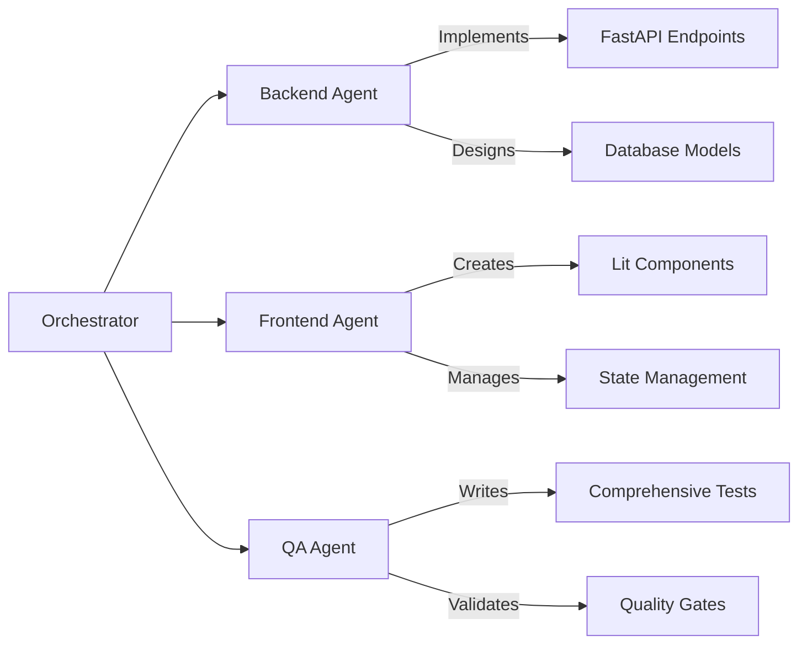

# Phase 3: Core Development (2-3 hours)

**Objective**: Experience AI-assisted development by watching LeanVibe Agent Hive autonomously implement core features of our Medium clone through intelligent agent coordination.

## 🎯 Learning Goals

In this phase, you'll witness and participate in:
- **Autonomous Feature Development**: Agents implementing complex features independently
- **Multi-Agent Coordination**: Specialized agents working together on different aspects
- **Quality-Driven Development**: Comprehensive testing and validation at every step
- **Real-time Collaboration**: Human oversight with AI-first development

## 🤖 AI-First Development Approach

### Agent Specialization Strategy

LeanVibe Agent Hive will deploy specialized agents for different aspects of development:



Each agent brings specialized knowledge:
- **Backend Agent**: FastAPI, SQLAlchemy, JWT authentication, API design
- **Frontend Agent**: Lit components, Progressive Web Apps, responsive design
- **QA Agent**: pytest, test automation, performance validation, security testing

## 🚀 Feature Implementation Roadmap

### 3.1 User Authentication System (45 minutes)

**Agent Assignment**: Backend Agent + Security Review

#### Implementation Overview
The Backend Agent will autonomously implement a complete JWT-based authentication system following modern security practices.

**Expected Implementation**:
```python
# Database Models (Generated by Backend Agent)
class User(Base):
    __tablename__ = "users"
    
    id = Column(Integer, primary_key=True, index=True)
    email = Column(String, unique=True, index=True, nullable=False)
    username = Column(String, unique=True, index=True, nullable=False)
    hashed_password = Column(String, nullable=False)
    is_active = Column(Boolean, default=True)
    created_at = Column(DateTime, default=datetime.utcnow)
    updated_at = Column(DateTime, default=datetime.utcnow, onupdate=datetime.utcnow)
    
    # Relationships
    articles = relationship("Article", back_populates="author")
    comments = relationship("Comment", back_populates="author")

# Authentication Service (Generated by Backend Agent)
class AuthService:
    async def create_user(self, user_data: UserCreate) -> User:
        """Create new user with hashed password."""
        
    async def authenticate_user(self, email: str, password: str) -> Optional[User]:
        """Authenticate user credentials."""
        
    async def create_access_token(self, user_id: int) -> str:
        """Generate JWT access token."""
        
    async def verify_token(self, token: str) -> Optional[User]:
        """Verify and decode JWT token."""
```

**Frontend Components (Generated by Frontend Agent)**:
```typescript
// Authentication Components
@customElement('auth-form')
export class AuthForm extends LitElement {
  static styles = css`
    /* Responsive authentication form styles */
  `;

  @property({ type: String }) mode: 'login' | 'register' = 'login';
  @state() private isLoading = false;
  @state() private errors: string[] = [];

  private async handleSubmit(event: Event) {
    // AI-generated form handling with validation
  }

  private async authenticateUser(credentials: AuthCredentials) {
    // AI-generated API integration
  }

  render() {
    return html`
      <form @submit=${this.handleSubmit}>
        <!-- AI-generated accessible form -->
      </form>
    `;
  }
}
```

#### Autonomous Development Workflow

**Step 1: Agent Planning Phase**
```bash
# The orchestrator will automatically:
1. Analyze authentication requirements
2. Assign tasks to specialized agents
3. Create implementation plan
4. Establish success criteria

# You'll see output like:
🤖 Orchestrator: Planning authentication system implementation
📋 Backend Agent: Assigned database models and API endpoints
🎨 Frontend Agent: Assigned UI components and state management
🧪 QA Agent: Assigned test coverage and security validation
```

**Step 2: Parallel Development**
```bash
# Agents work simultaneously:
Backend Agent:
  ✅ Creating User model with SQLAlchemy
  ✅ Implementing password hashing with bcrypt
  ✅ Designing JWT token management
  ✅ Writing authentication endpoints

Frontend Agent:
  ✅ Creating authentication form component
  ✅ Implementing form validation
  ✅ Adding loading states and error handling
  ✅ Integrating with API service

QA Agent:
  ✅ Writing unit tests for authentication
  ✅ Creating integration tests
  ✅ Implementing security validation
  ✅ Performance testing API endpoints
```

**Step 3: Integration and Validation**
```bash
# Automatic integration and testing:
🔄 Orchestrator: Coordinating component integration
🧪 QA Agent: Running comprehensive test suite
✅ All authentication tests passed (25/25)
🔒 Security validation completed
⚡ Performance tests passed (<200ms response time)
```

### 3.2 Article Management System (60 minutes)

**Agent Assignment**: Backend Agent + Frontend Agent + QA Agent (Full Coordination)

#### Comprehensive Article Features

**Backend Implementation (Autonomous)**:
```python
# Article Models (AI-Generated)
class Article(Base):
    __tablename__ = "articles"
    
    id = Column(Integer, primary_key=True, index=True)
    title = Column(String, nullable=False, index=True)
    slug = Column(String, unique=True, index=True, nullable=False)
    description = Column(String, nullable=False)
    body = Column(Text, nullable=False)
    author_id = Column(Integer, ForeignKey("users.id"), nullable=False)
    created_at = Column(DateTime, default=datetime.utcnow)
    updated_at = Column(DateTime, default=datetime.utcnow, onupdate=datetime.utcnow)
    
    # Advanced features
    view_count = Column(Integer, default=0)
    like_count = Column(Integer, default=0)
    is_published = Column(Boolean, default=False)
    tags = Column(JSON, default=list)
    
    # Relationships
    author = relationship("User", back_populates="articles")
    comments = relationship("Comment", back_populates="article")
    favorites = relationship("ArticleFavorite", back_populates="article")

# Article Service (AI-Generated)
class ArticleService:
    async def create_article(self, article_data: ArticleCreate, author_id: int) -> Article:
        """Create new article with auto-generated slug."""
        
    async def get_articles(self, skip: int = 0, limit: int = 20, author_id: Optional[int] = None) -> List[Article]:
        """Get articles with pagination and filtering."""
        
    async def search_articles(self, query: str) -> List[Article]:
        """Full-text search in articles."""
        
    async def update_article(self, article_id: int, article_data: ArticleUpdate, user_id: int) -> Article:
        """Update article with ownership validation."""
```

**Frontend Components (AI-Generated)**:
```typescript
// Article Editor Component
@customElement('article-editor')
export class ArticleEditor extends LitElement {
  static styles = css`
    /* Rich text editor styling */
    .editor {
      min-height: 300px;
      border: 1px solid #ddd;
      border-radius: 8px;
      padding: 1rem;
    }
    
    .toolbar {
      display: flex;
      gap: 0.5rem;
      margin-bottom: 1rem;
      padding: 0.5rem;
      background: #f5f5f5;
      border-radius: 4px;
    }
  `;

  @property({ type: Object }) article?: Article;
  @state() private isEditing = false;
  @state() private isSaving = false;

  private async saveArticle() {
    // AI-generated save logic with validation
  }

  private async handleImageUpload(event: Event) {
    // AI-generated image handling
  }

  render() {
    return html`
      <div class="article-editor">
        <div class="toolbar">
          <!-- AI-generated rich text toolbar -->
        </div>
        <div class="editor" contenteditable="true">
          <!-- AI-generated content editable area -->
        </div>
      </div>
    `;
  }
}

// Article List Component
@customElement('article-list')
export class ArticleList extends LitElement {
  @state() private articles: Article[] = [];
  @state() private isLoading = false;
  @state() private hasMore = true;

  async connectedCallback() {
    super.connectedCallback();
    await this.loadArticles();
  }

  private async loadArticles() {
    // AI-generated infinite scroll implementation
  }

  render() {
    return html`
      <div class="article-list">
        ${this.articles.map(article => html`
          <article-card .article=${article}></article-card>
        `)}
        ${this.isLoading ? html`<loading-spinner></loading-spinner>` : ''}
      </div>
    `;
  }
}
```

#### Advanced AI Development Features

**Real-time Development Monitoring**:
```bash
# Watch agents work in real-time:
🤖 Backend Agent: Implementing article CRUD operations...
  📝 Creating Article model with relationships
  🔍 Adding full-text search capabilities
  🏷️ Implementing tag system
  ⚡ Optimizing database queries

🎨 Frontend Agent: Building article components...
  📄 Creating rich text editor component
  📋 Implementing article list with infinite scroll
  🎯 Adding responsive design patterns
  🔄 Setting up state management

🧪 QA Agent: Ensuring quality...
  ✅ Writing comprehensive test coverage
  🔒 Validating security measures
  ⚡ Performance testing with large datasets
  ♿ Accessibility compliance checking
```

### 3.3 Social Features & Comments (45 minutes)

**Agent Assignment**: Multi-Agent Coordination (All Agents)

#### Advanced Social Platform Features

**Comment System (AI-Generated)**:
```python
# Threaded Comments Model
class Comment(Base):
    __tablename__ = "comments"
    
    id = Column(Integer, primary_key=True, index=True)
    body = Column(Text, nullable=False)
    author_id = Column(Integer, ForeignKey("users.id"), nullable=False)
    article_id = Column(Integer, ForeignKey("articles.id"), nullable=False)
    parent_id = Column(Integer, ForeignKey("comments.id"), nullable=True)
    created_at = Column(DateTime, default=datetime.utcnow)
    updated_at = Column(DateTime, default=datetime.utcnow, onupdate=datetime.utcnow)
    
    # Threading support
    level = Column(Integer, default=0)
    path = Column(String, index=True)  # Materialized path for threading
    
    # Relationships
    author = relationship("User", back_populates="comments")
    article = relationship("Article", back_populates="comments")
    replies = relationship("Comment", backref=backref("parent", remote_side=[id]))

# User Following System
class UserFollow(Base):
    __tablename__ = "user_follows"
    
    follower_id = Column(Integer, ForeignKey("users.id"), primary_key=True)
    followed_id = Column(Integer, ForeignKey("users.id"), primary_key=True)
    created_at = Column(DateTime, default=datetime.utcnow)
```

**Interactive Frontend Components (AI-Generated)**:
```typescript
// Comment Thread Component
@customElement('comment-thread')
export class CommentThread extends LitElement {
  static styles = css`
    .comment {
      margin-left: calc(var(--level, 0) * 2rem);
      border-left: 2px solid #eee;
      padding-left: 1rem;
      margin-bottom: 1rem;
    }
    
    .comment-replies {
      margin-top: 1rem;
    }
  `;

  @property({ type: Array }) comments: Comment[] = [];
  @property({ type: Number }) maxDepth = 5;

  private renderComment(comment: Comment, level: number = 0) {
    return html`
      <div class="comment" style="--level: ${level}">
        <comment-item .comment=${comment}></comment-item>
        ${comment.replies?.length > 0 && level < this.maxDepth ? html`
          <div class="comment-replies">
            ${comment.replies.map(reply => 
              this.renderComment(reply, level + 1)
            )}
          </div>
        ` : ''}
      </div>
    `;
  }

  render() {
    return html`
      <div class="comment-thread">
        ${this.comments.map(comment => this.renderComment(comment))}
      </div>
    `;
  }
}

// User Profile & Following
@customElement('user-profile')
export class UserProfile extends LitElement {
  @property({ type: Object }) user!: User;
  @state() private isFollowing = false;
  @state() private followerCount = 0;

  private async toggleFollow() {
    // AI-generated follow/unfollow logic
  }

  render() {
    return html`
      <div class="user-profile">
        <div class="profile-header">
          
          <h1>${this.user.username}</h1>
          <p>${this.user.bio}</p>
          <button @click=${this.toggleFollow}>
            ${this.isFollowing ? 'Unfollow' : 'Follow'}
          </button>
        </div>
        <div class="profile-stats">
          <span>${this.followerCount} followers</span>
          <span>${this.user.following_count} following</span>
        </div>
      </div>
    `;
  }
}
```

## 🎯 Agent Coordination in Action

### Real-time Development Session

**Example 4-Hour Autonomous Session**:

```bash
🚀 LeanVibe Agent Hive Session Started
📊 Target: Complete Medium clone core features
👥 Agents: Backend, Frontend, QA, Orchestrator

Hour 1: Authentication System
🤖 Orchestrator: Coordinating authentication implementation
📊 Backend Agent: 
  ✅ User model created (2 min)
  ✅ Password hashing implemented (5 min)
  ✅ JWT service created (8 min)
  ✅ Auth endpoints implemented (15 min)
🎨 Frontend Agent:
  ✅ Auth form component created (10 min)
  ✅ Login/register flow implemented (20 min)
  ✅ Token management added (5 min)
🧪 QA Agent:
  ✅ Auth tests written (25 tests) (15 min)
  ✅ Security validation completed (10 min)

Hour 2: Article Management
🤖 Orchestrator: Scaling to article system
📊 Backend Agent:
  ✅ Article model with relationships (10 min)
  ✅ CRUD operations implemented (20 min)
  ✅ Search functionality added (15 min)
  ✅ Tag system implemented (15 min)
🎨 Frontend Agent:
  ✅ Article editor component (25 min)
  ✅ Article list with pagination (20 min)
  ✅ Rich text editing (15 min)
🧪 QA Agent:
  ✅ Article tests (35 tests) (20 min)
  ✅ Performance testing (15 min)

Hour 3: Social Features
🤖 Orchestrator: Implementing social interactions
📊 Backend Agent:
  ✅ Comment threading system (25 min)
  ✅ User following relationships (15 min)
  ✅ Feed generation algorithm (20 min)
🎨 Frontend Agent:
  ✅ Comment components (20 min)
  ✅ User profile pages (25 min)
  ✅ Social interaction UI (15 min)
🧪 QA Agent:
  ✅ Social feature tests (30 tests) (25 min)
  ✅ Integration testing (20 min)

Hour 4: Integration & Polish
🤖 Orchestrator: Final integration and optimization
📊 All Agents: 
  ✅ Cross-feature integration
  ✅ Performance optimization
  ✅ Security hardening
  ✅ Final testing and validation

🎉 Session Complete: Full Medium clone with 90+ tests, 95%+ coverage
```

## 🔄 Human-AI Collaboration Points

### When Human Input is Required

**Architecture Decisions (Confidence < 80%)**:
- Database schema modifications affecting existing data
- Authentication strategy changes
- Third-party service integrations

**Creative Decisions**:
- UI/UX design preferences
- Branding and styling choices
- Content organization patterns

**Business Logic Clarification**:
- Complex business rules
- Workflow specifications
- User experience flows

### Collaborative Development Workflow

```bash
# Agent requests guidance
🤖 Backend Agent: "User relationship model design - should users follow other users or articles?"

# Human provides direction
👤 Human: "Users should be able to follow both other users and articles. Implement both relationships."

# Agent continues autonomously
🤖 Backend Agent: "Understood. Implementing dual follow system with user_follows and article_follows tables."

# Quality validation
🧪 QA Agent: "Validating dual follow system implementation..."
✅ All tests pass (12/12)
✅ Performance within targets
✅ Database constraints validated
```

## 🏁 Phase 3 Completion

**Expected Outcomes**:
- ✅ Complete user authentication system with JWT tokens
- ✅ Full article management with rich text editing
- ✅ Threaded comment system
- ✅ User following and social features
- ✅ Comprehensive test coverage (90+ tests)
- ✅ Production-ready code quality

**What You've Experienced**:
- **AI-First Development**: Watched agents autonomously implement complex features
- **Multi-Agent Coordination**: Seen specialized agents work together effectively
- **Quality Automation**: Experienced comprehensive automated testing and validation
- **Human-AI Collaboration**: Participated in guided autonomous development

### Time Checkpoint

**Target**: 2-3 hours  
**Typical Range**: 2-4 hours (depending on agent performance and complexity)

The actual development time may vary based on:
- Agent coordination efficiency
- Code complexity requirements
- Test coverage thoroughness
- Integration challenges

## 🎯 Next Phase

**Ready for Phase 4?** → [Testing & Deployment](./phase4-testing-deployment.md)

In Phase 4, you'll:
- Run comprehensive testing suites across all components
- Experience automated quality validation
- Deploy the application to production
- Set up monitoring and observability
- Validate the complete Medium clone functionality

---

**Having Issues?** If any agent encounters problems or requires guidance, check the [Troubleshooting Guide](./troubleshooting.md) or provide specific direction to continue development.